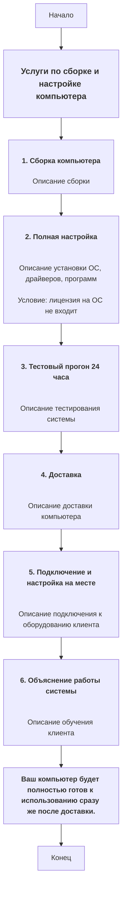

## Анализ HTML-кода: `service_as_product_ru.html`

### 1. <алгоритм>

Представленный HTML-код описывает услуги по сборке и настройке компьютера. Он структурирован в виде списка услуг, каждая из которых имеет заголовок (h4) и описание (p).
1.  **Начало:** HTML-документ начинается с элемента `<h3>`, который устанавливает основной заголовок: "Услуги по сборке и настройке компьютера".
    *   *Пример:* `<h3>Услуги по сборке и настройке компьютера</h3>`
2.  **Услуга 1: Сборка компьютера:** Заголовок `<h4>` и описание `
` описывают процесс сборки компьютера.
    *   *Пример:* `<h4>1. Сборка компьютера</h4>
Я собираю ваш компьютер...
`
3.  **Услуга 2: Полная настройка:** Заголовок `<h4>` и описание `
` поясняют процесс установки ОС и драйверов, а также присутствует примечание `p.note` об ОС.
    *   *Пример:* `<h4>2. Полная настройка</h4>
После сборки я устанавливаю...
 
...
`
4.  **Услуга 3: Тестовый прогон 24 часа:** Заголовок `<h4>` и описание `
` объясняют процесс тестирования системы.
    *   *Пример:* `<h4>3. Тестовый прогон 24 часа</h4>
Перед тем как передать вам технику, я провожу тестирование...
`
5.  **Услуга 4: Доставка:** Заголовок `<h4>` и описание `
` описывают услугу доставки компьютера.
    *   *Пример:* `<h4>4. Доставка</h4>
Доставлю компьютер лично в удобное для вас время и место...
`
6.  **Услуга 5: Подключение и настройка на месте:** Заголовок `<h4>` и описание `
` поясняют услугу подключения и настройки на месте у клиента.
    *   *Пример:* `<h4>5. Подключение и настройка на месте</h4>
При доставке я подключу компьютер к вашему монитору, клавиатуре, мыши...
`
7.  **Услуга 6: Объяснение работы системы:** Заголовок `<h4>` и описание `
` описывают процесс обучения клиента.
    *   *Пример:* `<h4>6. Объяснение работы системы</h4>
После подключения объясню, как пользоваться новой системой, отвечу на все ваши вопросы...
`
8.  **Заключение:** Последний абзац `
` подчеркивает готовность компьютера к использованию после доставки.
    *   *Пример:* `
<strong>Ваш компьютер будет полностью готов к использованию сразу же после доставки.</strong>
`
9.  **Конец:** HTML-документ завершен.

### 2. <mermaid>

**Объяснение:**

*   `flowchart TD`:  Определяет тип диаграммы как блок-схему (flowchart) с направлением сверху вниз (TD).
*   `Start`, `End`: Начало и конец процесса.
*   `ServiceHeader`: Заголовок всего блока с описанием услуги.
*   `Assemble`, `FullSetup`, `TestRun`, `Delivery`, `SetupOnSite`, `SystemExplanation`: Блоки, описывающие каждую конкретную услугу. Каждый блок содержит заголовок `h4` и абзац `p` с описанием.
*   `ReadyToUse`: Заключительный абзац, подчеркивающий готовность системы к работе.
*   Стрелки (`-->`): Указывают на последовательность шагов.

### 3. <объяснение>

**Импорты:**
В предоставленном коде нет импортов, поскольку это HTML-файл.

**Классы:**
В данном коде отсутствуют классы. Это HTML-документ, а не код на Python или другом языке программирования, поэтому классы не используются.

**Функции:**
В данном коде отсутствуют функции.

**Переменные:**
В HTML-документе, как правило, нет переменных, как в языках программирования. Однако, атрибуты элементов HTML (`class` в `
`) можно рассматривать как метаданные, но они не являются переменными в обычном смысле.

**Подробное Объяснение:**

*   **`<h3>Услуги по сборке и настройке компьютера</h3>`**: Это главный заголовок, который объявляет общую тему документа - услуги по сборке и настройке компьютера.
*   **`<h4>1. Сборка компьютера</h4>`**: Заголовок четвертого уровня, представляющий собой первую услугу.
    *   `
Я собираю ваш компьютер, подбирая все комплектующие...
`:  Описывает услугу по сборке, включая выбор и установку компонентов.
*   **`<h4>2. Полная настройка</h4>`**: Заголовок, определяющий вторую услугу - полную настройку.
    *   `
После сборки я устанавливаю операционную систему...
`: Описание настройки ПО, включая ОС, драйверы и программы.
    *   `
(Условие: лицензия на операционную систему и другие программы НЕ ВХОДЯТ в стоимость. Подробнее по тел 054-422-94-97)
`: Примечание, указывающее, что лицензии на ПО не включены в стоимость услуги. `class="note"` выделяет этот абзац, указывая на важность его содержимого.
*   **`<h4>3. Тестовый прогон 24 часа</h4>`**: Заголовок, обозначающий услугу тестирования собранного компьютера.
    *   `
Перед тем как передать вам технику, я провожу тестирование...
`: Описание тестирования производительности и стабильности системы.
*   **`<h4>4. Доставка</h4>`**: Заголовок, описывающий услугу доставки.
    *    `
Доставлю компьютер лично в удобное для вас время и место...
`: Описание доставки с акцентом на удобство и безопасность транспортировки.
*   **`<h4>5. Подключение и настройка на месте</h4>`**: Заголовок, определяющий услугу подключения и настройки на месте у клиента.
    *    `
При доставке я подключу компьютер к вашему монитору, клавиатуре, мыши и другим устройствам...
`: Описание процесса подключения и настройки периферии.
*   **`<h4>6. Объяснение работы системы</h4>`**: Заголовок для обучения клиента работе с системой.
    *   `
После подключения объясню, как пользоваться новой системой, отвечу на все ваши вопросы и покажу основные функции...
`: Описание процесса обучения клиента.
*   **`
<strong>Ваш компьютер будет полностью готов к использованию сразу же после доставки.</strong>
`**: Заключительное предложение, подчеркивающее, что компьютер будет готов к работе сразу после доставки. Тег `<strong>` делает текст жирным, выделяя его.

**Потенциальные области для улучшения:**

*   **Динамическое содержимое**: Текущий HTML статический. Для более гибкого управления и изменения контента можно использовать шаблонизатор (например, Jinja2) или JavaScript.
*   **CSS стилизация**:  Отсутствует стилизация. Добавление CSS позволит улучшить внешний вид и сделать структуру более читаемой.
*   **Валидация HTML**:  Проверка на валидность HTML (например, с помощью HTML валидатора) для соответствия стандартам.

**Взаимосвязь с другими частями проекта:**

Этот HTML-файл, вероятно, используется как шаблон для генерации прайс-листа. В контексте проекта он взаимодействует с Python-скриптами, которые генерируют HTML-страницы на основе данных о предоставляемых услугах.

**Дополнительные замечания:**

*   В файле `service_as_product_ru.html` представлено описание услуг в виде HTML, что является представлением данных для пользователя.
*   Файл не содержит логики, только структура и контент для отображения информации.
*   HTML-файл может быть частью веб-страницы или быть сгенерирован на стороне сервера с помощью шаблонизатора.

Таким образом, файл представляет собой статичный HTML, предназначенный для показа информации о предоставляемых услугах по сборке и настройке компьютера.