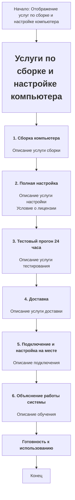

## АНАЛИЗ КОДА:

### 1. <алгоритм>

Представленный код — это HTML-шаблон, описывающий услуги по сборке и настройке компьютера. Он представляет собой структурированный текст, который можно визуализировать следующим образом:

1.  **Начало:**  Заголовок `Услуги по сборке и настройке компьютера`.
    *   *Пример:* `<h3>Услуги по сборке и настройке компьютера</h3>`
2.  **Услуга 1:** `Сборка компьютера`.
    *   *Описание:*  Описание услуги по подбору и сборке компонентов компьютера.
    *   *Пример:* `<h4>1. Сборка компьютера</h4> 
Я собираю ваш компьютер, подбирая все комплектующие...
`
3.  **Услуга 2:** `Полная настройка`.
    *   *Описание:*  Описание услуги по установке операционной системы, драйверов и программ.
    *   *Пример:*  `<h4>2. Полная настройка</h4>
После сборки я устанавливаю операционную систему...
`
        *   *Примечание:* Особое условие по поводу лицензии на программное обеспечение.
        *   *Пример:* `
(Условие: лицензия на операционную систему и другие программы НЕ ВХОДЯТ в стоимость...)
`
4.  **Услуга 3:** `Тестовый прогон 24 часа`.
    *   *Описание:*  Описание услуги по тестированию системы в течение 24 часов.
    *   *Пример:* `<h4>3. Тестовый прогон 24 часа</h4>
Перед тем как передать вам технику, я провожу тестирование...
`
5.  **Услуга 4:** `Доставка`.
    *   *Описание:*  Описание услуги по доставке компьютера.
    *   *Пример:* `<h4>4. Доставка</h4>
Доставлю компьютер лично в удобное для вас время и место...
`
6.  **Услуга 5:** `Подключение и настройка на месте`.
    *   *Описание:*  Описание услуги по подключению и настройке компьютера у клиента.
    *   *Пример:* `<h4>5. Подключение и настройка на месте</h4>
При доставке я подключу компьютер к вашему монитору...
`
7.  **Услуга 6:** `Объяснение работы системы`.
    *   *Описание:*  Описание услуги по обучению клиента работе с новой системой.
    *   *Пример:* `<h4>6. Объяснение работы системы</h4>
После подключения объясню, как пользоваться новой системой...
`
8.  **Заключение:** Краткое утверждение о готовности компьютера к использованию после доставки.
    *   *Пример:* `
<strong>Ваш компьютер будет полностью готов к использованию сразу же после доставки.</strong>
`
9.  **Конец**

Этот шаблон не содержит логических блоков или функций.  Это просто структура HTML-кода, предназначенная для отображения текстовой информации.

### 2. <mermaid>

**Объяснение диаграммы:**

*   `Start`: Начало процесса, представляет собой отправную точку.
*   `Title`: Заголовок страницы `Услуги по сборке и настройке компьютера`, отображается в виде `<h1>`.
*   `Service1` - `Service6`: Представляют собой последовательность услуг, каждая из которых состоит из заголовка `<h4>` и описания в виде тега `
`. Сервис `Service2` дополнительно содержит предупреждение об условии лицензии.
*   `Conclusion`: Заключительное утверждение о готовности компьютера к использованию.
*   `End`: Конец процесса отображения.

Диаграмма описывает последовательность представления информации об услугах в HTML-коде. Все элементы диаграммы соответствуют HTML-тегам, используемым в коде.

**Зависимости**
В данном случае, зависимости являются структурными - HTML элементы зависят от общей структуры документа и предназначены для форматирования и отображения текста. В предоставленном коде нет импортов или зависимостей от других файлов. Это автономный HTML-шаблон.

### 3. <объяснение>

**Импорты:**

*   В данном коде нет импортов, поскольку это чистый HTML-шаблон. HTML не требует импорта библиотек или модулей как, например, Python.

**Классы:**
*   HTML сам по себе не использует классов в том же смысле, что и языки программирования.  Он использует теги и атрибуты для структурирования и форматирования контента.  В данном контексте можно рассматривать теги, такие как `<h3>`, `<h4>`, `
`,  как элементы, определяющие структуру и стиль содержимого.
    *   Например, `
` использует класс `note` для стилизации примечания.

**Функции:**

*   В данном коде нет функций.  HTML — это язык разметки, а не язык программирования. Он используется для создания структуры и содержания веб-страниц, а не для выполнения каких-либо действий.

**Переменные:**

*   В HTML-коде не используются переменные в классическом понимании. Однако можно сказать, что значения тегов, атрибуты и текст представляют собой данные, отображаемые на странице.
    *   Например, в теге `
Я собираю ваш компьютер...
`, текст "Я собираю ваш компьютер..." является содержанием, которое динамически отображается в браузере, но это не переменная в понимании языка программирования.
    *  `class="note"` -  атрибут `class`, которому присвоено значение `note`, используется для стилизации.

**Подробности:**

*   **Структура:** Код представляет собой структурированный HTML-документ, разделенный на заголовки (`<h3>`, `<h4>`) и абзацы (`
`). Это делает информацию легко читаемой и понятной.
*   **Классы:** Использование класса `note` позволяет применить специфические стили для особых примечаний (например, для условий лицензирования).
*   **Условие по лицензии:** Включение примечания о том, что лицензия на ПО не включена в стоимость, важно для избежания недоразумений с клиентами.
*   **Детализация услуг:** Код детально описывает каждую услугу, что повышает прозрачность и доверие со стороны потенциальных клиентов.
*   **Готовность системы:** Заявление, что "Ваш компьютер будет полностью готов к использованию сразу же после доставки", является сильным заявлением, дающим уверенность клиентам.

**Потенциальные ошибки или области для улучшения:**

*   **Отсутствие динамичности:** Код статичен и не позволяет, например, менять цену или список услуг. В реальном проекте эта информация, вероятно, должна загружаться из базы данных или из файла конфигурации.
*   **Отсутствие стилизации:**  HTML-код без CSS может выглядеть не эстетично. Для лучшего представления необходимы стили.
*   **Отсутствие интерактивности:** Данный HTML-код представляет собой статичную страницу и не позволяет взаимодействовать с пользователем.

**Цепочка взаимосвязей:**

Этот HTML-шаблон обычно используется вместе с другими частями веб-приложения или сайта:

1.  **Бэкэнд:** Вероятно, в реальном проекте этот шаблон будет использован в связке с бэкендом на Python (например, Flask или Django), который будет динамически предоставлять данные в этот шаблон.
2.  **CSS:** Для придания стиля и хорошего внешнего вида этому HTML-коду, он должен быть связан с файлами CSS, которые определяют внешний вид элементов на странице.
3.  **Другие шаблоны:** Этот шаблон может быть частью более крупного HTML-шаблона, который включает в себя навигацию, подвал и другие компоненты веб-страницы.

В общем, этот шаблон является частью более крупного процесса и используется для представления информации о предоставляемых услугах.