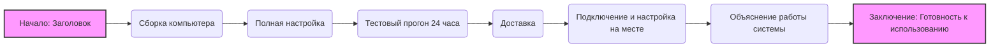

## Анализ HTML-кода: `service_as_product_ru.html`

### 1. <алгоритм>

**Блок-схема:**

1.  **Начало**: Представление заголовка "Услуги по сборке и настройке компьютера".
    *   *Пример*: Вывод `<h3>Услуги по сборке и настройке компьютера</h3>` на веб-странице.
2.  **Сборка компьютера**: Описание услуги сборки компьютера с использованием надежных компонентов.
    *   *Пример*: Вывод `<h4>1. Сборка компьютера</h4>` и абзаца с описанием.
3.  **Полная настройка**: Описание настройки операционной системы и необходимых программ.
    *   *Пример*: Вывод `<h4>2. Полная настройка</h4>` и абзаца с описанием и примечанием о лицензии.
4.  **Тестовый прогон**: Описание 24-часового тестирования системы.
    *   *Пример*: Вывод `<h4>3. Тестовый прогон 24 часа</h4>` и абзаца с описанием.
5.  **Доставка**: Описание услуги доставки компьютера.
    *   *Пример*: Вывод `<h4>4. Доставка</h4>` и абзаца с описанием.
6.  **Подключение и настройка на месте**: Описание подключения и настройки оборудования у клиента.
    *   *Пример*: Вывод `<h4>5. Подключение и настройка на месте</h4>` и абзаца с описанием.
7.  **Объяснение работы системы**: Описание обучения клиента использованию новой системы.
    *   *Пример*: Вывод `<h4>6. Объяснение работы системы</h4>` и абзаца с описанием.
8.  **Заключение**: Утверждение о полной готовности компьютера к использованию.
    *   *Пример*: Вывод `
<strong>Ваш компьютер будет полностью готов к использованию сразу же после доставки.</strong>
`.
9.  **Конец**: Отображение всего содержимого на веб-странице.

**Поток данных:**

В данном HTML-коде потока данных между функциями, классами или методами нет, поскольку это статический HTML-шаблон. Данные просто отображаются в браузере на основе структуры документа.

### 2. <mermaid>

**Анализ зависимостей:**

В данном коде `mermaid` нет импорта каких-либо внешних библиотек или модулей. Это простой граф, описывающий последовательность предоставления услуг. Каждая нода представляет собой шаг в процессе сборки и настройки компьютера.

*   **A**: Начало процесса (Заголовок).
*   **B**: Описание услуги сборки компьютера.
*   **C**: Описание полной настройки системы.
*   **D**: Описание 24-часового тестирования.
*   **E**: Описание доставки компьютера.
*   **F**: Описание подключения и настройки у клиента.
*   **G**: Описание обучения клиента.
*   **H**: Завершающее сообщение о готовности компьютера.

Связи представляют последовательность выполнения работ.

### 3. <объяснение>

**Импорты:**

В данном HTML-шаблоне импорты отсутствуют, так как это статический HTML-документ.

**Классы:**

В данном коде отсутствуют классы. HTML-код использует стандартные HTML-теги для структурирования контента.

**Функции:**

В данном коде отсутствуют функции. Код представляет собой статический HTML, который напрямую отображается браузером.

**Переменные:**

В данном коде нет переменных. В HTML используются теги и атрибуты для структурирования и отображения контента.

**Объяснение:**

*   Код представляет собой HTML-шаблон, описывающий услуги по сборке и настройке компьютера.
*   Структура HTML состоит из заголовков (`h3`, `h4`), абзацев (`p`), и выделенных текстов (`strong`).
*   Код разбит на логические блоки, каждый из которых описывает конкретный этап предоставления услуги.
*   Особое внимание уделяется подчеркиванию следующих моментов:
    *   использованию надежных комплектующих;
    *   полной настройке системы;
    *   тестированию перед доставкой;
    *   доставке и настройке на месте;
    *   обучению клиента использованию системы.
*   В абзаце про полную настройку есть примечание о том, что лицензии на ПО не входят в стоимость, что является важным для понимания клиентами условий предоставления услуги.

**Потенциальные ошибки или области для улучшения:**

*   Код является статическим HTML и не имеет динамического функционала. Это может быть улучшено путем интеграции с бэкендом для динамического управления контентом или добавления интерактивности.
*   Отсутствует стилизация (CSS), что влияет на внешний вид страницы. Рекомендуется добавить CSS для улучшения визуального восприятия.
*   Не предусмотрена локализация для других языков.
*   Нет проверки на валидность HTML кода.

**Взаимосвязи с другими частями проекта:**

*   Этот HTML-шаблон, вероятно, используется в качестве части генератора прайс-листов. Он может быть использован для отображения информации об услугах, предлагаемых клиентам.
*   Шаблон может быть связан с бэкенд-логикой, которая генерирует этот HTML или включает его в более крупный HTML-документ.
*   Шаблон может быть частью веб-приложения или сайта, где он отображается пользователю.
*   В связке с бэкенд частью, данная html страница может учавствовать в процессе генерации финального PDF документа.