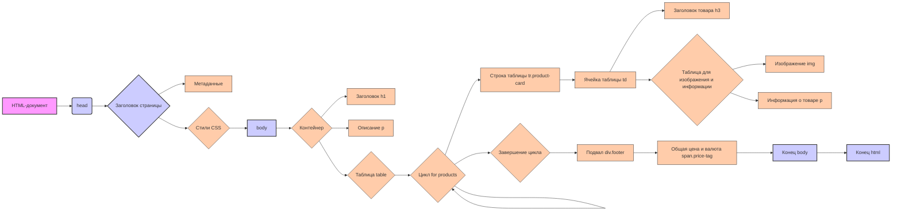

## Анализ HTML-шаблона для генерации прайс-листа

### 1. <алгоритм>

**Общая логика:**

Шаблон HTML предназначен для генерации прайс-листа в виде таблицы, где каждый товар представлен в отдельной карточке. Шаблон использует синтаксис шаблонизатора (вероятно, Jinja2), что позволяет динамически вставлять данные, переданные из бэкенда.

**Пошаговая блок-схема:**

1.  **Начало (HTML-документ):**
    *   Начинается с объявления `<!DOCTYPE html>`, указывающего, что это HTML5 документ.
    *   Устанавливается направление текста справа налево (`dir="rtl"`) в теге `<html>`.

2.  **Заголовок (`<head>`):**
    *   Определяются метаданные, такие как кодировка (`UTF-8`) и настройки viewport.
    *   Устанавливается динамический заголовок страницы (`<title>{{ title }}</title>`).
    *   Подключаются встроенные стили CSS (`<style>`), которые форматируют внешний вид страницы. Примеры стилей:
        *   `body` - белый фон, черный текст, шрифт, направление текста справа налево.
        *   `h1` - центрированный заголовок.
        *   `.lead` - центрированное описание.
        *   `.container` - контейнер с фиксированной шириной.
        *   `table` - таблица, занимающая всю ширину.
        *   `.product-card` - карточка товара со стилем, включающим границу, скругление, отступы.
        *   `.product-card img` - стили для изображения, включая размеры, отступы и радиус скругления.
        *   `.product-info` - стили для информации о продукте.
        *   `.price-tag` - стили для цены товара.
        *   `.footer` - стили для подвала.

3.  **Тело (`<body>`):**
    *   Контейнер (`
`) для содержимого страницы.
    *   Динамический заголовок страницы (`<h1>{{ title }}</h1>`).
        *   Пример:  `<h1>Прайс-лист на товары</h1>`.
    *   Динамическое описание (`
{{ description }}
`).
        *   Пример:  `
Список товаров с ценами
`.
    *   Таблица для отображения товаров (`<table>`).
    *   **Цикл `for` (Jinja2):**
        *   `` - начало цикла по списку товаров `products`.
        *   Создается строка таблицы `<tr>` с классом `product-card`.
        *   Создаётся ячейка таблицы `<td>` для содержимого карточки товара.
        *   Выводится заголовок товара (`<h3>{{ product.product_title }}</h3>`).
        *   Внутри ячейки создаётся таблица `<table>` для отображения изображения и информации о товаре.
        *   Изображение товара (``).
            *   Пример: ``.
        *   Описание товара и спецификация (`
{{ product.product_description }}
` и `
{{ product.specification }}
`).
           *  Пример: `
Описание товара 1.
` `
Спецификация: 100 шт.
`
        *   `` - конец цикла.
    *   Подвал (`
`):
        *   Общая цена и валюта  (`
מחיר כוךך הכל: {{ price }} {{ currency }}
`).
            *   Пример:  `
מחיר כוךך הכל: 15000 ₪
`.

4.  **Конец (HTML-документ):**
    *   Закрываются теги `<body>` и `<html>`.

### 2. <mermaid>

**Описание диаграммы:**

*   **HTML-документ**: Представляет общий HTML-документ, в котором создаётся структура страницы.
*   **head**: Раздел `<head>` документа.
*   **Заголовок страницы**: Содержит `title` страницы.
*   **Метаданные**: Содержит метаданные страницы, такие как кодировка и настройки viewport.
*   **Стили CSS**: Содержит стили CSS для форматирования элементов страницы.
*   **body**: Основное содержимое документа в разделе `<body>`.
*   **Контейнер**: `div` с классом `container`, ограничивающий ширину содержимого.
*   **Заголовок h1**: Заголовок страницы `<h1>`.
*   **Описание p**: Описание прайс-листа `
` с классом `lead`.
*   **Таблица table**: Таблица для вывода товаров.
*  **Цикл for products**: Цикл `for` для итерации по списку товаров.
*   **Строка таблицы tr.product-card**: Строка таблицы, представляющая карточку товара.
*   **Ячейка таблицы td**: Ячейка таблицы, содержащая контент карточки товара.
*   **Заголовок товара h3**: Заголовок товара внутри карточки.
*   **Таблица для изображения и информации**: Внутренняя таблица для отображения изображения и текста.
*   **Изображение img**: Изображение товара.
*   **Информация о товаре p**: Описание и спецификация товара.
*   **Завершение цикла**: Конец цикла `for`.
*   **Подвал div.footer**: Подвал страницы, содержащий итоговую цену.
*   **Общая цена и валюта span.price-tag**: Отображение общей цены и валюты.
*  **Конец body**: Конец тега `body`.
*   **Конец html**: Конец тега `html`.

**Зависимости:**

Диаграмма не имеет явных импортов, так как это HTML-шаблон, а не код Python. Однако, неявно он зависит от:

*   **Jinja2 (или аналогичный шаблонизатор):** Для обработки `{{ title }}`, `{{ description }}`, ``, `{{ product.product_title }}` и т.д. Этот шаблонизатор предоставляет функциональность для вставки динамических данных в HTML.
*   **CSS:** Для стилизации элементов HTML. Стили определены внутри тега `<style>`.
*   **Бэкенд:** Который предоставляет данные для шаблона (список товаров, их описание, изображения, итоговая цена и валюта).

### 3. <объяснение>

**Импорты:**

В данном коде нет явных импортов Python, так как это HTML-шаблон. Однако,  неявно используется синтаксис шаблонизатора (скорее всего, Jinja2), который обрабатывает переменные и управляющие структуры, такие как цикл `for`.

**Классы:**

В HTML-коде используются классы CSS для стилизации элементов. Примеры:

*   `.container`: Класс для контейнера, ограничивающего ширину содержимого.
*   `.lead`: Класс для описания прайс-листа.
*   `.product-card`: Класс для карточки товара.
*   `.product-info`: Класс для блока с информацией о товаре.
*   `.price-tag`: Класс для отображения цены товара.
*   `.footer`: Класс для подвала страницы.

Эти классы определяют визуальное представление элементов на странице.

**Функции:**

В данном коде нет явных функций JavaScript.  Однако, функциональность шаблона обеспечивается  тем, что в него передаются переменные, которые затем отображаются на странице.
*   `{{ title }}`: Заголовок прайс-листа.
*   `{{ description }}`: Описание прайс-листа.
*   `{{ products }}`: Список товаров, каждый из которых представляет собой объект с атрибутами (например, `product.product_title`, `product.image_local_saved_path`, `product.product_description`, `product.specification`).
*   `{{ price }}`: Общая цена всех товаров.
*   `{{ currency }}`: Валюта.

**Переменные:**

*   `title` (строка): Заголовок прайс-листа.
*   `description` (строка): Описание прайс-листа.
*   `products` (список объектов): Список товаров. Каждый объект содержит:
    *   `product_title` (строка): Название товара.
    *   `image_local_saved_path` (строка): Путь к изображению товара.
    *   `product_description` (строка): Описание товара.
    *   `specification` (строка): Спецификация товара.
*   `price` (число): Итоговая цена.
*   `currency` (строка): Валюта.

**Цепочка взаимосвязей с другими частями проекта:**

1.  **Бэкенд (Python/Flask):** Бэкенд, вероятно, используя Flask или аналогичный фреймворк, обрабатывает запросы, получает данные из базы данных или других источников, подготавливает словарь с данными (`title`, `description`, `products`, `price`, `currency`) и передает их в этот шаблон HTML через шаблонизатор.

2.  **Шаблонизатор (Jinja2):**  Шаблонизатор обрабатывает шаблон HTML,  динамически вставляет полученные из бэкенда данные в шаблон, формируя финальный HTML-код.

3.  **Веб-браузер:** Веб-браузер получает HTML-код,  интерпретирует его и отображает страницу с прайс-листом.

**Потенциальные ошибки и области для улучшения:**

*   **Отсутствие обработки ошибок:**  Шаблон не обрабатывает случаи, когда какие-либо данные отсутствуют (например, нет изображения или описания). Необходимо предусмотреть обработку таких ситуаций, чтобы не возникли ошибки отображения.
*   **Жестко заданные стили:**  Стили CSS определены непосредственно в шаблоне, что затрудняет их поддержку и масштабирование.  Лучше вынести стили в отдельный CSS-файл.
*   **Адаптивность:**  Шаблон не адаптирован к различным размерам экранов.  Следует использовать медиазапросы CSS для обеспечения корректного отображения на мобильных устройствах.
*   **Локализация:** В шаблоне есть текст на иврите ( מחיר כוךך הכל)  . Необходима поддержка других языков.
*   **Производительность:** При очень большом количестве товаров, рендеринг таблицы может быть медленным. Следует предусмотреть меры по оптимизации, например, пагинация или отложенная загрузка.

Этот анализ дает полное представление о структуре, функциональности и взаимосвязях данного HTML-шаблона для генерации прайс-листа.