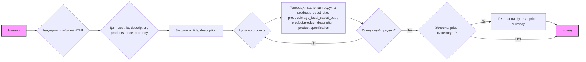
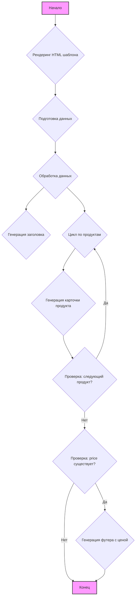

## Анализ HTML-шаблона для генерации прайс-листа

### 1. <алгоритм>

**Блок-схема:**

**Примеры:**

*   **Заголовок:** `title` может быть "Прайс-лист на товары", `description` - "Перечень товаров с ценами".
*   **Цикл по продуктам:**
    *   **`product` (первый):**
        *   `product.product_title` = "Телефон Samsung Galaxy S21"
        *   `product.image_local_saved_path` = "/images/samsung_s21.jpg"
        *   `product.product_description` = "Современный смартфон с отличной камерой"
        *   `product.specification` = "8 Гб RAM, 128 Гб ROM"
    *   **`product` (второй):**
        *   `product.product_title` = "Наушники Sony WH-1000XM4"
        *   `product.image_local_saved_path` = "/images/sony_headphones.jpg"
        *   `product.product_description` = "Беспроводные наушники с шумоподавлением"
        *   `product.specification` = "Bluetooth 5.0, до 30 часов работы"
    *   И так далее для всех продуктов в списке `products`
*   **Футер:** `price` = "15000", `currency` = "руб."

### 2. <mermaid>

**Описание зависимостей `mermaid`:**

*   **`flowchart TD`**: Определяет тип диаграммы как блок-схему (flowchart) с направлением сверху вниз (Top Down).
*   **`Start`**: Обозначает начало процесса.
*   **`RenderTemplate`**: Блок, в котором HTML-шаблон обрабатывается.
*   **`PrepareData`**: Блок, в котором подготавливаются данные для шаблона, например, `title`, `description`, `products`, `price` и `currency`.
*   **`ProcessData`**: Блок, представляющий обработку данных, таких как итерация по списку продуктов и проверка наличия цены.
*   **`GenerateHeader`**: Блок, отвечающий за создание заголовка HTML-страницы с информацией о title и description.
*   **`LoopProducts`**: Обозначает цикл, в котором происходит итерация по всем продуктам.
*   **`GenerateProductCard`**: Блок, отвечающий за создание карточки продукта с изображением, названием, описанием и спецификацией.
*  **`CheckNextProduct`**: Блок проверки, есть ли следующий продукт для итерации
*   **`CheckPrice`**: Блок, который проверяет, нужно ли добавлять футер с общей ценой.
*  **`GenerateFooter`**: Блок, отвечающий за создание футера с общей ценой
*   **`End`**: Обозначает конец процесса рендеринга HTML.
*   Связи между блоками обозначаются `-->` (стрелкой), а ветвление логики  `-- Да -->` и `-- Нет -->`.
*   **`style ... fill:#f9f,stroke:#333,stroke-width:2px`**: стилизует блоки `Start` и `End` для визуального акцента.

### 3. <объяснение>

**Импорты:**

*   В этом коде нет импортов Python. Это HTML-шаблон, который использует синтаксис шаблонизатора Jinja2 (выражения в двойных фигурных скобках `{{ ... }}` и операторы ``). Шаблон получает данные из Python-бэкенда и динамически генерирует HTML.

**Классы:**

*   В данном файле отсутствуют определения классов. Это HTML-шаблон, а не класс Python. Структура HTML-страницы создаётся через теги, а данные подставляются с помощью Jinja2.

**Функции:**

*   В данном файле также отсутствуют определения функций. Функциональность обеспечивается HTML-тегами и логикой шаблонизатора Jinja2, который подставляет данные в нужные места.
*   **Примеры:**
    *   `{{ title }}`: Вставляет значение переменной `title`, полученной из Python-кода.
    *   `{{ description }}`: Вставляет описание, переданное в `description`.
    *   ``: Цикл, который перебирает каждый продукт из списка `products` и для каждого продукта генерирует HTML-разметку.
    *   `{{ product.product_title }}`: Вставляет название текущего продукта.
    *   `{{ product.image_local_saved_path }}`: Вставляет путь к изображению текущего продукта.
    *   `{{ product.product_description }}`: Вставляет описание текущего продукта.
    *   `{{ product.specification }}`: Вставляет спецификацию текущего продукта.
    *    ``  и `` - условный оператор, который проверяет наличие цены и отображает блок с ценой, если она есть.
    *   `{{ price }}`: Вставляет общую цену товаров.
    *   `{{ currency }}`: Вставляет валюту.

**Переменные:**

*   `title` (строка): Название прайс-листа, отображается в заголовке страницы.
*   `description` (строка): Описание прайс-листа, отображается под заголовком.
*   `products` (список объектов): Список товаров, каждый из которых имеет поля `product_title`, `image_local_saved_path`, `product_description` и `specification`.
*   `price` (число/строка): Общая цена всех товаров. Может отсутствовать, если цена не требуется.
*   `currency` (строка): Валюта, в которой указана цена.

**Потенциальные ошибки и улучшения:**

*   **Обработка ошибок изображений**: Если путь к изображению `product.image_local_saved_path` некорректный, изображение не будет отображаться. Можно добавить fallback-изображение или проверку на существование файла.
*   **Локализация**: Текст в шаблоне на русском. Нужно учитывать возможность локализации на другие языки.
*   **Отсутствие единиц измерения**: В описании `product.specification` могут быть упущены единицы измерения, которые можно было бы добавить.
*   **Динамические стили**: Можно добавить возможность настраивать стили (например, цвета) динамически, через передачу дополнительных переменных в шаблон.
*  **Отсутствие пагинации**: Если продуктов очень много, на странице могут возникнуть проблемы с производительностью и отображением. Стоит рассмотреть возможность добавления пагинации.

**Взаимосвязи с другими частями проекта:**

*   Этот шаблон используется совместно с бэкенд-компонентом, который отвечает за подготовку данных и передачу их в шаблон.
*   Данные, используемые в шаблоне, скорее всего, получаются из базы данных или других источников данных.
*   Шаблон, вероятно, является частью системы, которая генерирует прайс-листы на основе данных о продуктах.

Таким образом, этот HTML-шаблон служит для представления данных о продуктах в виде прайс-листа.