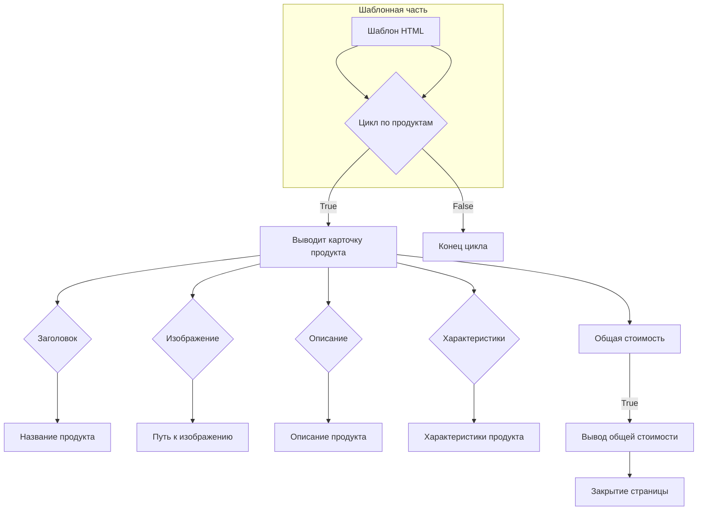
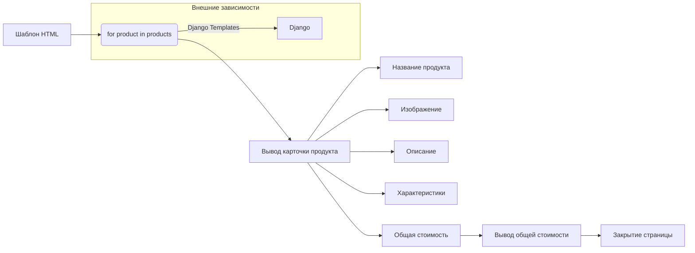

# <input code>

```html
<!DOCTYPE html>
<html>

<head>
    <meta charset="UTF-8">
    <meta name="viewport" content="width=device-width, initial-scale=1.0">
    <title>{{ title }}</title>
    <style>
        body {
            background-color: #ffffff; /* Белый фон */
            color: #000000; /* Черный текст */
            font-family: 'Segoe UI', Tahoma, Geneva, Verdana, sans-serif;
            margin: 0;
            padding: 0;
        }
        h1 {
            text-align: center;
            margin-top: 50pt;
            font-size: 36pt;
        }
        .lead {
            text-align: center;
            font-size: 18pt;
            margin: 10pt 0;
        }
        .container {
            width: 90%;
            margin: 0 auto;
        }
        table {
            width: 100%;
            border-collapse: collapse;
        }
        .product-card {
            background-color: #f8f9fa; /* Светлый фон карточек */
            border: 1pt solid #dee2e6;
            border-radius: 8pt;
            padding: 15pt;
            margin: 15pt 0;
            width: 100%;
            box-sizing: border-box;
        }
        .product-card h3 {
            margin-top: 0; /* Убираем верхний отступ у заголовка */
        }
        .product-card img {
            width: 150pt; /* Новая ширина */
            height: auto; /* Автоматическая высота, чтобы сохранить пропорции */
            object-fit: contain; /* Сохранение пропорций изображения */
            border-radius: 5pt;
            background-color: white; /* Белый фон под изображением */
            margin-right: 15pt; /* Отступ справа от изображения */
        }
        .product-info {
            flex: 1; /* Занимает оставшееся пространство */
        }
        .price-tag {
            background-color: #238636;
            color: white;
            padding: 5pt 10pt;
            border-radius: 5pt;
            font-weight: bold;
        }
        .footer {
            text-align: center;
            margin-top: 30pt;
            padding: 15pt;
            border-top: 1pt solid #dee2e6;
        }
    </style>
</head>

<body>
    <div class="container">
        <h1>{{ title }}</h1>
        <p class="lead">{{ description }}</p>

        <table>
            <tbody>
                \
                <tr class="product-card">\
                    <td>\
                        <h3>{{ product.product_title }}</h3>\
                        <table>\
                            <tr>\
                                <td>\
                                    \
                                </td>\
                                <td class="product-info">\
                                    <p>{{ product.product_description }}</p>\
                                    <p>{{ product.specification }}</p>\
                                </td>\
                            </tr>\
                        </table>\
                    </td>\
                </tr>\
                \
            </tbody>
        </table>

        <div class="footer">
            <p>Общая стоимость: 
                <span class="price-tag">{{ price }} {{ currency }}</span>
            </p>
        </div>
    </div>
</body>

</html>
```

# <algorithm>



Пример: Если `products` содержит список из 3 продуктов, цикл `for` будет выполняться 3 раза, выводя карточку для каждого продукта, заполняя ее соответствующими данными.


# <mermaid>



**Объяснение:**

Эта диаграмма показывает, что шаблон HTML (A) использует цикл Django `for` (B) для обработки списка продуктов (`products`).  Цикл (B) получает данные о продуктах из Django (K) и передает их для вывода в соответствующие блоки (C - вывод карточки продукта, D - название, E - изображение, F - описание, G - характеристики, H - общая стоимость).  Заключительный блок (I) отвечает за вывод общей стоимости и закрытие страницы.  В зависимости показана связь с Django, использующимся для вывода информации из модели приложения.


# <explanation>

**Импорты:**

В данном коде нет импортов Python-модулей.  Это шаблон Django, который использует ``,  `{{ title }}`, `{{ description }}`, `{{ price }}` и `{{ currency }}`. Эти переменные подставляются в шаблон из контекста, заданного при его рендеринге Django.

**Классы:**

Нет определенных классов, используется язык шаблонов Django.

**Функции:**

Нет функций Python.  Шаблон использует Django-синтаксис для работы с данными.

**Переменные:**

* `title`: Строка, название списка.
* `description`: Строка, описание списка.
* `products`: Список объектов, содержащих данные о продуктах (например, `product_title`, `image_local_saved_path`, `product_description`, `specification`).
* `price`: Число, общая стоимость.
* `currency`: Строка, валюта.

**Возможные ошибки и улучшения:**

* **Отсутствие валидации данных:** Шаблон не проверяет, какие данные передаются в него.  В реальном приложении необходимо убедиться, что переменные `products`, `title`, `description`, `price`, и `currency` имеют ожидаемые типы.
* **Обработка ошибок:** Шаблон не обрабатывает ситуации, когда переменные не определены или содержат неподходящие значения.
* **Возможно, не хватает связи с моделью данных:** Не видно, откуда берутся данные в `products`.  Нужно убедиться, что в Django приложение есть модель данных, связанная с этим шаблоном.

**Взаимосвязь с другими частями проекта:**

Этот шаблон HTML связан с другими частями проекта, такими как модель данных (из которой `products` извлекаются) и контроллер, который обеспечивает контекст для шаблона (с параметрами `title`, `description`, `price`, `currency`).  Шаблон получает эти данные из Django-контекста.  Без доступа к модели данных и логике контроллера этот шаблон не может функционировать самостоятельно.  Нужна логика, чтобы формировать `products`, `title`, `description`, `price` и `currency` из реальных данных.