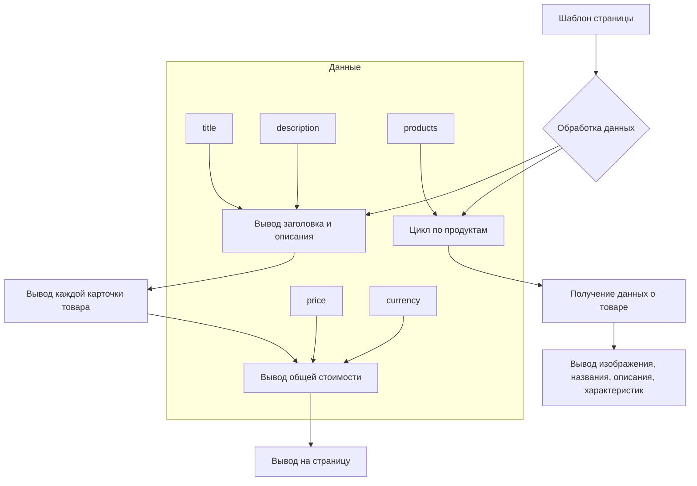

```MD
# <input code>

```html
<!DOCTYPE html>
<html>

<head>
    <meta charset="UTF-8">
    <meta name="viewport" content="width=device-width, initial-scale=1.0">
    <title>{{ title }}</title>
    <style>
        body {
            background-color: #ffffff; /* Белый фон */
            color: #000000; /* Черный текст */
            font-family: 'Segoe UI', Tahoma, Geneva, Verdana, sans-serif;
            margin: 0;
            padding: 0;
        }
        h1 {
            text-align: center;
            margin-top: 50pt;
            font-size: 36pt;
        }
        .lead {
            text-align: center;
            font-size: 18pt;
            margin: 10pt 0;
        }
        .container {
            width: 90%;
            margin: 0 auto;
        }
        table {
            width: 100%;
            border-collapse: collapse;
        }
        .product-card {
            background-color: #f8f9fa; /* Светлый фон карточек */
            border: 1pt solid #dee2e6;
            border-radius: 8pt;
            padding: 15pt;
            margin: 15pt 0;
            width: 100%;
            box-sizing: border-box;
        }
        .product-card h3 {
            margin-top: 0; /* Убираем верхний отступ у заголовка */
        }
        .product-card img {
            width: 150pt; /* Новая ширина */
            height: auto; /* Автоматическая высота, чтобы сохранить пропорции */
            object-fit: contain; /* Сохранение пропорций изображения */
            border-radius: 5pt;
            background-color: white; /* Белый фон под изображением */
            margin-right: 15pt; /* Отступ справа от изображения */
        }
        .product-info {
            flex: 1; /* Занимает оставшееся пространство */
        }
        .price-tag {
            background-color: #238636;
            color: white;
            padding: 5pt 10pt;
            border-radius: 5pt;
            font-weight: bold;
        }
        .footer {
            text-align: center;
            margin-top: 30pt;
            padding: 15pt;
            border-top: 1pt solid #dee2e6;
        }
    </style>
</head>

<body>
    <div class="container">
        <h1>{{ title }}</h1>
        <p class="lead">{{ description }}</p>

        <table>
            <tbody>
                \
                <tr class="product-card">\
                    <td>\
                        <h3>{{ product.product_title }}</h3>\
                        <table>\
                            <tr>\
                                <td>\
                                    \
                                </td>\
                                <td class="product-info">\
                                    <p>{{ product.product_description }}</p>\
                                    <p>{{ product.specification }}</p>\
                                </td>\
                            </tr>\
                        </table>\
                    </td>\
                </tr>\
                \
            </tbody>
        </table>

        <div class="footer">
            <p>Общая стоимость: 
                <span class="price-tag">{{ price }} {{ currency }}</span>
            </p>
        </div>
    </div>
</body>

</html>
```

# <algorithm>

**Шаг 1:** Вывод заголовка и описания.
    * Входные данные: `title`, `description`.
    * Выходные данные: Отображенный заголовок и описание на странице.
    * Пример:  `title` = "Список цен", `description` = "Цены на товары"

**Шаг 2:** Перебор списка товаров.
    * Входные данные: `products` (список объектов товара).
    * Выходные данные:  Отформатированные карточки товаров на странице.
    * Пример: `products` содержит объекты, каждый с полями `product_title`, `image_local_saved_path`, `product_description`, `specification`.

**Шаг 3:** Вывод карточки товара.
    * Входные данные:  Информация о товаре из списка `products`.
    * Выходные данные: Карточка товара на странице с изображением, названием, описанием и характеристиками.
    * Пример: Для товара с `product_title` = "Товар 1", отображается изображение, название, описание и характеристики.


**Шаг 4:** Вывод общей стоимости.
    * Входные данные: `price`, `currency`.
    * Выходные данные:  Общая стоимость на странице с валютой.
    * Пример:  `price` = 100, `currency` = "руб". Выводится "Общая стоимость: 100 руб."


# <mermaid>



# <explanation>

**Импорты:**  В данном коде нет импортов Python-модулей.  Это шаблон HTML, используемый для генерации страницы.  `` и другие тэги — это синтаксис Jinja2, шаблонизатора, который позволяет вставлять данные Python в HTML.

**Классы:**  В коде нет классов Python.  Это шаблон HTML, который отображает данные, полученные из внешнего источника, предположительно, в Python-приложении.

**Функции:**  Нет функций в этом HTML-шаблоне.  Функциональность обеспечивается Jinja2.

**Переменные:**  
* `title`: строка, содержащая заголовок страницы.
* `description`: строка, содержащая описание страницы.
* `products`: список объектов (предполагается), содержащих данные о товарах.  Каждый объект должен иметь атрибуты `product_title`, `image_local_saved_path`, `product_description`, `specification`.
* `price`: число, представляющее общую стоимость.
* `currency`: строка, содержащая обозначение валюты.

**Возможные ошибки или области для улучшений:**

* **Динамическое содержимое:** Код предполагает наличие данных `products`, `price`, `currency` и `title`.  Необходимо убедиться, что эти данные правильно передаются в шаблон из кода Python.
* **Обработка ошибок:** Шаблон не содержит логики обработки ошибок, например, если `products` пуст или данные о товаре неполны. Это требует соответствующей обработки в коде Python, который управляет шаблоном.
* **Валидация данных:** В коде нет проверок на корректность данных, поступающих в шаблон.  Проверка данных должна осуществляться на этапе обработки данных Python.
* **Локализация:**  Использование hardcoded цветов и размеров может потребовать локализации.

**Взаимосвязь с другими частями проекта:**

Этот HTML-шаблон предполагает, что Python-код (скорее всего, в `src`) подготавливает данные (`products`, `price`, `currency`, `title`, `description`) и передает их шаблону.  Поскольку шаблон использует Jinja2, Python-приложение должно использовать Jinja2 для рендеринга шаблона и передачи данных в него.  Также нужен механизм для сохранения путей к изображениям (`image_local_saved_path`).  Таким образом, существует зависимость от `src` для получения необходимых данных и обеспечения их корректного форматирования для отображения.