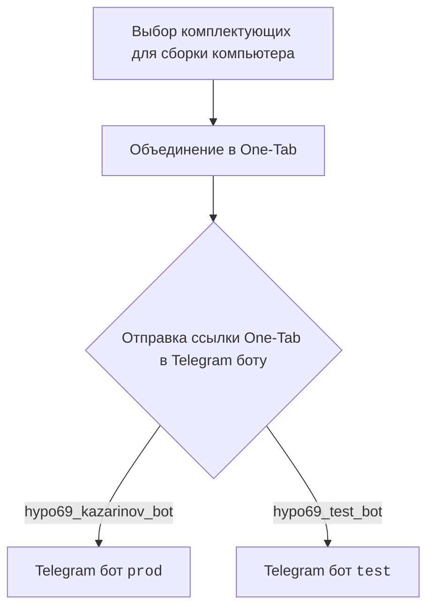

## АНАЛИЗ КОДА:

### 1. <алгоритм>

**Клиентская часть (диаграмма `mermaid`):**

1.  **Начало:** Пользователь начинает процесс выбора комплектующих для сборки компьютера.
2.  **Объединение:** Выбранные комплектующие объединяются в ссылку One-Tab.
3.  **Отправка в бот:** Ссылка One-Tab отправляется одному из двух Telegram ботов.
    *   `hypo69_kazarinov_bot`:  Отправка в бот `prod` (боевой).
    *   `hypo69_test_bot`: Отправка в бот `test` (тестовый).

**Серверная часть (диаграмма `mermaid`):**

1.  **Начало:** Функция `kazarinov_bot.handle_message()` принимает сообщение от Telegram бота.
2.  **Проверка URL:** Проверяется, является ли полученное сообщение URL-адресом от One-Tab.
    *   **Да:** Переход к шагу 3.
    *   **Нет:** Отправляется сообщение об ошибке "Попробуйте еще раз" и завершение.
3.  **Получение данных:** Если URL от One-Tab, то извлекаются данные из этого URL.
4.  **Проверка данных:** Проводится проверка корректности полученных данных.
    *   **Нет:**  Отправляется сообщение об ошибке "Некорректные данные" и завершение.
    *   **Да:** Переход к шагу 5.
5.  **Запуск сценария:** Запускается сценарий `Mexiron`.
6.  **Проверка выполнения сценария:** Проверяется, успешно ли выполнен сценарий.
    *   **Да:** Отправляется сообщение "Готово! Я отправлю ссылку в WhatsApp" и завершение.
    *   **Нет:** Отправляется сообщение об ошибке "Ошибка выполнения сценария" и завершение.

### 2. <mermaid>



```mermaid
flowchart TD
    StartMessageHandling[Start: <code>kazarinov_bot.handle_message()</code>] --> IsOneTabURL{Is URL from OneTab?}
    IsOneTabURL -- Yes --> GetDataFromOneTab[Get data from OneTab]
    IsOneTabURL -- No --> ReplyTryAgain[Reply: Try again]
    GetDataFromOneTab --> IsDataValid{Is Data valid?}
    IsDataValid -- No --> ReplyIncorrectData[Reply: Incorrect data]
    IsDataValid -- Yes --> RunMexironScenario[Run Mexiron scenario]
     RunMexironScenario --> IsScenarioSuccessful{Scenario successful?}
    IsScenarioSuccessful -- Yes --> ReplyDone[Reply: Done! I will send the link to WhatsApp]
    IsScenarioSuccessful -- No --> ReplyErrorRunningScenario[Reply: Error running scenario]
    ReplyTryAgain --> EndMessageHandling[Return]
    ReplyIncorrectData --> EndMessageHandling[Return]
    ReplyDone --> EndMessageHandling[Return]
    ReplyErrorRunningScenario --> EndMessageHandling[Return]
```

**Разбор зависимостей:**

*   **`Start`**: Начальная точка процесса выбора комплектующих (клиентская часть).
*   **`Combine`**: Шаг, где комплектующие объединяются в ссылку One-Tab (клиентская часть).
*   **`SendToBot`**: Точка отправки ссылки в Telegram бота (клиентская часть).
*   **`ProdBot`**:  Telegram бот `prod` (боевой) (клиентская часть).
*   **`TestBot`**: Telegram бот `test` (тестовый) (клиентская часть).
*   **`StartMessageHandling`**: Начало обработки сообщения в функции `kazarinov_bot.handle_message()` (серверная часть).
*   **`IsOneTabURL`**: Проверка, является ли сообщение URL-адресом от One-Tab (серверная часть).
*   **`GetDataFromOneTab`**: Извлечение данных из One-Tab URL (серверная часть).
*    **`IsDataValid`**: Проверка корректности извлеченных данных (серверная часть).
*   **`RunMexironScenario`**: Запуск сценария `Mexiron` (серверная часть).
*    **`IsScenarioSuccessful`**: Проверка успешности выполнения сценария (серверная часть).
*   **`ReplyTryAgain`**: Ответ бота "Попробуйте еще раз", если URL не от One-Tab (серверная часть).
*    **`ReplyIncorrectData`**: Ответ бота "Некорректные данные", если данные некорректны (серверная часть).
*    **`ReplyDone`**: Ответ бота "Готово! Я отправлю ссылку в WhatsApp" после успешного выполнения сценария (серверная часть).
*    **`ReplyErrorRunningScenario`**: Ответ бота "Ошибка выполнения сценария", если сценарий не выполнен (серверная часть).
*    **`EndMessageHandling`**: Конец обработки сообщения в `kazarinov_bot.handle_message()`, возвращение (серверная часть).

### 3. <объяснение>

**Общее описание:**

Этот код описывает логику работы бота, который принимает ссылки One-Tab, извлекает данные о комплектующих, выполняет сценарий для генерации прайс-листа и затем уведомляет пользователя.  Он представляет собой связующее звено между пользовательским запросом (ссылка на One-Tab) и внутренней логикой обработки (сценарий `Mexiron`).

**Импорты:**

В представленном коде нет явных импортов, но из контекста понятно, что подразумеваются следующие импорты, которые будут использоваться в файле `kazarinov_bot.py`, о котором упоминается в описании:

*  `kazarinov.scenarios`:  Этот импорт предположительно используется для запуска сценариев обработки данных `Mexiron`.

**Функции:**

*   `kazarinov_bot.handle_message()`:  Это функция-обработчик входящих сообщений от Telegram бота. Она отвечает за получение URL One-Tab, проверку корректности данных и запуск сценария `Mexiron`.

**Переменные:**

В предоставленном описании кода переменные не указаны явно, но на диаграммах  `mermaid`  можно выделить следующие условные переменные:

*   `message`: Сообщение, полученное от Telegram бота (входящие данные для `kazarinov_bot.handle_message()`).
*   `one_tab_url`:  URL-адрес от One-Tab (извлекается из `message`).
*   `data`:  Данные, извлеченные из URL-адреса One-Tab.
*  `scenario_result`: Результат выполнения сценария `Mexiron`.

**Потенциальные ошибки и области для улучшения:**

*   **Отсутствие явных проверок:** Код не показывает явных проверок на формат URL (кроме проверки, что он от One-Tab) и на корректность данных. Рекомендуется добавить более строгие валидации.
*   **Обработка ошибок:** Код обрабатывает только базовые ошибки, но не предоставляет подробной информации для отладки. Можно добавить логирование и более информативные сообщения об ошибках.
*   **Зависимость от One-Tab:** Код зависит от структуры данных, предоставляемой One-Tab. При изменениях в One-Tab потребуется обновление кода.
*   **Неизвестный сценарий Mexiron:** Описание не предоставляет информации о том, что делает сценарий Mexiron.

**Взаимосвязи с другими частями проекта:**

*   **`src.endpoints.kazarinov`**: Этот модуль содержит основной код, связанный с ботом Казаринова.
*   **`src.endpoints.kazarinov.kazarinov_bot`**: Модуль, содержащий логику обработки сообщений бота.
*   **`src.endpoints.kazarinov.scenarios`**:  Модуль, содержащий сценарии (например, `Mexiron`) для обработки данных и генерации результатов.
*   **Telegram API**: Код взаимодействует с Telegram API для получения и отправки сообщений.
*   **WhatsApp**: Упоминается в ответе о том, что ссылка будет отправлена в WhatsApp, что указывает на взаимодействие с WhatsApp API в будущем.
*    **`src.gs`**: Файл глобальных настроек приложения.

Этот анализ предоставляет подробное представление о работе кода, его структуре и взаимодействии с другими частями проекта.