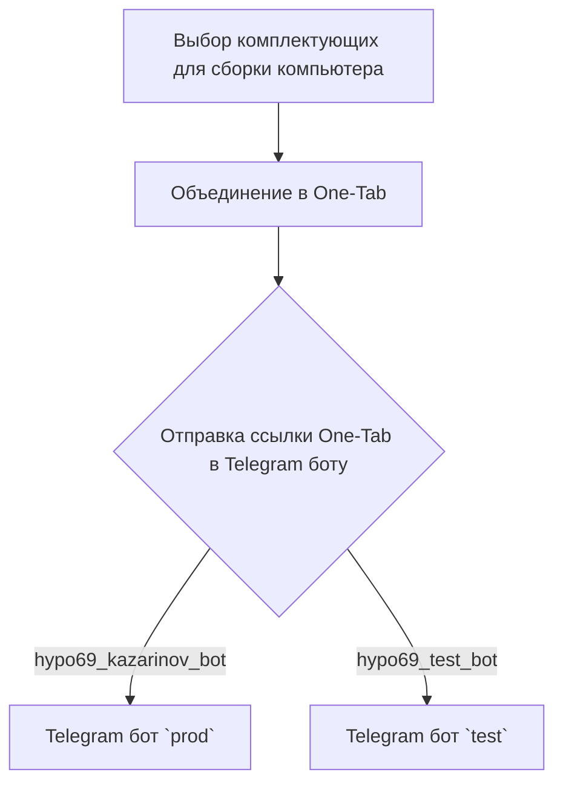
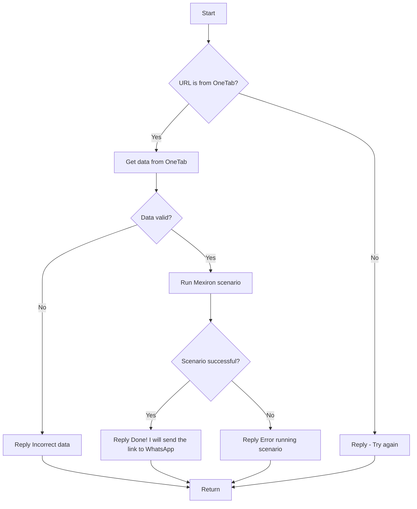

# Анализ кода `src/endpoints/kazarinov/readme.ru.md`

## 1. <алгоритм>

**Описание рабочего процесса:**

Этот файл `readme.ru.md` описывает логику работы бота для создания прайс-листа для магазина "Казаринов". Процесс можно разделить на две части: клиентская и серверная (кодовая) стороны.

**Клиентская сторона:**

1.  **Сборка комплектующих:** Пользователь выбирает комплектующие для компьютера на сайтах (например, указанных: `one-tab.co.il`, `morlevi.co.il` и др.)
    *   Пример: Пользователь добавляет в корзину на сайте `ksp.co.il` материнскую плату, процессор и видеокарту.
2.  **Объединение в One-Tab:** Пользователь использует расширение One-Tab для объединения всех вкладок с выбранными комплектующими в одну ссылку.
    *   Пример: Пользователь нажимает на кнопку One-Tab, и все открытые вкладки с комплектующими сохраняются в виде одной ссылки.
3.  **Отправка ссылки в Telegram бот:** Пользователь отправляет сгенерированную ссылку One-Tab боту через Telegram.
    *   Пример: Пользователь отправляет ссылку `https://one-tab.co.il/XXXXXXXX` боту `hypo69_kazarinov_bot` или `hypo69_test_bot`
4.  **Telegram бот:** Сообщение переходит в бот `prod` или `test`  в зависимости от отправителя.
    *   Пример: Сообщение отправляется в `prod` бота, если пользователь использует `hypo69_kazarinov_bot`,  иначе в `test` бота, если используется `hypo69_test_bot`.

**Кодовая (серверная) сторона:**

1.  **Обработка сообщения:** Функция `kazarinov_bot.handle_message()` принимает сообщение от бота Telegram.
2.  **Проверка URL:** Проверяется, является ли URL ссылкой One-Tab.
    *   Пример: Если URL начинается с `https://one-tab.co.il/`, проверка проходит.
3.  **Получение данных из One-Tab:**  Если URL является ссылкой One-Tab, данные извлекаются.
    *   Пример: Извлекается информация о вкладках и их URL с помощью `one-tab` API.
4.  **Валидация данных:** Проверяется корректность извлеченных данных.
    *   Пример: Проверка наличия необходимых полей в данных, таких как URL-адреса товаров.
5.  **Запуск сценария:** Если данные корректны, запускается сценарий `kazarinov.scenarios.run_scenario()`.
    *   Пример: Вызывается функция для формирования прайс-листа на основе данных о товарах.
6.  **Результат сценария:** Проверяется, успешно ли выполнился сценарий.
7.  **Ответ пользователю:**
    *   В случае успеха, отправляется сообщение "Done! I will send the link to WhatsApp" (будет отправлена в WhatsApp).
    *   В случае ошибки, отправляется сообщение "Error running scenario".
    *   В случае некорректного URL или данных, отправляется сообщение "Try again" или "Incorrect data".
8.  **Возврат:** Функция завершает работу.

## 2. <mermaid>

**Диаграмма клиентской стороны:**



**Диаграмма серверной стороны:**



**Анализ зависимостей:**

*   **Клиентская сторона:**
    *   `One-Tab` - стороннее расширение для браузера, используется для объединения вкладок.
    *   `Telegram` - мессенджер, через который пользователь отправляет ссылку боту.
    *   `hypo69_kazarinov_bot` и `hypo69_test_bot` - Telegram боты, которые принимают ссылки.
*   **Серверная сторона:**
    *   `kazarinov_bot.handle_message()` - функция в коде бота, обрабатывает сообщения.
    *   `kazarinov.scenarios.run_scenario()` - функция, выполняющая логику создания прайс-листа.
    *   Логика проверки URL на принадлежность One-Tab.
    *   Логика извлечения данных из One-Tab.
    *   Логика валидации данных.
    *   Логика отправки ответов пользователю.

## 3. <объяснение>

**Импорты:**

В данном файле нет импортов, поскольку это `README.md` файл, а не код Python. Однако, анализ подразумевает, что `kazarinov_bot` и `scenarios` – это модули внутри проекта `src`, которые будут импортированы в соответствующих файлах.

**Классы:**

В файле `readme.ru.md`  классы не описаны напрямую. Предполагается, что `kazarinov_bot` представляет собой класс или модуль, который обрабатывает входящие сообщения от Telegram. Также, подразумевается, что в модуле `scenarios` есть класс или функция, которая выполняет сценарий генерации прайс-листа.

**Функции:**

*   `kazarinov_bot.handle_message()`:
    *   **Аргументы:** Сообщение от Telegram бота (текст, содержащий ссылку One-Tab).
    *   **Возвращаемое значение:** Неявное. Функция отправляет ответное сообщение пользователю в Telegram и может инициировать отправку ссылки в WhatsApp.
    *   **Назначение:** Обрабатывает входящие сообщения, проверяет URL, получает данные из One-Tab, запускает сценарий и отправляет ответ пользователю.
    *   **Пример:**
        ```
        Сообщение: "Привет! Вот ссылка https://one-tab.co.il/XXXXXXXX"
        Вызов функции: kazarinov_bot.handle_message(message)
        ```

*   `kazarinov.scenarios.run_scenario()`:
    *   **Аргументы:** Данные, полученные из One-Tab.
    *   **Возвращаемое значение:** Bool или иной тип, указывающий на успех или неудачу сценария.
    *   **Назначение:** Выполняет основной сценарий формирования прайс-листа на основе полученных данных.
    *   **Пример:**
        ```
        Данные: { "tabs": [ {"url": "https://ksp.co.il/item/12345"} ,{"url": "https://www.ivory.co.il/item/67890"} ]}
        Вызов функции: kazarinov.scenarios.run_scenario(data)
        ```

**Переменные:**

В `readme.ru.md` переменные явно не определены. Однако, неявно используются:

*   `URL`: Строка, содержащая ссылку на One-Tab.
*   `data`: Словарь или JSON, содержащий данные, извлеченные из One-Tab.

**Потенциальные ошибки и области для улучшения:**

1.  **Обработка ошибок:** В схеме не описана подробная обработка исключений в процессе получения и обработки данных. Например, могут возникнуть ошибки при запросе данных с сайтов, неверном формате данных One-Tab, ошибках при выполнении сценария.
2.  **Валидация данных:** В схеме есть общая валидация, но нет подробностей о том, какие конкретные проверки выполняются. Важно проверять наличие необходимых полей, форматы данных, корректность ссылок и т.д.
3.  **Асинхронность:** При работе с внешними ресурсами желательно использовать асинхронные запросы для избежания блокировки основного потока.
4.  **Логирование:** Не хватает логирования для отслеживания ошибок, успешных операций и отладки.
5.  **WhatsApp:** Сообщение о отправке ссылки в WhatsApp, но нет подробностей о реализации. Как отправлять сообщение в WhatsApp и какие могут быть проблемы.

**Взаимосвязи с другими частями проекта:**

*   `kazarinov_bot` зависит от:
    *   API Telegram для получения и отправки сообщений.
    *   Логики обработки сообщений.
    *   `kazarinov.scenarios` для запуска сценария формирования прайс-листа.
*   `kazarinov.scenarios` зависит от:
    *   Структуры данных, полученных из One-Tab.
    *   Логики формирования прайс-листа.
    *   Возможно, от API других сайтов, если необходимо получать дополнительные данные о товарах.

**Дополнительно:**

В `readme.ru.md` имеются ссылки на другие файлы (`kazarinov_bot.ru.md` и `scenarios/readme.ru.md`), что позволяет понять, что это части единой системы. Для понимания полной картины необходимо проанализировать также эти файлы.