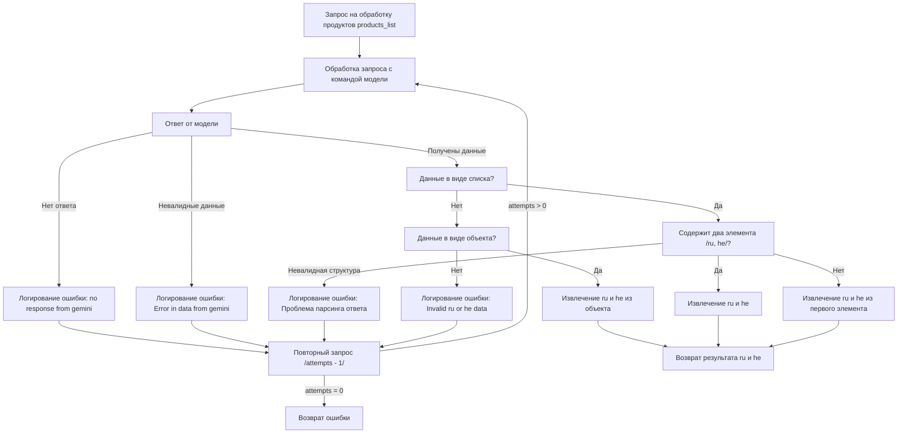

## Анализ кода `mermaid` диаграммы

### 1. <алгоритм>

**Блок-схема обработки запроса продуктов:**

1. **Начало:** Получение запроса на обработку списка продуктов (`products_list`).
   * _Пример:_ `products_list` содержит список ID продуктов, которые нужно обработать.
2. **Обработка запроса с командой модели:** Запрос отправляется модели для обработки, с командой, специфичной для модели.
   * _Пример:_ Отправка запроса в Gemini с текстом для перевода и указанием целевых языков `ru` и `he`.
3. **Ответ от модели:** Получение ответа от модели.
    * _Пример:_ Ответ в виде строки JSON или списка с переводами.
4. **Проверка на отсутствие ответа:** Проверка, был ли получен ответ от модели.
   * Если нет ответа, то переход к логированию ошибки.
     * _Пример:_ Ответ от модели равен null или пустой строке.
5. **Логирование ошибки "no response from gemini":** Логирование ошибки отсутствия ответа от модели.
    * _Пример:_ Запись в лог "Ошибка: нет ответа от Gemini".
6. **Повторный запрос:** Вычитание единицы из счетчика попыток `attempts` и повторный запрос, если `attempts > 0`.
    * _Пример:_ Попытка повторно отправить запрос модели если максимальное количество попыток не израсходовано.
7. **Проверка на валидность данных:** Проверка, являются ли полученные данные валидными, например, в формате, ожидаемом от модели.
   * Если данные не валидны, то переход к логированию ошибки.
     * _Пример:_ JSON парсинг возвращает ошибку.
8. **Логирование ошибки "Error in data from gemini":** Логирование ошибки, связанной с невалидными данными от модели.
    * _Пример:_ Запись в лог "Ошибка: невалидные данные от Gemini".
9. **Проверка на полученные данные:** Проверка, получены ли данные после проверок.
   * Если данные есть, то переход к проверке их типа.
10. **Проверка типа данных: Список?** Проверка, являются ли данные списком.
    * Если да, то переход к проверке списка на наличие двух элементов.
        * _Пример:_ Ответ `['русский текст', 'ивритский текст']`
11. **Проверка списка на наличие двух элементов:** Проверка, содержит ли список два элемента.
    * Если да (элементы являются `ru` и `he`), то переход к извлечению элементов.
    * Если нет, то переход к извлечению элементов из первого элемента.
12.  **Извлечение ru и he:** Извлечение элементов `ru` и `he` из списка.
      * _Пример_: ru = "русский текст"; he = "ивритский текст"
13.  **Извлечение ru и he из первого элемента:** Если список не содержит два элемента, то попытаться извлечь данные `ru` и `he` из первого элемента.
    * _Пример_: извлечение ru и he из первого элемента списка `[{'ru': 'русский текст', 'he': 'ивритский текст'}]`
14. **Проверка на невалидную структуру:** Если структура данных списка не соответствует ожидаемой, то переход к логированию ошибки.
      * _Пример_: Ответ `[ {'en': 'english text'}]`
15. **Логирование ошибки "Проблема парсинга ответа":** Логирование ошибки, связанной с проблемой парсинга ответа.
    * _Пример_: Запись в лог "Ошибка: проблема парсинга ответа от Gemini".
16. **Проверка типа данных: Объект?** Проверка, являются ли данные объектом.
     * Если да, то переход к извлечению элементов из объекта.
        * _Пример:_ Ответ `{'ru': 'русский текст', 'he': 'ивритский текст'}`
17. **Извлечение ru и he из объекта:** Извлечение элементов `ru` и `he` из объекта.
     * _Пример_: ru = "русский текст"; he = "ивритский текст"
18. **Логирование ошибки "Invalid ru or he data":** Логирование ошибки, связанной с неверными данными `ru` и `he`.
    * _Пример:_ Запись в лог "Ошибка: неверные данные ru или he от Gemini".
19. **Возврат результата ru и he:** Возврат результатов `ru` и `he`.
     * _Пример_: Результат, который возвращает функция `(ru="русский текст", he="ивритский текст")`.

### 2. <mermaid>

**Объяснение диаграммы `mermaid`:**

*   **`Request`**: Начальная точка, представляющая запрос на обработку списка продуктов.
*   **`ProcessRequest`**: Обработка запроса путем отправки команды модели.
*   **`ModelResponse`**: Ответ, полученный от модели.
*   **`LogNoResponse`**: Логирование ошибки, если нет ответа от модели.
*   **`RetryRequest`**: Повторная отправка запроса с уменьшением счетчика попыток.
*  **`LogInvalidData`**: Логирование ошибки, если данные ответа не валидны.
*   **`CheckList`**: Проверка, являются ли данные списком.
*   **`CheckListLength`**: Проверка, содержит ли список два элемента.
*  **`ExtractListItems`**: Извлечение элементов `ru` и `he` из списка.
*   **`ExtractFirstItem`**: Извлечение `ru` и `he` из первого элемента списка.
*   **`LogParsingError`**: Логирование ошибки, связанной с проблемой парсинга ответа.
*   **`CheckObject`**: Проверка, являются ли данные объектом.
*   **`ExtractObjectItems`**: Извлечение `ru` и `he` из объекта.
*   **`LogInvalidRuHe`**: Логирование ошибки, если данные `ru` или `he` не валидны.
*   **`ReturnResult`**: Возвращение результата с `ru` и `he`.
*   **`ReturnError`**: Возвращение ошибки, если все попытки исчерпаны.

**Импорты для диаграммы mermaid:**

Диаграмма не имеет импортов, так как это графическое представление логики, а не исполняемый код.

### 3. <объяснение>

**Импорты:**

*   В данном фрагменте кода импортов нет. Код является описанием логики в виде диаграммы, и не взаимодействует непосредственно с другими частями проекта.

**Классы:**

*   В этом коде нет классов, поскольку это диаграмма, а не код.

**Функции:**

*   В этом коде нет функций. Это графическое представление логики, а не исполняемый код.

**Переменные:**

*   В коде `mermaid` используются только переменные, представляющие этапы обработки. Они имеют описательные названия и не являются типичными переменными программирования.
    *   `products_list`: Список продуктов для обработки.
    *   `ModelResponse`: Ответ модели.
    *   `attempts`: Счетчик попыток переотправки запроса.
    *   `ru`: Перевод на русский.
    *   `he`: Перевод на иврит.

**Объяснение функциональности:**

Диаграмма описывает процесс получения перевода на `ru` и `he` для заданного `products_list` используя некую модель. Последовательность действий включает отправку запроса, обработку ответа (с проверкой на ошибки) и возвращение полученных данных. Основные шаги:

1.  **Получение запроса:**  Обрабатывается запрос на основе `products_list`.
2.  **Отправка запроса:** Запрос отправляется модели.
3.  **Обработка ответа:**
    *   Проверяется, был ли получен ответ. Если нет, логируется ошибка и запрос повторяется.
    *   Проверяется, является ли ответ валидным. Если нет, логируется ошибка и запрос повторяется.
    *   Если данные валидные, проверяется их тип: список или объект.
    *   В зависимости от типа данных, происходит извлечение `ru` и `he`.
    *   В случае ошибок, связанных с форматом или структурой данных, выводятся сообщения об ошибках, и запрос повторяется.
4.  **Возврат результата:** Возвращаются переводы на `ru` и `he` или ошибка, если не удалось их получить.

**Потенциальные ошибки и области для улучшения:**

1.  **Обработка ошибок:** В случае многократных ошибок, логика повторного запроса ограничена. Возможно, стоит добавить логику ожидания перед повторным запросом, чтобы избежать перегрузки модели.
2.  **Логирование:** Логирование ошибок может быть улучшено добавлением контекстной информации, например, идентификатора запроса или времени.
3.  **Формат ответа:** Код предполагает, что ответ от модели может быть либо списком, либо объектом. Может потребоваться дополнительная обработка в случае других форматов.
4.  **Проверка валидности данных:** Можно добавить более детальные проверки валидности данных, например, проверку наличия полей `ru` и `he` в объекте.

**Взаимосвязь с другими частями проекта:**

Этот фрагмент кода (в виде диаграммы) является частью процесса обработки запросов к модели (вероятно, Gemini). Он может быть связан с другими частями проекта, которые инициируют запросы на обработку продуктов и используют полученные переводы. Например, это может быть часть системы, которая занимается локализацией контента.

В целом, диаграмма представляет логику обработки данных в понятном виде, позволяя легко понять последовательность операций и потенциальные проблемы, которые могут возникнуть при работе с моделью.