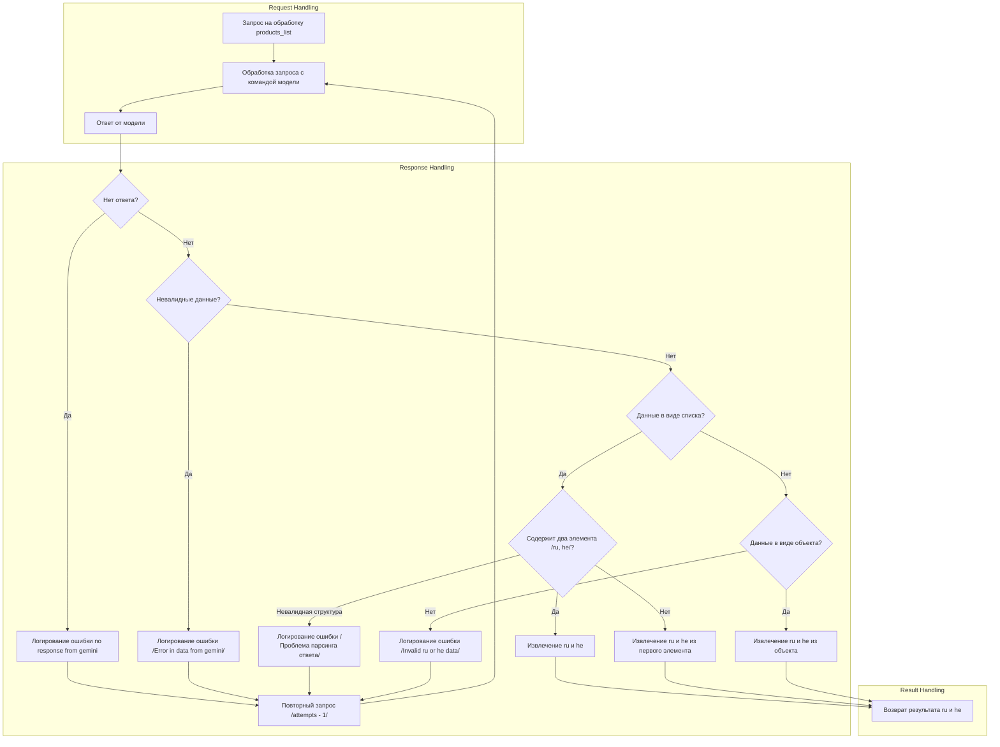

## Анализ кода:

### 1. <алгоритм>

**Блок-схема:**

1. **Начало**: Получен запрос на обработку списка продуктов `products_list`.

2. **Обработка запроса с моделью**: Запрос передается в модель (например, Gemini) для обработки.
   * _Пример_: `products_list = ["apple", "banana", "orange"]` передается модели для перевода или обработки.

3. **Ответ от модели**: Получен ответ от модели.

4. **Проверка на отсутствие ответа**:
   *  _Пример_: Если модель не вернула ответа, логируется ошибка `no response from gemini`.
   *   *Переход:* Если ответа нет, выполняется повторный запрос с уменьшением счетчика попыток.

5. **Проверка на валидность данных**:
    * _Пример_: Если модель вернула ответ в неправильном формате, например, пустую строку или null, логируется ошибка `Error in data from gemini`.
    *   *Переход:* Если данные невалидны, выполняется повторный запрос.

6. **Проверка на тип полученных данных**: Если ответ получен, проверяется, являются ли данные списком.
   * _Пример_: `response = [["ru", "he"], ["apple", "תפוח"]].`

7. **Если данные - список**:
   *   **Проверка на два элемента**: Проверяется, содержит ли список два элемента.
       * _Пример_: `response = [["ru", "he"], ["apple", "תפוח"]].`
       *   *Переход:* Если два элемента есть, то переходим к извлечению `ru` и `he`.
       *   *Пример:* `response = [["ru", "he"]].`
       *   *Переход:* Если элементов меньше или больше двух, то переходим к извлечению `ru` и `he` из первого элемента.
       *   _Пример_: `response = [["ru", "he", "en"]].`
       *   *Переход:* Если структура невалидная, логируется ошибка `Проблема парсинга ответа` и выполняется повторный запрос.

8. **Если данные - не список**:
    *   **Проверка на объект**: Проверяется, являются ли данные объектом.
       *   *Пример:* `response = {"ru": "яблоко", "he": "תפוח"}.`
       *   *Переход:* Если это объект, извлекаются `ru` и `he`.
       * _Пример_: `response = "невалидные данные"`
       *   *Переход:* Если не является объектом, логируется ошибка `Invalid ru or he data` и выполняется повторный запрос.

9. **Извлечение ru и he**:
    *   Из списка с двумя элементами извлекаются `ru` и `he`
    *   Из первого элемента списка извлекаются `ru` и `he`.
    *   Из объекта извлекаются `ru` и `he`.

10. **Возврат результата**: Возвращаются извлеченные `ru` и `he`.

### 2. <mermaid>

**Объяснение зависимостей `mermaid`:**

- `request`: Начальная точка, представляющая входящий запрос на обработку списка продуктов.
- `processRequest`: Представляет процесс отправки запроса в модель.
- `modelResponse`: Ответ полученный от модели.
- `checkNoResponse`: Условный блок, проверяющий наличие ответа от модели.
- `logNoResponse`: Блок, регистрирующий ошибку в случае отсутствия ответа.
- `retryRequest`: Блок, инициирующий повторный запрос.
- `checkValidData`: Условный блок, проверяющий валидность данных.
- `logInvalidData`: Блок, регистрирующий ошибку в случае невалидных данных.
- `checkList`: Условный блок, проверяющий, является ли ответ списком.
- `checkTwoElements`: Условный блок, проверяющий, содержит ли список два элемента.
- `extractRuHeList`: Блок, извлекающий `ru` и `he` из списка с двумя элементами.
- `extractRuHeFromFirstElement`: Блок, извлекающий `ru` и `he` из первого элемента списка.
- `logParseError`: Блок, регистрирующий ошибку парсинга ответа.
- `checkObject`: Условный блок, проверяющий, является ли ответ объектом.
- `extractRuHeObject`: Блок, извлекающий `ru` и `he` из объекта.
- `logInvalidFormat`: Блок, регистрирующий ошибку, если данные не в формате списка или объекта.
- `returnResult`: Блок, возвращающий извлеченные `ru` и `he`.

### 3. <объяснение>

**Импорты:**
- В предоставленном коде нет импортов, так как это `mermaid` диаграмма. Однако, при реализации, скорее всего, потребуются импорты для работы с моделями обработки языка (например, Gemini), логированием и т.д. Предположим, что код, использующий эту логику, может импортировать:
    -  `src.models.gemini_model`: для взаимодействия с моделью Gemini
    - `src.utils.logger`: для логирования ошибок
    - `src.utils.data_parser`: для парсинга данных
  
**Классы:**
- В предоставленной диаграмме нет классов, но при реализации, вероятно, будет класс, который инкапсулирует логику обработки запроса, например `ProductProcessor`. Он может иметь атрибуты, такие как:
  - `model`: экземпляр модели обработки (например, `gemini_model`)
  - `logger`: экземпляр логгера
  - `max_attempts`: максимальное количество повторных попыток

**Функции:**
- В диаграмме также нет функций, но они будут в реализации. Примеры функций:
  - `process_products(products_list)`:
    -   Аргумент: `products_list` (список продуктов)
    -   Возвращаемое значение: словарь или список, содержащий `ru` и `he` переводы для каждого продукта
    -   Назначение: обрабатывает запрос для списка продуктов, вызывает модель и возвращает результат.
  - `_send_request_to_model(products_list, attempt)`:
    -   Аргументы: `products_list` (список продуктов), `attempt` (текущая попытка запроса)
    -   Возвращаемое значение: ответ от модели или `None` в случае ошибки.
    -   Назначение: отправляет запрос в модель обработки.
  -  `_extract_ru_he(response)`:
    -   Аргумент: `response` - ответ от модели
    -   Возвращаемое значение: кортеж (ru, he)
    -  Назначение: анализирует ответ и извлекает `ru` и `he` данные.
  - `_log_error(message)`:
    -   Аргумент: `message` (сообщение об ошибке)
    -   Возвращаемое значение: `None`
    -   Назначение: логирует ошибки.

**Переменные:**
- `products_list`: список продуктов для обработки.
- `response`: ответ от модели.
- `ru`: перевод на русский язык.
- `he`: перевод на иврит.
- `attempts`: количество оставшихся попыток повторного запроса.
- `max_attempts`: максимальное количество попыток.
- `message`: сообщение об ошибке, которое будет записано в лог.

**Потенциальные ошибки и области для улучшения:**
-  **Обработка ошибок**: Обработка ошибок выполняется через повторные запросы, но нет механизма отслеживания или предотвращения бесконечных повторов в случае постоянных проблем. Можно добавить лимит попыток и, если все попытки исчерпаны, возвращать ошибку или обрабатывать ее иначе.
- **Тип возвращаемых данных от модели**:  Требуется более строгая спецификация формата возвращаемых данных от модели. Валидация данных сейчас делается на основе проверок "является ли списком" или "является ли объектом". Лучше задать конкретную схему для ответа и валидировать данные по ней.
-  **Логирование**: Сейчас ошибки просто логируются, но нет механизма для уведомления о критических ошибках или сбора статистики по ним.
-  **Гибкость**: Логика обработки ответа (список или объект) жестко задана. Можно добавить более гибкий механизм, позволяющий обрабатывать различные типы ответов, возможно с помощью конфигурации или стратегий.
- **Производительность**: Многократные повторные запросы могут замедлить процесс. Можно рассмотреть использование кеширования результатов и/или асинхронную обработку запросов для ускорения.

**Цепочка взаимосвязей с другими частями проекта:**

1.  **Запрос**: Запросы (например, HTTP запросы) с данными о продуктах поступают в endpoint `src/endpoints/kazarinov/scenarios`.
2.  **Обработка**:  В  `src/endpoints/kazarinov/scenarios` вызывается  `ProductProcessor`, который  использует модель `src/models/gemini_model` для обработки данных.
3.  **Логирование**: Ошибки логируются с помощью `src/utils.logger`, а результаты обрабатываются `src/utils.data_parser`.
4.  **Ответ**: `ProductProcessor` возвращает обработанные данные в `src/endpoints/kazarinov/scenarios`, которые затем отправляются обратно в качестве ответа на запрос.

Этот анализ предоставляет подробное объяснение представленного кода и его взаимосвязей с другими частями проекта.