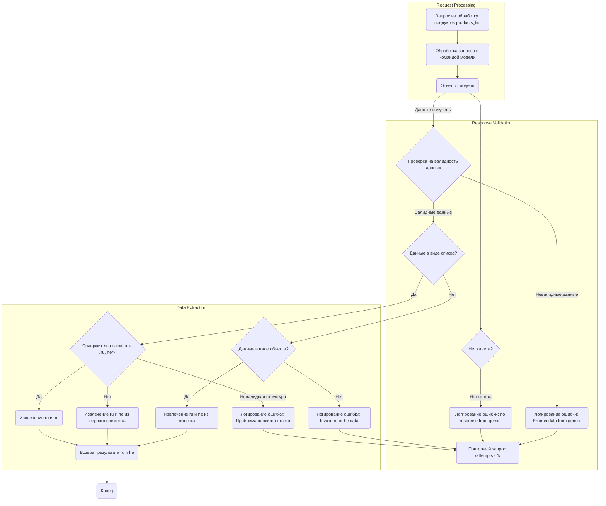

## Анализ кода и его объяснение

### <алгоритм>

1.  **Начало:** Получен запрос на обработку списка продуктов `products_list`.
    *   _Пример_: Запрос с данными о продуктах, которые нужно перевести.
2.  **Обработка запроса:** Запрос передается в модель для обработки.
    *   _Пример_: Запрос отправляется в API языковой модели для перевода или генерации текста.
3.  **Получение ответа от модели:** Получается ответ от модели.
    *   _Пример_: Ответ от языковой модели в виде JSON или текстовой строки.
4.  **Проверка на отсутствие ответа:** Проверяется, был ли получен ответ от модели.
    *   _Пример_: Если ответ пустой или `None`.
5.  **Логирование ошибки (нет ответа):** Если нет ответа, логируется ошибка "no response from gemini".
    *   _Пример_: В лог записывается сообщение об отсутствии ответа, чтобы отследить проблемы с моделью.
6.  **Повторный запрос:** Если нет ответа, делается попытка повторного запроса (с уменьшением счетчика попыток).
    *   _Пример_: Повторный запрос отправляется с обновленным счетчиком `attempts - 1`.
7.  **Проверка на валидность данных:** Проверяется, является ли ответ от модели валидными данными.
    *   _Пример_: Проверка формата данных на соответствие ожидаемой структуре (например, JSON).
8.  **Логирование ошибки (невалидные данные):** Если данные невалидны, логируется ошибка "Error in data from gemini".
    *   _Пример_: В лог записывается сообщение об ошибке валидации, указывающее на проблему с форматом ответа модели.
9.  **Проверка на полученные данные:** Если данные валидны, проверяется, являются ли они списком.
    *   _Пример_: Проверка, что `data` это `list` (например `[{"ru": "text", "he": "text"}]`)
10. **Проверка структуры списка:** Если данные - список, проверяется, содержит ли он два элемента (ru, he).
    *   _Пример_: Проверка, что список `list` имеет два элемента, каждый из которых содержит поля "ru" и "he".
11. **Извлечение ru и he:** Если структура списка правильная, извлекаются значения для `ru` и `he`.
    *   _Пример_: `ru_text = list[0]["ru"]`, `he_text = list[1]["he"]`
12. **Извлечение ru и he из первого элемента:** Если список содержит один элемент, извлекаются значения `ru` и `he` из первого элемента.
     *   _Пример_: `ru_text = list[0]["ru"]`, `he_text = list[0]["he"]`
13. **Логирование ошибки (проблема парсинга ответа):** Если структура не валидна (не является списком с одним или двумя элементами), логируется ошибка "Проблема парсинга ответа".
      *   _Пример_: В лог записывается сообщение об ошибке парсинга, если структура данных не соответствует ожидаемой.
14. **Проверка на объект:** Если данные не список, проверяется, являются ли они объектом (словарем).
      *   _Пример_: Проверка, что `data` это `dict` (например: `{"ru": "text", "he": "text"}`)
15. **Извлечение ru и he из объекта:** Если данные - объект, извлекаются значения `ru` и `he`.
      *   _Пример_: `ru_text = data["ru"]`, `he_text = data["he"]`
16. **Логирование ошибки (Invalid ru or he data):** Если данные не соответствуют ожидаемой структуре (не список и не объект), логируется ошибка "Invalid ru or he data".
      *   _Пример_: В лог записывается сообщение об ошибке, если данные не имеют ожидаемого формата.
17. **Возврат результата:** Возвращаются извлеченные значения `ru` и `he`.
      *   _Пример_: Возвращается объект, содержащий текст на `ru` и `he`.

### <mermaid>

### <объяснение>

**Общее описание:**

Представленный код описывает процесс обработки ответа от языковой модели после отправки запроса на обработку списка продуктов. Он включает в себя проверку валидности ответа, извлечение данных о переводах на языки `ru` (русский) и `he` (иврит), а также логирование ошибок при возникновении проблем.

**Разбор блоков:**

1.  **`Request Processing`:**
    *   `Start`: Начальная точка процесса, где принимается запрос на обработку продуктов.
    *   `ProcessRequest`: Отправляет запрос на обработку данных в языковую модель.
    *   `ModelResponse`: Получение ответа от языковой модели.

2.  **`Response Validation`:**
    *   `ModelResponse`: Полученный ответ от модели.
    *   `NoResponseCheck`: Проверяет наличие ответа от модели.
        *   Если ответ отсутствует, переход к `LogNoResponse`.
    *   `LogNoResponse`: Регистрирует ошибку отсутствия ответа.
    *   `RetryRequest`: Переход к повторной отправке запроса.
    *   `ValidateData`: Проверяет, являются ли данные валидными.
         *   Если данные невалидны, переход к `LogInvalidData`
    *   `LogInvalidData`: Регистрирует ошибку, если данные невалидны.
    *   `CheckDataFormat`: Проверяет, являются ли данные списком.

3.  **`Data Extraction`:**
    *   `CheckDataFormat`: Проверяет, являются ли данные списком.
         *   Если это список, то переход к `CheckListStructure`.
         *   Если нет, то переход к `CheckDataObject`
    *   `CheckListStructure`: Проверяет, что список содержит два элемента `ru` и `he`.
        *   Если да, то переход к `ExtractRuHeFromList`.
        *    Если нет, то проверка на один элемент `ExtractRuHeFromFirstElement` или ошибка `LogParseError`
    *   `ExtractRuHeFromList`: Извлекает значения для `ru` и `he` из списка.
    *   `ExtractRuHeFromFirstElement`: Извлекает значения для `ru` и `he` из первого элемента списка.
    *   `LogParseError`: Регистрирует ошибку, если структура списка невалидна.
    *   `CheckDataObject`: Проверяет, являются ли данные объектом.
        *    Если да, то переход к `ExtractRuHeFromObject`.
        *    Если нет, то ошибка `LogInvalidRuHe`
    *   `ExtractRuHeFromObject`: Извлекает значения для `ru` и `he` из объекта.
    *   `LogInvalidRuHe`: Регистрирует ошибку, если данные не имеют ожидаемого формата.
    *   `ReturnResult`: Возвращает извлеченные значения `ru` и `he`.

**Функциональность:**

Код предназначен для обработки ответов от языковой модели и извлечения необходимых данных для перевода. Он включает логику обработки ошибок, таких как отсутствие ответа, невалидные данные или проблемы с форматом ответа.

**Потенциальные ошибки и области для улучшения:**

*   **Повторные запросы:** Код предполагает наличие логики повторных запросов, которая не детализирована в этой блок-схеме. Необходимо убедиться в правильной реализации механизма повторных запросов, чтобы избежать бесконечных циклов.
*   **Обработка ошибок:** Логирование ошибок может быть дополнено контекстной информацией для облегчения отладки.
*   **Формат данных:** Код предполагает, что данные всегда будут представлены либо списком, либо объектом.  Хорошо бы добавить обработку других возможных форматов ответов, если это требуется.
*   **Расширение логики:** Логика извлечения `ru` и `he` может быть расширена для поддержки других языков или для обработки более сложных структур данных.

**Связь с другими частями проекта:**

Данный фрагмент кода, вероятно, является частью более крупной системы, которая использует языковые модели для обработки данных. Он может быть связан с:

*   **Модулями отправки запросов:** Код должен взаимодействовать с модулем, который отправляет запросы в языковую модель.
*   **Модулем логирования:** Для записи ошибок используется модуль логирования.
*   **Модулями обработки данных:** Извлеченные данные могут использоваться другими модулями для дальнейшей обработки (например, для сохранения в базу данных или отображения в пользовательском интерфейсе).