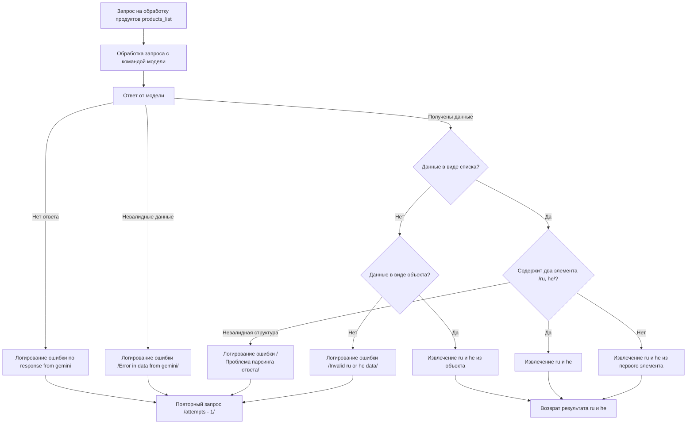

```MD
# Анализ кода

## <input code>



## <algorithm>

Алгоритм описывает обработку запроса на получение данных `ru` и `he` для списка продуктов.  Он проходит следующие шаги:

1. **Запрос на обработку**: Принимается запрос `products_list`.
2. **Обработка запроса с командой модели**: Выполняется обработка запроса с использованием модели (например, LLМ).
3. **Получение ответа от модели**: Модель возвращает ответ.
4. **Проверка на отсутствие ответа**: Если ответа нет, происходит логирование ошибки и повторный запрос.
5. **Проверка на валидность ответа**: Если ответ невалидный, происходит логирование ошибки и повторный запрос.
6. **Проверка типа данных**: Проверяется, является ли ответ списком или объектом.
7. **Обработка списка**: Если ответ - список:
    * Проверяется, содержит ли список два элемента `ru` и `he`.
    * Если содержит, данные извлекаются.
    * Если не содержит, извлекаются `ru` и `he` из первого элемента списка.
    * Если структура невалидна, логируется ошибка и выполняется повторный запрос.
8. **Обработка объекта**: Если ответ - объект, извлекаются значения `ru` и `he`.
9. **Ошибка при извлечении данных**: Если данные не могут быть извлечены, происходит логирование ошибки и выполняется повторный запрос.
10. **Возврат результата**: Полученные данные `ru` и `he` возвращаются.


## <mermaid>

Диаграмма Mermaid демонстрирует последовательность запросов и проверок для получения данных. Она изображает поток данных от начального запроса `products_list` до получения и возвращения данных `ru` и `he`.  Промежуточные проверки на наличие ответа, валидность и тип данных обеспечивают надежность обработки запросов.

## <explanation>

Этот код представляет собой блок-схему алгоритма, а не реализацию на конкретном языке программирования.  В нем описываются логические шаги обработки запроса на получение данных, а не конкретные функции или классы.  

**Импорты**:  Отсутствуют импорты, так как это не код, а диаграмма потоков.

**Классы**: Нет классов.

**Функции**: Нет функций, так как это описание алгоритма, а не код функции.

**Переменные**: Нет переменных.

**Возможные ошибки или улучшения**:

* **Недостающая детализация:** Не указано, как именно происходит обработка запроса с моделью и как происходит извлечение данных `ru` и `he` из ответа.
* **Управление ошибками**: Алгоритм предполагает перехват и обработку ошибок, но не описывает детали реализации механизмов обработки исключений.
* **Повторные запросы**:  Необходимо определить максимальное количество попыток.
* **Поведение при непредвиденных ошибках**:  Описания обработки неожиданных структур данных в ответе модели недостаточно.
* **Зависимости**: Не указаны зависимости от других компонентов проекта, поскольку это просто описание алгоритма.


**Цепочка взаимосвязей с другими частями проекта (если применимо):**

Схема предполагает взаимодействие с моделью (например, Gemini),  которой передается запрос на обработку продуктов и получение информации `ru` и `he`.  Также предполагается логирование ошибок и событий, которые в реальной реализации должны быть частью системы логирования приложения.