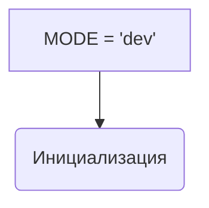

1. **<input code>**

```python
## \file hypotez/src/endpoints/kazarinov/scenarios/__init__.py
# -*- coding: utf-8 -*-\
#! venv/Scripts/python.exe
#! venv/bin/python/python3.12

"""
.. module: src.endpoints.kazarinov.scenarios 
	:platform: Windows, Unix
	:synopsis: Модуль сценария для создания прайлиста.
"""
MODE = 'dev'
```

2. **<algorithm>**

Этот код представляет собой инициализационный файл модуля `scenarios` внутри пакета `kazarinov` в `endpoints` проекта `hypotez`.  Поскольку он содержит только одну строковую переменную `MODE`,  алгоритм работы в данном случае тривиален:

* **Шаг 1:** Определяется переменная `MODE` и присваивается значение `'dev'`.

Нет конкретных действий, связанных с функциями или классами.  Данный файл является скорее метаданными, чем кодом, который непосредственно выполняет какие-либо действия.

3. **<mermaid>**



4. **<explanation>**

* **Импорты:** В этом файле нет импортов. Это инициализационный файл, который не зависит от других модулей, за исключением тех, что импортируются в самих сценариях.

* **Классы:** Нет классов.

* **Функции:** Нет функций.

* **Переменные:**
    * `MODE`: Строковая переменная, которая, скорее всего, определяет режим работы (например, 'dev', 'prod').  Это константа, значение которой может использоваться в других частях кода проекта `hypotez`. Значение `'dev'` говорит, что приложение запущено в режиме разработки.

* **Возможные ошибки и улучшения:**

    * **Нет документации для MODE:**  Необходимо добавить более подробную документацию для переменной `MODE`, например, что означает каждый из возможных режимов ('dev', 'prod', 'test' и т.д.).
    * **Условные ветвления в зависимости от MODE:**  Более полезным было бы использование переменной `MODE` в условных конструкциях (например, `if MODE == 'prod': ...`). Это позволит запускать разные сценарии в зависимости от режима работы. Например, в режиме 'prod' можно было бы отключить дебажные сообщения или использовать другое хранилище данных.
    * **Типизация:** Необходимо указать, что переменная MODE - это строка (например, `MODE: str = 'dev'`), хотя Python и так обрабатывает ее как строку, но явная типизация повысит читаемость и безопасность кода.

* **Взаимосвязи с другими частями проекта:**

    Этот файл, скорее всего, является частью более крупного проекта, где другие сценарии, находящиеся в `src.endpoints.kazarinov.scenarios`, будут использовать переменную `MODE` для управления своими действиями.  Например, в сценариях можно будет загружать различные конфигурации в зависимости от режима (`dev`, `prod`) или использовать разные базы данных.


В целом, файл `__init__.py` в данном случае является простым, но важным элементом структуры проекта, обеспечивающим возможность использования общего значения `MODE` в других модулях.  Добавление более расширенной логики, основанной на `MODE`, существенно расширит функциональность этого модуля.