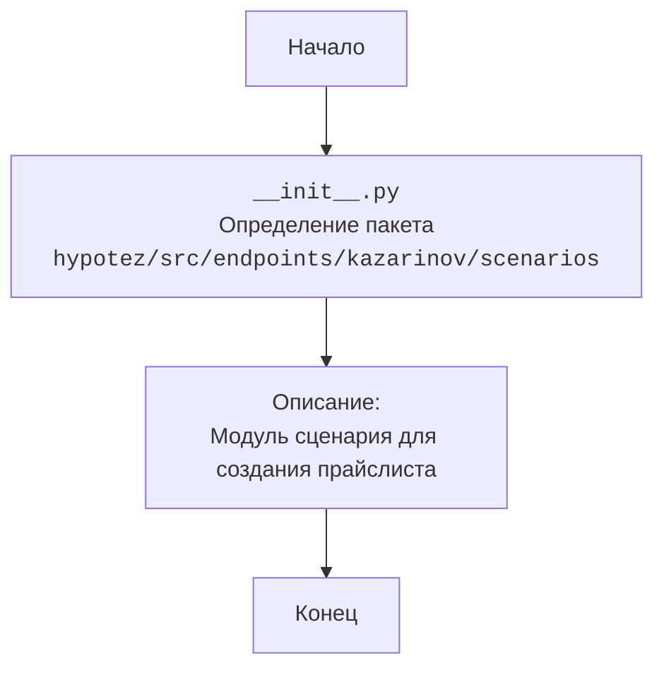

## АНАЛИЗ КОДА: `hypotez/src/endpoints/kazarinov/scenarios/__init__.py`

### <алгоритм>
1. **Начало:** Файл `__init__.py` в директории `hypotez/src/endpoints/kazarinov/scenarios`.
2. **Импорт:** В данном файле нет явных импортов. Это `__init__.py` файл, который нужен для обозначения директории `hypotez/src/endpoints/kazarinov/scenarios` как пакета Python.
3. **Документация модуля:** Присутствует docstring, описывающий модуль, его платформы и назначение.
4. **Конец:** Завершение выполнения файла.

### <mermaid>

### <объяснение>
#### Импорты:
- В данном файле `__init__.py` нет явных импортов. Файл `__init__.py` делает директорию пакетом, обеспечивая возможность импорта других модулей из этой директории.
- **Взаимосвязь с `src`**: Файл является частью более крупной структуры пакета `src`. Внутри пакета `src` этот файл является частью подпакета `endpoints`, затем подпакета `kazarinov`, затем `scenarios`. Он позволяет Python интерпретировать содержимое каталога `scenarios` как пакет.

#### Классы:
- В данном файле классы не определены.

#### Функции:
- В данном файле функции не определены.

#### Переменные:
- В файле переменные не используются.

#### Особенности:
1.  **`__init__.py`**:  Файл  `__init__.py`  в Python используется для того, чтобы интерпретатор Python воспринимал директорию как пакет. Может быть пустым, как в данном случае, или содержать код инициализации пакета.
2.  **Docstring**: Наличие `docstring` улучшает читаемость кода и позволяет использовать инструменты для автоматического создания документации.
3.  **Shebang**: Первые две строки - Shebang - указывают на интерпретаторы Python для Windows и Unix-систем. Они полезны для запуска скрипта как исполняемого файла.
4.  **Роль**: Файл `__init__.py`  в  `scenarios`  пакете делает все файлы в этой директории доступными для импорта в других частях проекта. Это позволяет использовать сценарии внутри пакета `kazarinov`.

#### Потенциальные ошибки или области для улучшения:
1.  **Отсутствие кода:**  Файл пока не содержит фактического кода, что делает его текущую роль только декларативной. По мере развития проекта в него могут быть добавлены функции, классы или переменные.
2.  **Будущая функциональность:**  Из docstring ясно, что этот модуль будет связан с созданием прайс-листов, поэтому будущие изменения должны будут отразить эту функциональность.

#### Цепочка взаимосвязей:
- Этот файл `__init__.py` лежит в директории `hypotez/src/endpoints/kazarinov/scenarios`, что делает все файлы в этой директории доступными для импорта в других частях проекта, например, из  `hypotez/src/endpoints/kazarinov/__init__.py`, `hypotez/src/endpoints/__init__.py` или  `hypotez/src/__init__.py`.