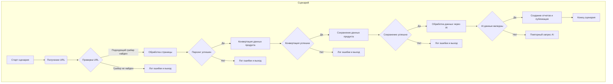

1. <input code>
```graph TD
    A[Старт сценария] -->|Получение URL| B[Проверка URL]
    B -->|Подходящий грабер найден| C[Обработка страницы]
    B -->|Грабер не найден| D[Лог ошибки и выход]
    C -->|Парсинг успешен| E[Конвертация данных продукта]
    C -->|Парсинг не удался| F[Лог ошибки и выход]
    E -->|Конвертация успешна| G[Сохранение данных продукта]
    E -->|Ошибка конвертации| H[Лог ошибки и выход]
    G -->|Сохранение успешно| I[Обработка данных через AI]
    G -->|Ошибка сохранения| J[Лог ошибки и выход]
    I -->|AI данные валидны| K[Создание отчетов и публикация]
    I -->|Ошибка AI данных| L[Повторный запрос AI]
    K --> M[Конец сценария]
```

2. <algorithm>
**Шаг 1**: Старт сценария.
**Шаг 2**: Получение URL (из файла конфигурации или другого источника).
**Шаг 3**: Проверка URL: проверяется, существует ли подходящий грабер (например, библиотека для парсинга веб-страниц) для данного URL.  
     * Пример: Если URL соответствует шаблону `https://example.com/pricelist`, используется грабер `pricelist_grabber`.
     * Если подходящего грабера нет, логируется ошибка и происходит выход из сценария.
**Шаг 4**: Обработка страницы: Запрос страницы по полученному URL с помощью выбранного грабера.
     * Пример: Если грабер `pricelist_grabber` выбран, он выполняет запрос на `https://example.com/pricelist` и возвращает HTML-код.
**Шаг 5**: Парсинг страницы: Извлечение данных продукта из HTML страницы.
     * Пример:  Парсер извлекает информацию о наименовании продукта, цене, описании из HTML-кода.
     * Если парсинг не удался, логируется ошибка и выход из сценария.
**Шаг 6**: Конвертация данных продукта: Преобразование полученных данных в требуемый формат.
     * Пример: Преобразование из формата HTML в структурированный формат JSON.
     * Если конвертация не успешна, логируется ошибка и выход из сценария.
**Шаг 7**: Сохранение данных продукта: Сохранение преобразованных данных в базу данных или файл.
     * Пример: Сохранение данных продукта в таблицу `products`.
     * Если сохранение не удалось, логируется ошибка и выход из сценария.
**Шаг 8**: Обработка данных через AI:  Применение AI модели (например, для анализа цен, прогнозирования или других задач).
     * Пример: Модель анализирует данные о ценах и вычисляет среднюю цену.
     * Если данные AI не валидны, происходит повторный запрос к AI.
**Шаг 9**: Создание отчетов и публикация:  Формирование отчетов на основе обработанных данных и их публикация.
     * Пример: Создание отчета о ценах на продукты.
**Шаг 10**: Конец сценария.


3. <mermaid>

**Объяснение диаграммы:** Диаграмма отображает последовательность действий сценария. Подключаемые зависимости (например, библиотеки граберов, парсеров, AI-моделей) не показаны, но подразумеваются.


4. <explanation>
**Импорты**:
Код не содержит импортов, так как это блок-схема, а не код на конкретном языке программирования.  В реальной реализации будут импортироваться необходимые библиотеки (например, для парсинга, работы с базами данных, работы с AI).

**Классы**:
Нет классов, только блок-схема.

**Функции**:
Нет функций, только блок-схема.

**Переменные**:
Нет переменных, только блок-схема.

**Возможные ошибки/улучшения**:
Блок-схема описывает общий алгоритм, но не детализирует, как реализовать каждый шаг. Для реализации необходимо будет:
* Указать конкретные библиотеки и инструменты для парсинга, обработки данных и работы с AI.
* Определить структуру данных для хранения информации о продуктах, URL и других данных.
* Описать логику проверки URL и выбора грабера.
* Доработать логику обработки ошибок, чтобы сценарий не прекращался при первой ошибке.
* В реальной реализации, необходимо добавить логирование, чтобы отслеживать ход выполнения и выявлять возможные проблемы.

**Цепочка взаимосвязей**:
Блок-схема описывает сценарий, который зависит от внешних ресурсов (сайты, API, AI-модели).  Реализация данного сценария потребует взаимодействия с другими компонентами системы.

**Заключение**:
Блок-схема предоставляет хорошее представление о логике сценария, но для практической реализации потребуется развить ее в конкретный код на определённом языке программирования.