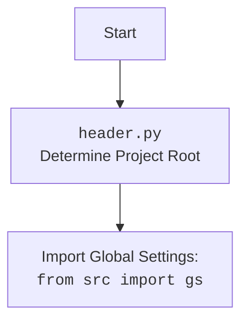

## ИНСТРУКЦИЯ:

Анализируй предоставленный код подробно и объясни его функциональность. Ответ должен включать три раздела:

1. **<алгоритм>**: Опиши рабочий процесс в виде пошаговой блок-схемы, включая примеры для каждого логического блока, и проиллюстрируй поток данных между функциями, классами или методами.
2. **<mermaid>**: Напиши код для диаграммы в формате `mermaid`, проанализируй и объясни все зависимости,
    которые импортируются при создании диаграммы.
    **ВАЖНО!** Убедитесь, что все имена переменных, используемые в диаграмме `mermaid`,
    имеют осмысленные и описательные имена. Имена переменных вроде `A`, `B`, `C`, и т.д., не допускаются!

    **Дополнительно**: Если в коде есть импорт `import header`, добавьте блок `mermaid` flowchart, объясняющий `header.py`:
    ```mermaid
    flowchart TD
        Start --> Header[<code>header.py</code><br> Determine Project Root]

        Header --> import[Import Global Settings: <br><code>from src import gs</code>]
    ```

3. **<объяснение>**: Предоставьте подробные объяснения:
   - **Импорты**: Их назначение и взаимосвязь с другими пакетами `src.`.
   - **Классы**: Их роль, атрибуты, методы и взаимодействие с другими компонентами проекта.
   - **Функции**: Их аргументы, возвращаемые значения, назначение и примеры.
   - **Переменные**: Их типы и использование.
   - Выделите потенциальные ошибки или области для улучшения.

Дополнительно, постройте цепочку взаимосвязей с другими частями проекта (если применимо).

Это обеспечивает всесторонний и структурированный анализ кода.
## Формат ответа: `.md` (markdown)
**КОНЕЦ ИНСТРУКЦИИ**
## <алгоритм>

1.  **`set_project_root(marker_files)`**:
    *   **Начало**: Функция вызывается с кортежем `marker_files` (по умолчанию `('__root__',)`).
    *   **Получение текущего пути**: Определяется абсолютный путь к директории, содержащей текущий файл (`header.py`).  Например, если файл находится в `hypotez/src/endpoints/kazarinov/scenarios/header.py`, то `current_path` будет равен `hypotez/src/endpoints/kazarinov/scenarios`.
    *   **Инициализация `__root__`**:  `__root__`  изначально устанавливается равным `current_path`.
    *   **Поиск родительских директорий**: Функция итерируется по текущей директории и всем её родительским директориям. Например, для пути  `hypotez/src/endpoints/kazarinov/scenarios` это будет: `hypotez/src/endpoints/kazarinov/scenarios`, `hypotez/src/endpoints/kazarinov`, `hypotez/src/endpoints`, `hypotez/src`, `hypotez`.
    *   **Проверка на наличие маркерных файлов**: Для каждой родительской директории проверяется наличие любого из `marker_files`.
        *   **Пример 1:**  Если `marker_files` это `('__root__',)` и в директории `hypotez` есть файл или директория с именем `__root__`, то эта директория (`hypotez`) будет считаться корневой.
        *   **Пример 2:** Если ни в одной директории нет `__root__`, то корневой директорией останется та, где находится скрипт.
    *   **Обновление `__root__`**: Если маркерный файл найден, `__root__` устанавливается равным директории, где файл был найден.
    *   **Добавление в `sys.path`**: Если `__root__` отсутствует в `sys.path`, то он добавляется в начало списка путей.
    *   **Возврат `__root__`**: Функция возвращает путь к корневой директории проекта.

2.  **Получение настроек**:
    *   **Вызов `set_project_root`**: Вызывается функция `set_project_root()` для определения корневой директории проекта, результат сохраняется в переменной `__root__`.
    *   **Импорт `gs`**: Импортируется модуль `gs` из пакета `src`.
    *   **Чтение `settings.json`**: Попытка открытия и чтения файла `settings.json` из `src`  в корневой директории проекта (`gs.path.root`).
    *   **Обработка ошибок**: Если файл `settings.json` не найден или его не удалось прочитать из-за ошибки декодирования JSON, то переменная `settings` остаётся равной `None`.
    *   **Чтение `README.MD`**: Попытка открытия и чтения файла `README.MD` из `src`  в корневой директории проекта (`gs.path.root`).
    *    **Обработка ошибок**: Если файл `README.MD` не найден или его не удалось прочитать, то переменная `doc_str` остаётся равной `None`.
    *   **Инициализация глобальных переменных**: На основе считанных данных из  `settings.json` и `README.MD` инициализируются  глобальные переменные:
        *   `__project_name__`: название проекта, по умолчанию `'hypotez'`.
        *   `__version__`: версия проекта, по умолчанию `''`.
        *   `__doc__`: описание проекта, по умолчанию `''`.
        *  `__details__`: дополнительные детали проекта, по умолчанию `''`.
        *   `__author__`: автор проекта, по умолчанию `''`.
        *   `__copyright__`: авторские права проекта, по умолчанию `''`.
        *   `__cofee__`: сообщение для поддержки разработчика, по умолчанию `Treat the developer to a cup of coffee for boosting enthusiasm in development: https://boosty.to/hypo69`
## <mermaid>
```mermaid
flowchart TD
    Start --> SetProjectRoot[<code>set_project_root()</code><br> Determine Project Root]
    SetProjectRoot -- Returns Project Root Path --> ProjectRootPath(__root__)
    ProjectRootPath --> Import_gs[Import Global Settings: <br><code>from src import gs</code>]
    Import_gs --> ReadSettingsJSON[Read settings.json]
    ReadSettingsJSON -- Success --> Set_settings_variable[Set <code>settings</code>]
    ReadSettingsJSON -- Fail --> settings_None[<code>settings</code> = None]
    Set_settings_variable --> ReadReadmeMD[Read README.MD]
    settings_None --> ReadReadmeMD
    ReadReadmeMD -- Success --> Set_doc_str_variable[Set <code>doc_str</code>]
    ReadReadmeMD -- Fail --> doc_str_None[<code>doc_str</code> = None]
    Set_doc_str_variable --> Set_Global_Vars[Set Global Variables]
    doc_str_None --> Set_Global_Vars
    Set_Global_Vars --> End

    style SetProjectRoot fill:#f9f,stroke:#333,stroke-width:2px
    style ProjectRootPath fill:#ccf,stroke:#333,stroke-width:2px
    style Import_gs fill:#ccf,stroke:#333,stroke-width:2px
    style Set_settings_variable fill:#ccf,stroke:#333,stroke-width:2px
     style settings_None fill:#fcc,stroke:#333,stroke-width:2px
    style Set_doc_str_variable fill:#ccf,stroke:#333,stroke-width:2px
    style doc_str_None fill:#fcc,stroke:#333,stroke-width:2px

```

## <объяснение>

**Импорты:**

*   `sys`: Используется для работы с системными параметрами и функциями, в частности для добавления пути к корневой директории проекта в `sys.path`.
*   `json`: Используется для работы с данными в формате JSON, для чтения данных из файла `settings.json`.
*   `packaging.version.Version`: Импортируется, но не используется в предоставленном коде, что может быть упущением.
*   `pathlib.Path`: Используется для работы с путями файловой системы, обеспечивает кроссплатформенную работу с путями.
*   `src.gs`:  Глобальные настройки проекта, предоставляющие доступ к путям и другим глобальным переменным проекта.

**Функции:**

*   `set_project_root(marker_files: tuple = ('__root__',)) -> Path:`
    *   **Аргументы**:
        *   `marker_files`: кортеж строк с названиями файлов или папок, которые отмечают корневую директорию проекта, по умолчанию `('__root__', )`.
    *   **Возвращаемое значение**: Объект `Path`, представляющий путь к корневой директории проекта или директорию, где находится скрипт, если маркерный файл не найден.
    *   **Назначение**: Функция осуществляет поиск корневой директории проекта, начиная с директории текущего файла и двигаясь вверх по дереву директорий.

**Переменные:**

*   `__root__`: `Path`. Глобальная переменная, хранящая путь к корневой директории проекта. Изначально определяется в `set_project_root` и используется для доступа к другим ресурсам проекта, таким как `settings.json` и `README.MD`.
*    `settings`: `dict`. Глобальная переменная, хранящая настройки проекта, загруженные из `settings.json`.
*    `doc_str`: `str`. Глобальная переменная, хранящая текст из файла `README.MD`.
*   `__project_name__`:  `str`. Имя проекта, по умолчанию `'hypotez'`.
*   `__version__`: `str`. Версия проекта, по умолчанию `''`.
*    `__doc__`: `str`. Описание проекта, по умолчанию `''`.
*    `__details__`: `str`. Дополнительные детали проекта, по умолчанию `''`.
*   `__author__`: `str`. Автор проекта, по умолчанию `''`.
*   `__copyright__`: `str`. Авторские права проекта, по умолчанию `''`.
*  `__cofee__`: `str`.  Сообщение для поддержки разработчика.

**Объяснение работы кода:**

1.  **Определение корневой директории:** Функция `set_project_root` ищет маркерный файл, чтобы определить корень проекта. Это позволяет запускать скрипты из любой подпапки проекта без необходимости указывать абсолютные пути.
2.  **Импорт `src.gs`:** Модуль `gs` содержит глобальные пути и настройки, которые используются в проекте. Он используется для получения абсолютного пути к файлам `settings.json` и `README.MD`.
3.  **Чтение настроек:**  Файл `settings.json` содержит параметры проекта. Этот файл загружается и используется для инициализации переменных проекта, таких как имя проекта, версия, автор и т.д. Если чтение настроек не удается, то используются значения по умолчанию.
4. **Чтение `README.MD`:**  Файл `README.MD` содержит описание проекта. Этот файл загружается и используется для инициализации переменной `__doc__`. Если чтение файла не удается, то используется значение по умолчанию.
5. **Глобальные переменные:** Глобальные переменные `__project_name__`, `__version__`, `__doc__`, `__author__`, `__copyright__` и `__cofee__`  инициализируются из `settings.json`, если таковой имеется. В противном случае, они принимают значения по умолчанию.

**Потенциальные ошибки и области для улучшения:**

*   **Обработка исключений:** В блоках `try...except` не происходит логирования или иной обработки ошибок при чтении файлов. Возможно, стоит добавить логирование, чтобы отслеживать эти проблемы.
*   **Неиспользуемый импорт:** Импорт `packaging.version.Version` не используется и должен быть удален.
*   **Отсутствие типа в `settings:dict = None`** Типизация переменной не гарантирует её тип, а подсказывает IDE.
*   **Отсутствие комментариев.** Код не содержит комментариев, объясняющих сложные моменты и назначение переменных.
*   **Область видимости `__root__`**:  Переменная `__root__` создается в функции `set_project_root`, а затем снова в глобальной области видимости.
*   **Стилистика** Не соответствие стандарту PEP8, переменные и имена файлов не должны начинаться с __.

**Взаимосвязи с другими частями проекта:**

*   `src.gs`: Этот модуль является центральным для доступа к глобальным путям и параметрам.
*   `settings.json` и `README.MD`:  Эти файлы содержат конфигурацию и документацию проекта, которые используются при инициализации переменных.
*   Другие модули проекта могут использовать глобальные переменные, определенные в этом файле, для получения доступа к информации о проекте.