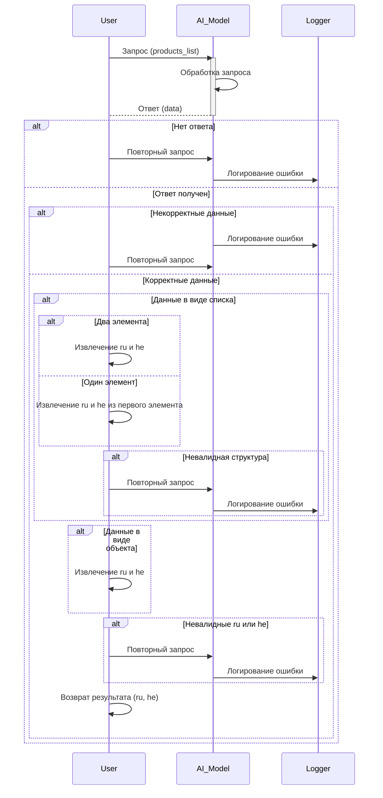

```MD
# Анализ кода

## <input code>

```sequenceDiagram
    participant User
    participant AI_Model
    participant Logger

    User->>AI_Model: Запрос на обработку продуктов (products_list)
    AI_Model->>AI_Model: Обработка запроса с командой модели
    AI_Model->>User: Ответ от модели

    alt Нет ответа от модели
        Logger->>Logger: Логирирование ошибки "no response from gemini"
        User->>AI_Model: Повторный запрос (attempts - 1)
    end

    alt Невалидные данные (data)
        Logger->>Logger: Логирирование ошибки "Error in data from gemini"
        User->>AI_Model: Повторный запрос (attempts - 1)
    end

    alt Получены данные (data)
        alt Данные в виде списка
            alt Два элемента (ru, he)
                User->>User: Извлечение ru и he
            end
            alt Один элемент
                User->>User: Извлечение ru и he из первого элемента
            end
            alt Невалидная структура данных
                Logger->>Logger: Логирирование ошибки "Проблема парсинга ответа"
                User->>AI_Model: Повторный запрос (attempts - 1)
            end
        end

        alt Данные в виде объекта
            User->>User: Извлечение ru и he из объекта
        end

        alt Невалидные значения (ru или he)
            Logger->>Logger: Логирирование ошибки "Invalid ru or he data"
            User->>AI_Model: Повторный запрос (attempts - 1)
        end

        User->>User: Возврат результата ru и he
    end
```

## <algorithm>

Пошаговая блок-схема алгоритма отображает процесс обработки запроса на обработку продуктов от пользователя через модель AI.

1. **Пользователь отправляет запрос** к `AI_Model` с данными `products_list`.
2. **Обработка запроса AI_Model**: Модель выполняет обработку запроса, используя какой-то свой алгоритм.
3. **Ответ от AI_Model**: Модель возвращает данные пользователю.
4. **Обработка ответа пользователем**:
   - **Проверка на отсутствие ответа:** Если ответа нет, происходит логирование ошибки ("no response from gemini") и повторный запрос.
   - **Проверка на невалидные данные:** Если данные некорректны, происходит логирование ошибки ("Error in data from gemini") и повторный запрос.
   - **Проверка на валидные данные:**
     - **Проверка типа данных:**  Проверяется, являются ли данные списком или объектом.
     - **Проверка списка:** Если данные в виде списка:
       - **Проверка на достаточное количество элементов:**  Проверка на наличие 2 элементов (`ru`, `he`). Если один элемент — извлечение из первого.
       - **Проверка структуры:** Если структура данных неверна ("Проблема парсинга ответа"), происходит логирование ошибки и повторный запрос.
     - **Обработка объекта:** Если данные в виде объекта, извлекаются необходимые значения (`ru`, `he`).
     - **Проверка на валидность значений:** Если значения `ru` или `he` некорректны, происходит логирование ошибки ("Invalid ru or he data") и повторный запрос.
   - **Возврат результата:** Если все проверки пройдены, пользователь получает результат (`ru`, `he`).

## <mermaid>



## <explanation>

**Импорты**: В данном случае нет импортов. Код представляет собой диаграмму последовательности (sequence diagram) в формате Mermaid, описывающую взаимодействие между компонентами (пользователь, AI-модель, логирование).

**Классы**: Нет классов. Имеется описание компонентов: `User`, `AI_Model`, `Logger`.

**Функции**: Нет функций в традиционном понимании. Диаграмма описывает последовательность действий и ветвления.

**Переменные**: В диаграмме указаны переменные `products_list` (передается в `AI_Model`), `data` (возвращаемое значение), `ru`, `he` (получаемые значения).  `attempts` - не явное значение, которое используется для повторных запросов, но не показано, где оно используется, это предполагается.

**Возможные ошибки или улучшения**:
- Диаграмма не указывает, каким образом `AI_Model` обрабатывает запрос, что может быть неопределенностью.
- Диаграмма предполагает, что `AI_Model` может возвращать данные в разных форматах (список или объект), и пользователь должен уметь обрабатывать оба случая. Это хороший показатель обработки возможных вариантов.
- Не совсем понятно, какой механизм повторных запросов используется и как `attempts` влияет на эту логику. Подробности не показаны в диаграмме.  Необходимо дополнительное описание, если это не предусмотрено каким-то внешним модулем.


**Взаимосвязи с другими частями проекта**:  Диаграмма описывает взаимодействие с `AI_Model` и `Logger`. Чтобы получить полное представление, нужно изучить кодовые фрагменты, которые эти компоненты используют.