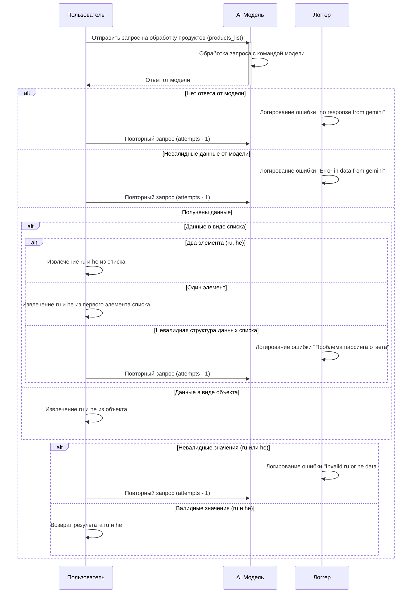

## Анализ кода `scenario_picelist.process_ai.mmd`

### 1. <алгоритм>

**Блок-схема обработки запроса к AI-модели для получения данных о продуктах (ru/he):**

1.  **Начало:** Пользователь отправляет запрос `products_list` на обработку в `AI_Model`.
    *   *Пример:* Запрос списка продуктов для перевода и обработки.

2.  **Обработка запроса AI_Model:** `AI_Model` обрабатывает запрос, используя команду модели.

3.  **Получение ответа от AI_Model:**
    *   **Успех:** `AI_Model` возвращает ответ.
    *   **Неудача:** `AI_Model` не возвращает ответ. Переход к шагу 4.

4.  **Нет ответа:** `Logger` логирует ошибку "no response from gemini".
    *   *Пример:* `Logger` записывает: "Error: no response from gemini".
    *   Пользователь делает повторный запрос в `AI_Model` (количество попыток уменьшается на 1). Переход к шагу 2.

5. **Обработка ответа:** 
    * **Успех:** Получен ответ от модели.
    * **Неудача:** Ответ не является валидным, ошибка "Error in data from gemini" - Переход к шагу 6.

6. **Невалидные данные:** `Logger` логирует ошибку "Error in data from gemini".
     *    *Пример:* `Logger` записывает: "Error: Error in data from gemini".
     *    Пользователь делает повторный запрос в `AI_Model` (количество попыток уменьшается на 1). Переход к шагу 2.

7. **Анализ структуры данных:** 
    * **Данные - список:** Проверка структуры списка. Переход к шагу 8.
    * **Данные - объект:** Извлечение `ru` и `he` из объекта. Переход к шагу 13.
    * **Невалидная структура:** Логирование ошибки "Проблема парсинга ответа". Переход к шагу 15.

8. **Анализ списка:** 
    * **Два элемента:** Предполагается, что это `ru` и `he`, извлечение данных. Переход к шагу 13.
    * **Один элемент:** Извлечение `ru` и `he` из первого элемента. Переход к шагу 13.
    * **Невалидная структура:** Логирование ошибки "Проблема парсинга ответа". Переход к шагу 15.

9.  **Извлечение ru и he (список 2 элемента):** Извлекаются значения `ru` и `he`.
     *   *Пример:* `ru` = "название на русском", `he` = "название на иврите".

10. **Извлечение ru и he (список 1 элемент):** Извлекаются значения `ru` и `he` из первого элемента.
     *   *Пример:* Если первый элемент `{ru:"...", he:"..."}`, то извлекаются эти значения.
 

11. **Извлечение ru и he (объект):** Извлекаются значения `ru` и `he` из объекта.
    *   *Пример:* Если объект `{ru:"...", he:"..."}`, то извлекаются эти значения.

12. **Валидация значений ru и he:**
    * **Успех:** `ru` и `he` не null и не пустые.
    * **Неудача:** Если значения `ru` или `he` являются невалидными (null, пустая строка). Переход к шагу 14.

13. **Возврат результата ru и he:** Пользователю возвращаются значения `ru` и `he`.

14. **Невалидные значения ru или he:** `Logger` логирует ошибку "Invalid ru or he data".
   *   *Пример:* `Logger` записывает: "Error: Invalid ru or he data".
   *   Пользователь делает повторный запрос в `AI_Model` (количество попыток уменьшается на 1). Переход к шагу 2.
15.  **Проблема парсинга ответа:** `Logger` логирует ошибку "Проблема парсинга ответа".
     *    *Пример:* `Logger` записывает: "Error: Проблема парсинга ответа".
     *    Пользователь делает повторный запрос в `AI_Model` (количество попыток уменьшается на 1). Переход к шагу 2.

16. **Конец:** Завершение обработки запроса.

### 2. <mermaid>

**Анализ зависимостей:**

Диаграмма `mermaid` описывает последовательность взаимодействия между тремя участниками:
*   **Пользователь (User):** Инициирует запрос и получает ответ.
*   **AI_Model (AI_Model):** Обрабатывает запрос, используя модель, и возвращает данные.
*   **Логгер (Logger):** Записывает ошибки.

**Зависимости в диаграмме:**

*   `User` напрямую взаимодействует с `AI_Model`, отправляя запросы и получая ответы.
*   `AI_Model` обрабатывает запросы и общается с `User`.
*   `Logger` пассивно получает и регистрирует ошибки.
*   Все взаимодействие происходит последовательно, с ветвлением при обработке результатов от `AI_Model`.
*   Диаграмма показывает, что в случае ошибки (`no response`, `invalid data`, `invalid ru/he`, `parsing error`) делается повторный запрос от `User` к `AI_Model`.
*    Диаграмма также показывает различные варианты обработки структуры данных, полученных от `AI_Model` (список или объект).

### 3. <объяснение>

**Объяснение:**

**Импорты:**

*   В данном коде `mermaid` импорты не указаны, поскольку этот код является описанием диаграммы последовательности, а не исполняемым кодом на Python или другом языке программирования. Диаграмма, вероятно, используется для визуализации логики работы некоторого процесса в коде, который, в свою очередь, может содержать импорты, относящиеся к `src`.
*   Возможные импорты в `src`, связанные с этим процессом, могут быть:
    *   `src.ai.gemini.model`: Для работы с AI-моделью (например, Gemini).
    *   `src.logger.logger`: Для логирования ошибок и событий.
    *   `src.data.validators`: Для проверки валидности данных.

**Классы:**

*   **AI_Model**: Представляет класс, который обрабатывает запросы, используя модель машинного обучения.
    *   **Атрибуты**: Могут включать в себя настройки модели, параметры подключения к модели и т.д.
    *   **Методы**:
        *   `process_request(products_list)`: Метод, который принимает запрос от пользователя и обрабатывает его, используя модель.
        *   `get_response()`: Метод, который возвращает ответ от модели.
        *    `validate_data(data)`: Метод, который валидирует данные полученные от модели.
    *   **Взаимодействие**: Получает запросы от пользователя, обрабатывает их с помощью модели и возвращает результаты. Может взаимодействовать с `Logger` для логирования ошибок.
*   **Logger**: Представляет класс для логирования сообщений и ошибок.
    *   **Атрибуты**: Может включать настройки логирования (например, уровень логирования, файл для записи).
    *   **Методы**:
        *   `log_error(message)`: Метод для логирования сообщений об ошибках.
    *   **Взаимодействие**: Получает сообщения об ошибках от других компонентов (в частности, `AI_Model`) и записывает их в лог.

**Функции:**

*   В данном коде `mermaid` не описываются функции напрямую, но логика предполагает наличие функций, например:
    *   `extract_ru_he_from_list(data)`: Функция, извлекающая `ru` и `he` из списка.
        *   **Аргументы**: `data` (список).
        *   **Возвращаемое значение**: Кортеж (`ru`, `he`).
        *   **Назначение**: Извлекает значения на русском (`ru`) и иврите (`he`) из списка.
        *  *Пример:* `extract_ru_he_from_list(["название на русском", "название на иврите"])` вернет `("название на русском", "название на иврите")`.
    *   `extract_ru_he_from_object(data)`: Функция, извлекающая `ru` и `he` из объекта.
        *   **Аргументы**: `data` (объект).
        *   **Возвращаемое значение**: Кортеж (`ru`, `he`).
        *   **Назначение**: Извлекает значения на русском (`ru`) и иврите (`he`) из объекта.
        * *Пример:* `extract_ru_he_from_object({"ru": "название на русском", "he": "название на иврите"})` вернет `("название на русском", "название на иврите")`.
    *   `validate_ru_he(ru, he)`: Функция, валидирующая `ru` и `he`.
        *   **Аргументы**: `ru` (строка), `he` (строка).
        *   **Возвращаемое значение**: `True` если валидно, иначе `False`.
        *   **Назначение**: Проверяет, что значения `ru` и `he` не являются `null` или пустой строкой.

**Переменные:**

*   `products_list`: Список продуктов для обработки (тип: список строк, объект или другой формат данных).
*   `data`: Данные, полученные от модели (тип: объект или список).
*   `ru`: Значение на русском (тип: строка).
*   `he`: Значение на иврите (тип: строка).
*    `attempts` : Количество попыток отправки запроса.
*    `error_message` : Строка с сообщением об ошибке.

**Потенциальные ошибки и области для улучшения:**

*   **Обработка ошибок:**
    *   Не хватает обработки конкретных типов ошибок от `AI_Model` (например, ошибки сети, таймауты).
    *   Возможно, стоит добавить механизм отката или автоматической перенастройки модели при повторяющихся ошибках.
*  **Количество повторов**: Желательно параметризировать количество повторов запроса.
*   **Валидация данных:**
    *   Валидация данных может быть более строгой и проверять не только на null и пустую строку, но и на формат, длину и прочие параметры.
    *   Стоит добавить возможность проверки валидности данных в функции `validate_data`, если это не реализовано в модели.
*   **Структура данных:**
    *   Ограничения на структуру данных (список из двух элементов, список из одного элемента, объект) можно расширить.
*   **Логирование:**
    *   Логирование можно сделать более детальным, записывая не только ошибки, но и успешные запросы, а также передаваемые и возвращаемые данные.

**Взаимосвязи с другими частями проекта:**

*   `src.endpoints.kazarinov`: Данный сценарий, вероятно, используется в контексте обработки запросов, поступающих в endpoint `/kazarinov`.
*   `src.ai`: Взаимодействует с модулями, отвечающими за работу с AI-моделями, например, `src.ai.gemini`.
*   `src.logger`: Использует функциональность `src.logger` для логирования событий и ошибок.
*   `src.data`: Потенциально использует модули для валидации данных (`src.data.validators`).
*   Может быть связан с модулем управления попытками повторных запросов.

Этот анализ предоставляет подробное понимание функциональности кода, его зависимостей и областей для улучшения.