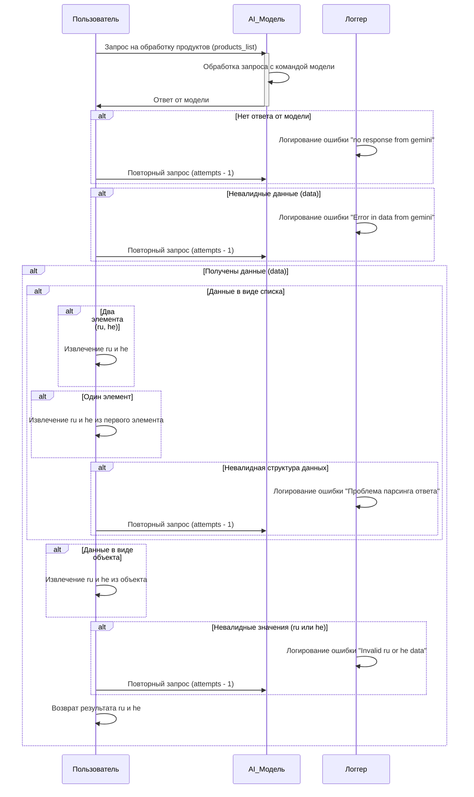

## АНАЛИЗ КОДА

### 1. <алгоритм>

**Блок-схема обработки запроса к AI-модели:**

```mermaid
graph LR
    A[Начало: Пользовательский запрос (products_list)] --> B{Запрос к AI_Model};
    B --> C{Получен ответ от AI_Model?};
    C -- Нет --> D[Логирование ошибки "no response from gemini"];
    D --> E{Повторный запрос (attempts - 1)};
    E --> B;
    C -- Да --> F{Валидны ли данные от AI_Model?};
    F -- Нет --> G[Логирование ошибки "Error in data from gemini"];
    G --> H{Повторный запрос (attempts - 1)};
    H --> B;
    F -- Да --> I{Данные в виде списка?};
    I -- Да --> J{Два элемента?};
    J -- Да --> K[Извлечение ru и he];
    K --> L;
    J -- Нет --> M{Один элемент?};
    M -- Да --> N[Извлечение ru и he из первого элемента];
    N --> L;
    M -- Нет --> O[Логирование ошибки "Проблема парсинга ответа"];
    O --> P{Повторный запрос (attempts - 1)};
    P --> B;
    I -- Нет --> Q{Данные в виде объекта?};
    Q -- Да --> R[Извлечение ru и he из объекта];
        R --> L;
    Q -- Нет --> O;
    L --> S{Валидны ли ru и he?};
    S -- Нет --> T[Логирование ошибки "Invalid ru or he data"];
    T --> U{Повторный запрос (attempts - 1)};
    U --> B;
    S -- Да --> V[Возврат результата ru и he];
    V --> W[Конец];
```

**Примеры для логических блоков:**

1.  **Начало (A):** Пользователь отправляет список продуктов `products_list` на обработку AI-модели.

2.  **Запрос к AI_Model (B):** Функция отправляет `products_list` в AI-модель для обработки.

3.  **Получен ответ от AI_Model? (C):** Проверяется, получен ли ответ от AI-модели.
    -   **Пример "Нет":** Если ответ не получен, происходит переход к логированию ошибки и повторному запросу.
    -   **Пример "Да":** Если ответ получен, данные передаются для проверки.

4.  **Валидны ли данные от AI_Model? (F):** Проверяется, что ответ имеет ожидаемый формат.
    -   **Пример "Нет":**  Если ответ в неправильном формате, логируется ошибка, и выполняется повторный запрос.
    -   **Пример "Да":** Если формат верный, данные обрабатываются.

5. **Данные в виде списка? (I):** Проверяется, являются ли полученные данные списком.
    - **Пример "Да":** Если данные - список, то анализируется количество элементов.
    - **Пример "Нет":** Если данные не список, то проверяется, является ли объект.

6. **Два элемента? (J):** Проверяется, содержит ли список два элемента.
     -   **Пример "Да":** Если два элемента, предполагается `ru` и `he`, происходит их извлечение.
     -   **Пример "Нет":** Если не два элемента, переходим к проверке количества элементов списка.
7. **Один элемент? (M):** Проверяется, содержит ли список один элемент.
    - **Пример "Да":** Если один элемент, извлекаем `ru` и `he` из первого элемента.
    - **Пример "Нет":** Если не один элемент, логируем ошибку.
8. **Данные в виде объекта? (Q):** Проверяется, являются ли полученные данные объектом.
    - **Пример "Да":** Если данные - объект, извлекаются `ru` и `he` из объекта.
    - **Пример "Нет":** Если данные не объект, то логируем ошибку.
9. **Валидны ли ru и he? (S):** Проверяется, что извлеченные `ru` и `he` имеют валидные значения.
    -   **Пример "Нет":** Если  `ru` или `he` невалидны, логируется ошибка, и выполняется повторный запрос.
    -   **Пример "Да":** Если значения валидны, результат возвращается.

10. **Возврат результата ru и he (V):** Функция возвращает извлеченные `ru` и `he`.

**Поток данных:**

*   Пользовательский запрос `products_list` --> `AI_Model`
*   Ответ от `AI_Model` --> Проверка валидности данных
*   Извлеченные `ru` и `he` --> Функция возвращает результат

### 2. <mermaid>



**Объяснение зависимостей:**

*   **`User` (Пользователь):** Представляет пользователя, инициирующего запрос и получающего результат.
*   **`AI_Model` (AI Модель):** Представляет AI-модель, выполняющую обработку запроса.
*   **`Logger` (Логгер):**  Представляет систему логирования для записи ошибок и событий.

**Описание связей:**

1.  Пользователь отправляет запрос `products_list` на обработку в `AI_Model`.
2.  `AI_Model` обрабатывает запрос.
3.  `AI_Model` возвращает ответ пользователю.
4.  Далее, если ответ от модели не получен или данные невалидны,  логгер записывает ошибку, и выполняется повторный запрос.
5.  Если ответ получен и данные валидны, происходит дальнейшая обработка.
6.  Если данные в виде списка, происходит анализ структуры списка на количество элементов.
7.  Если данные в виде объекта, происходит извлечение ru и he из объекта.
8.  Если данные не удовлетворяют ни одному условию,  логгер записывает ошибку и выполняется повторный запрос.
9.  Если извлеченные `ru` и `he` невалидны, логгер записывает ошибку и выполняется повторный запрос.
10. После всех проверок, пользователь получает результат в виде `ru` и `he`.

### 3. <объяснение>

**Импорты:**

*   В данном коде нет явных импортов. Все взаимодействие происходит через абстрактные сущности, такие как `User`, `AI_Model`, и `Logger`.  Поэтому нет необходимости рассматривать импорты из `src`.

**Классы:**

*   **`User`**: Представляет абстрактного пользователя системы. Он инициирует процесс обработки и получает результат.
*   **`AI_Model`**: Абстракция AI-модели, которая выполняет обработку данных.
*   **`Logger`**: Абстракция системы логирования, которая записывает ошибки и события.

    Все классы представлены как абстракции, взаимодействие между ними описано в последовательной диаграмме.

**Функции:**

*   **Обработка запроса:**
    *   **Аргументы:** `products_list` (список продуктов).
    *   **Возвращаемое значение:** Кортеж `(ru, he)` или `None` в случае ошибки.
    *   **Назначение:** Обрабатывает запрос к AI-модели, извлекает данные, проверяет их и возвращает результат.
    *   **Примеры:**
        *   `products_list` = `['product1', 'product2']` -> `(ru_value, he_value)`
        *   `products_list` = `['product3']` -> `None` (при ошибке)

**Переменные:**

*   `products_list`: Список продуктов для обработки.
*   `data`: Данные, полученные от AI-модели.
*   `ru`: Строка с текстом на русском.
*   `he`: Строка с текстом на иврите.
*   `attempts`: Счётчик попыток повторного запроса.

**Потенциальные ошибки и области для улучшения:**

*   **Обработка ошибок:**
    *   Текущий код обрабатывает ошибки логированием и повторными запросами, но нет механизма отслеживания количества повторных запросов и выхода из бесконечного цикла. Необходимо добавить ограничение на количество попыток и обработку критических ошибок.
*   **Обработка данных:**
    *   Код предполагает, что данные могут прийти в виде списка или объекта, но не обрабатывает другие возможные форматы. Необходимо расширить валидацию и парсинг данных.
    *   Нет конкретного алгоритма валидации значений `ru` и `he`, что может привести к получению некорректных данных.
*   **Логирование:**
    *   Логирование только ошибок может быть недостаточно. Необходимо добавить логирование успешных операций и промежуточных состояний для улучшения отслеживания процесса.
*   **Абстракция:**
    *   Код слишком абстрактен и не предоставляет конкретной реализации `AI_Model`, `Logger` или обработки `products_list`. Необходимо определить конкретные интерфейсы и классы.

**Цепочка взаимосвязей с другими частями проекта:**

*   Этот код является частью обработки данных от AI-модели. Предполагается, что он входит в более крупный конвейер обработки данных.
*   Логика обработки ошибок связана с системой логирования проекта, где регистрируются все ошибки.
*   Возвращаемый результат `(ru, he)` используется в последующих шагах конвейера.

Этот анализ предоставляет подробное описание функциональности кода, структуры и взаимодействия компонентов.