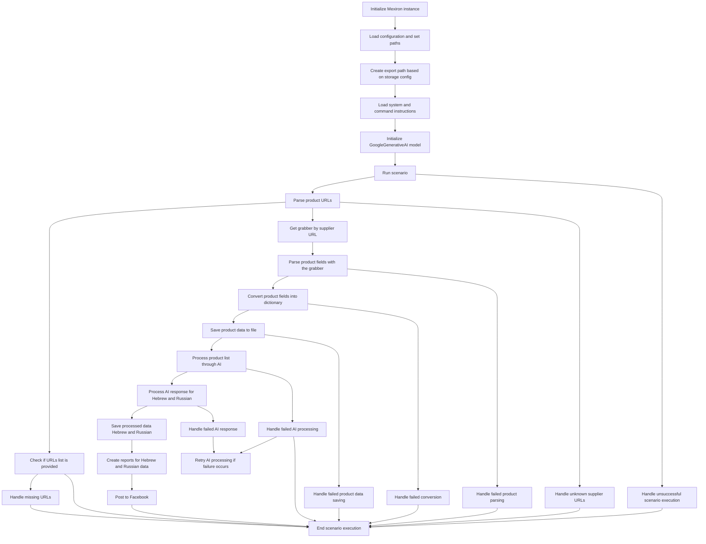

# Анализ кода сценария pricelist

**1. <input code>**



**2. <algorithm>**

Данный код описывает алгоритм обработки данных для формирования прайслистов, включая взаимодействие с API и обработку результатов. Алгоритм состоит из нескольких этапов: инициализации, загрузки данных, парсинга, обработки AI и отправки данных.  Пройдемся по ключевым этапам:

* **Инициализация:** Создается экземпляр Mexiron, загружаются настройки и пути.
* **Загрузка данных:** Загружаются инструкции и конфигурация, осуществляется инициализация модели AI.
* **Парсинг данных:** Парсится список URL-адресов, проверяется их наличие, и, в случае успеха, запрашивается граббер. Выполняется парсинг полей.
* **Обработка AI:** Данные передаются в AI для обработки.
* **Обработка результатов:** Результаты обрабатываются, сохраняются в файлы, создаются отчеты на иврите и русском.
* **Отправка данных:** Отчеты публикуются в Facebook.
* **Обработка ошибок:** На каждой стадии предусмотрены обработчики ошибок (например, для сбоя в парсинге или отсутствия данных).

**3. <mermaid>**

```mermaid
graph LR
    subgraph Инициализация
        InitMexiron --> LoadConfig
        LoadConfig --> CreateExportPath
        CreateExportPath --> LoadInstructions
        LoadInstructions --> InitializeAI
    end
    subgraph Парсинг и Обработка
        InitializeAI --> RunScenario
        RunScenario --> ParseURLs
        ParseURLs --> GetGrabber
        GetGrabber --> ParseFields
        ParseFields --> ConvertToDict
        ConvertToDict --> SaveToFile
        ParseFields --> HandleParseFailure
        ConvertToDict --> HandleConversionFailure
        SaveToFile --> HandleSaveFailure
    end
    subgraph Обработка AI
        SaveToFile --> ProcessWithAI
        ProcessWithAI --> HandleAIResponse
        HandleAIResponse --> SaveProcessedData
        HandleAIResponse --> HandleAIResponseFailure
        ProcessWithAI --> HandleAIProcessingFailure
        HandleAIProcessingFailure --> RetryAI
    end
    subgraph Генерация и Отправка
        SaveProcessedData --> GenerateReports
        GenerateReports --> PostToFacebook
        PostToFacebook --> EndScenario
        RunScenario --> HandleScenarioFailure
        HandleScenarioFailure --> EndScenario
        ParseURLs --> CheckURLs
        CheckURLs --> HandleMissingURLs
        ParseURLs --> HandleUnknownSupplierURLs
        HandleMissingURLs --> EndScenario
        HandleUnknownSupplierURLs --> EndScenario
        CheckURLs --> EndScenario
        HandleParseFailure --> EndScenario
        HandleConversionFailure --> EndScenario
        HandleSaveFailure --> EndScenario
        HandleAIProcessingFailure --> EndScenario
        HandleAIResponseFailure --> RetryAI

    ```

**4. <explanation>**

* **Импорты**:  В данном случае отсутствует код Python, поэтому анализ импортов невозможен.
* **Классы**:  Аналогично нет кода, поэтому невозможно определить классы и их взаимодействие.
* **Функции**:  Нет информации о функциях, поэтому невозможно рассмотреть их поведение.
* **Переменные**: Нет информации о переменных, поэтому невозможно определить их типы и использование.

**Цепочка взаимосвязей:**

Данный код, вероятно, часть более крупного проекта, связанного с обработкой данных прайслистов, парсингом веб-страниц, взаимодействием с AI-моделями для перевода и созданием отчетов.  Связи могут быть следующими:

1. **mexiron:**  Является  центральным модулем, управляющим всеми этапами обработки.
2. **API:**  Для загрузки конфигурации и выполнения задач.
3. **Система хранения данных:** Для сохранения промежуточных и конечных результатов.
4. **AI-модель:**  Для обработки текстовых данных, перевода.
5. **Facebook:** Для публикации отчетов.

**Возможные ошибки и улучшения:**

* **Отсутствие обработки исключений:**  В каждом шаге не описаны детальные механизмы обработки ошибок, что может привести к непредсказуемому поведению.  
* **Логирование:**  Отсутствие логирования затрудняет отладку.
* **Переиспользование кода:**  Отсутствие рефакторинга.  Сложность повторного использования кода для разных задач.
* **Избыточность обработки ошибок:**  Несколько обработчиков для одних и тех же типов ошибок (например, ошибки в парсинге).  Можно объединить в более общий обработчик.


**Заключение:**

Схема предоставляет высокую функциональную детализацию процесса, но без кода сложно оценить практическую реализацию и потенциальные проблемы.  Для более глубокого анализа необходим сам код.