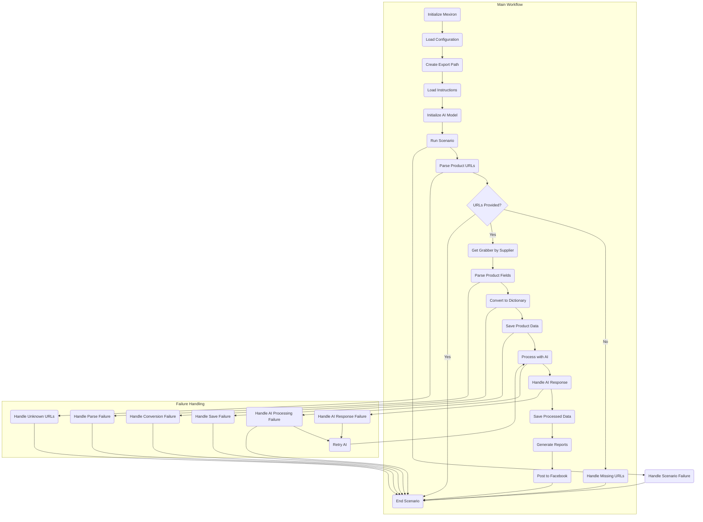

## Анализ кода `scenario_pricelist.mmd`

### 1. <алгоритм>

Этот код описывает процесс обработки прайс-листа товаров, начиная от загрузки конфигурации до публикации результатов в Facebook. Вот пошаговая блок-схема с примерами для каждого логического блока:

1.  **InitMexiron**: Инициализация экземпляра `Mexiron`.
    *   *Пример*: `mexiron = Mexiron()`
2.  **LoadConfig**: Загрузка конфигурации и установка путей.
    *   *Пример*: Загрузка конфигурации из JSON-файла и установка путей для хранения данных.
3.  **CreateExportPath**: Создание пути экспорта на основе конфигурации хранения.
    *   *Пример*: Если `storage_path` в конфигурации `/data`, то путь экспорта `/data/export_products`.
4.  **LoadInstructions**: Загрузка системных и командных инструкций.
    *   *Пример*: Загрузка инструкций для `GoogleGenerativeAI` из текстовых файлов.
5.  **InitializeAI**: Инициализация модели `GoogleGenerativeAI`.
    *   *Пример*: `ai_model = GoogleGenerativeAI(api_key='your_api_key')`
6.  **RunScenario**: Запуск сценария обработки прайс-листа.
    *   *Пример*: `result = run_scenario(mexiron, config, instructions, ai_model)`
7.  **ParseURLs**: Разбор URL-адресов продуктов из входных данных.
    *   *Пример*: Из входного текста `"url1,url2"` парсится `['url1', 'url2']`.
8.  **CheckURLs**: Проверка наличия списка URL-адресов.
    *   *Пример*: Если список URL пуст, то обработка переходит в `HandleMissingURLs`.
9.  **HandleMissingURLs**: Обработка отсутствующих URL-адресов.
    *   *Пример*: Логирование ошибки и завершение сценария.
10. **GetGrabber**: Получение соответствующего парсера (grabber) на основе URL-адреса поставщика.
    *   *Пример*: Для URL `aliexpress.com` используется `AliexpressGrabber`.
11. **ParseFields**: Разбор полей продукта с помощью выбранного парсера.
    *   *Пример*: Из HTML-страницы товара парсится `{'name': 'Product A', 'price': 100}`.
12. **HandleParseFailure**: Обработка ошибки разбора полей продукта.
    *   *Пример*: Если парсинг не удался, логирование ошибки и завершение сценария.
13. **ConvertToDict**: Преобразование полей продукта в словарь.
    *   *Пример*: Преобразование `ProductFields` в `dict` вида `{'name': 'Product A', 'price': 100}`.
14. **HandleConversionFailure**: Обработка ошибки преобразования в словарь.
    *   *Пример*: Если преобразование не удалось, логирование ошибки и завершение сценария.
15. **SaveToFile**: Сохранение данных о продукте в файл.
    *   *Пример*: Запись словаря в JSON или CSV файл.
16. **HandleSaveFailure**: Обработка ошибки сохранения данных.
    *   *Пример*: Логирование ошибки сохранения данных в файл и завершение сценария.
17. **ProcessWithAI**: Обработка списка продуктов с использованием AI.
    *   *Пример*: Отправка текстового описания продукта в AI для генерации улучшенного описания.
18. **HandleAIProcessingFailure**: Обработка ошибки AI.
    *   *Пример*: Если AI не ответил, повторная отправка запроса (RetryAI).
19. **RetryAI**: Повторная отправка запроса в AI.
    *  *Пример*: Повторный вызов `ai_model.generate_content()` после ошибки.
20. **HandleAIResponse**: Обработка ответа AI для иврита и русского.
    *   *Пример*: Разбор ответа AI, полученного в виде JSON, и извлечение полей.
21. **HandleAIResponseFailure**: Обработка ошибки ответа AI.
    *   *Пример*: Если ответ AI нельзя разобрать, то повторная отправка запроса (RetryAI).
22. **SaveProcessedData**: Сохранение обработанных данных на иврите и русском.
    *   *Пример*: Запись обновлённых данных в отдельные файлы для каждого языка.
23. **GenerateReports**: Создание отчетов для данных на иврите и русском.
    *   *Пример*: Создание CSV-отчетов с описанием продуктов.
24. **PostToFacebook**: Публикация отчетов в Facebook.
    *   *Пример*: Публикация текстовых сообщений с данными продуктов в Facebook.
25. **HandleUnknownSupplierURLs**: Обработка неизвестных URL-адресов поставщиков.
    *   *Пример*: Вывод ошибки в лог и завершение обработки.
26. **HandleScenarioFailure**: Обработка неудачного сценария.
    *   *Пример*: Запись ошибки в лог и завершение обработки.
27. **EndScenario**: Завершение выполнения сценария.

### 2. <mermaid>

**Объяснение зависимостей в диаграмме:**

*   `InitMexiron` является начальной точкой, создавая экземпляр класса `Mexiron`.
*   `LoadConfig` отвечает за загрузку конфигурационных данных, которые могут включать пути к файлам, настройки API и другие параметры.
*   `CreateExportPath` создаёт путь для сохранения результатов на основе параметров конфигурации.
*   `LoadInstructions` загружает инструкции для AI, что влияет на работу `InitializeAI` и `ProcessWithAI`.
*   `InitializeAI` инициализирует модель AI, используемую для обработки данных.
*  `RunScenario` запускает основной процесс обработки данных, координируя остальные шаги.
*   `ParseURLs` извлекает URL-адреса продуктов из входных данных.
*   `CheckURLs` проверяет, есть ли URL-адреса для обработки.
*   `HandleMissingURLs` обрабатывает случай отсутствия URL-адресов, завершая сценарий.
*   `GetGrabber` определяет подходящий парсер на основе доменного имени URL-адреса.
*   `ParseFields` извлекает данные о продукте из HTML-страницы, используя определенный парсер.
*   `HandleParseFailure` обрабатывает ошибки, возникшие при парсинге полей продукта.
*   `ConvertToDict` преобразует извлеченные данные в формат словаря.
*   `HandleConversionFailure` обрабатывает ошибки при преобразовании в словарь.
*   `SaveToFile` сохраняет данные о продуктах в файле.
*   `HandleSaveFailure` обрабатывает ошибки, возникшие при сохранении данных в файл.
*   `ProcessWithAI` обрабатывает данные о продуктах с помощью модели AI, возвращая обработанный текст.
*   `HandleAIProcessingFailure` обрабатывает ошибки, возникшие при обработке данных AI.
*   `RetryAI`  повторно отправляет запрос в AI при неудачной обработке.
*   `HandleAIResponse` обрабатывает ответ AI, извлекая нужную информацию.
*   `HandleAIResponseFailure` обрабатывает ошибки, возникшие при работе с ответом AI.
*   `SaveProcessedData` сохраняет данные, обработанные с помощью AI.
*   `GenerateReports` создает отчеты на основе обработанных данных.
*   `PostToFacebook` публикует отчеты в Facebook.
*    `HandleUnknownSupplierURLs` обрабатывает неизвестные URL адреса, не позволяя дальнейшую обработку.
*   `HandleScenarioFailure` обрабатывает неудачное завершение сценария.
*   `EndScenario` завершает выполнение сценария.

### 3. <объяснение>

#### Импорты

В предоставленном коде импорты не указаны, но, судя по логике, можно предположить использование следующих библиотек и модулей:

*   **`Mexiron`**: Предпологается, что это собственный класс или модуль проекта, возможно, он отвечает за общую логику и инициализацию.
*   **`GoogleGenerativeAI`**: Библиотека для работы с моделью генерации текста от Google.
*   **Модули для работы с файлами**: Могут быть использованы стандартные модули Python `json`, `csv` или `os`.
*   **Парсеры**: Предположительно, есть отдельные классы, такие как `AliexpressGrabber`, `AmazonGrabber`, и т.д., для извлечения данных с разных сайтов.
*   **Facebook API**: Библиотека для работы с Facebook API, например, `facebook-sdk`.

#### Классы

*   **`Mexiron`**: Этот класс, вероятно, является центральным компонентом приложения. Он может содержать методы для загрузки конфигурации, управления процессами и обработки ошибок.
    *   *Атрибуты*: Могут включать конфигурационные данные, пути к файлам и настройки.
    *   *Методы*: Могут включать `load_config()`, `run_scenario()`, `handle_error()`.
    *   *Взаимодействие*: Взаимодействует со всеми частями проекта, предоставляя конфигурацию и управляя ходом выполнения.
*   **`GoogleGenerativeAI`**: Это класс, инкапсулирующий взаимодействие с API Google для генерации текста.
    *   *Атрибуты*: Может включать API ключ, модель AI.
    *   *Методы*: Может включать `generate_content()`.
    *   *Взаимодействие*: Используется в `ProcessWithAI` для обработки данных и генерации текста.
*   **`Grabber` (например, `AliexpressGrabber`, `AmazonGrabber`)**: Это абстрактный класс или интерфейс, который определяет методы для извлечения данных с конкретных веб-сайтов. Каждый конкретный граббер реализует этот интерфейс для своего сайта.
    *  *Атрибуты:* Содержит методы для доступа к html-странице.
    *  *Методы*: `parse_product_fields()`.
    *  *Взаимодействие*: Используются в `GetGrabber` и `ParseFields`.

#### Функции

*   **`run_scenario()`**:
    *   *Аргументы*: Экземпляр `Mexiron`, конфигурация, инструкции, модель AI.
    *   *Возвращаемое значение*: Может возвращать статус выполнения сценария или данные.
    *   *Назначение*: Координирует выполнение всего сценария обработки прайс-листа, вызывает другие функции и обрабатывает ошибки.
    *   *Пример*: `result = run_scenario(mexiron, config, instructions, ai_model)`
*   **`parse_urls(urls)`**:
    *   *Аргументы*: Строка с URL-адресами.
    *   *Возвращаемое значение*: Список URL-адресов.
    *   *Назначение*: Разбирает строку URL-адресов на список.
    *   *Пример*: `urls = parse_urls("url1,url2")`
*   **`get_grabber(url)`**:
    *   *Аргументы*: URL-адрес продукта.
    *   *Возвращаемое значение*: Экземпляр соответствующего `Grabber`.
    *   *Назначение*: Определяет и возвращает парсер для конкретного домена.
    *   *Пример*: `grabber = get_grabber("aliexpress.com/product1")`
*   **`parse_fields(grabber, url)`**:
    *   *Аргументы*: Экземпляр `Grabber`, URL-адрес продукта.
    *   *Возвращаемое значение*: Словарь с полями продукта.
    *   *Назначение*: Извлекает данные о продукте с веб-страницы.
    *   *Пример*: `product_data = parse_fields(grabber, "aliexpress.com/product1")`
*   **`convert_to_dict(product_fields)`**:
    *   *Аргументы*: Данные о продукте.
    *   *Возвращаемое значение*: Словарь с данными продукта.
    *   *Назначение*: Преобразует данные продукта в словарь.
    *   *Пример*: `product_dict = convert_to_dict(product_fields)`
*   **`save_to_file(data, filename)`**:
    *   *Аргументы*: Данные продукта, имя файла.
    *   *Возвращаемое значение*: Статус сохранения.
    *   *Назначение*: Сохраняет данные в файл.
    *   *Пример*: `save_to_file(product_dict, "product.json")`
*  **`process_with_ai(ai_model, product_description)`**:
    *  *Аргументы*: Модель AI, описание продукта.
    *  *Возвращаемое значение*: Обработанный текст.
    *  *Назначение*: Отправляет описание продукта в AI для генерации улучшенного текста.
    *  *Пример*: `ai_description = process_with_ai(ai_model, "original description")`
* **`handle_ai_response(ai_response)`**:
    *  *Аргументы*: Ответ от AI.
    *  *Возвращаемое значение*: Структурированные данные, полученные из ответа.
    *  *Назначение*: Извлекает нужную информацию из ответа AI.
    *  *Пример*: `processed_data = handle_ai_response(ai_response)`
*   **`save_processed_data(data, language, filename)`**:
    *   *Аргументы*: Обработанные данные, язык, имя файла.
    *   *Возвращаемое значение*: Статус сохранения.
    *   *Назначение*: Сохраняет обработанные данные в файл.
    *   *Пример*: `save_processed_data(processed_data_ru, "ru", "product_ru.json")`
*   **`generate_reports(data_ru, data_he)`**:
    *   *Аргументы*: Данные на русском и иврите.
    *   *Возвращаемое значение*: Пути к отчетам.
    *   *Назначение*: Генерирует отчеты.
    *   *Пример*: `report_paths = generate_reports(processed_data_ru, processed_data_he)`
*   **`post_to_facebook(report_paths)`**:
    *   *Аргументы*: Пути к отчетам.
    *   *Возвращаемое значение*: Статус публикации.
    *   *Назначение*: Публикует отчеты в Facebook.
    *   *Пример*: `post_status = post_to_facebook(report_paths)`
*   **`handle_error(error)`**:
    *   *Аргументы*: Текст ошибки.
    *   *Возвращаемое значение*: Отсутствует.
    *   *Назначение*: Обрабатывает ошибку, возможно, логгирует ее.
    *   *Пример*: `handle_error("Failed to parse url")`
*    **`handle_missing_urls()`**:
    *   *Аргументы*: Отсутствуют.
    *   *Возвращаемое значение*: Отсутствует.
    *   *Назначение*: Обрабатывает случай отсутствия URL-адресов в входных данных.
    *   *Пример*: `handle_missing_urls()`
*  **`handle_unknown_supplier_urls()`**:
    *   *Аргументы*: Отсутствуют.
    *   *Возвращаемое значение*: Отсутствует.
    *   *Назначение*: Обрабатывает случай неизвестных URL-адресов поставщиков, для которых нет граббера.
    *  *Пример*: `handle_unknown_supplier_urls()`
*   **`handle_parse_failure()`**:
    *   *Аргументы*: Отсутствуют.
    *   *Возвращаемое значение*: Отсутствует.
    *   *Назначение*: Обрабатывает ошибку разбора полей продукта.
    *   *Пример*: `handle_parse_failure()`
*   **`handle_conversion_failure()`**:
    *   *Аргументы*: Отсутствуют.
    *   *Возвращаемое значение*: Отсутствует.
    *   *Назначение*: Обрабатывает ошибку преобразования данных в словарь.
    *   *Пример*: `handle_conversion_failure()`
*   **`handle_save_failure()`**:
    *   *Аргументы*: Отсутствуют.
    *   *Возвращаемое значение*: Отсутствует.
    *   *Назначение*: Обрабатывает ошибку сохранения данных в файл.
    *   *Пример*: `handle_save_failure()`
* **`handle_ai_processing_failure()`**:
    *  *Аргументы*: Отсутствуют.
    *  *Возвращаемое значение*: Отсутствует.
    *  *Назначение*: Обрабатывает ошибку, связанную с AI.
    *  *Пример*: `handle_ai_processing_failure()`
* **`handle_ai_response_failure()`**:
    *  *Аргументы*: Отсутствуют.
    *  *Возвращаемое значение*: Отсутствует.
    *  *Назначение*: Обрабатывает ошибку, связанную с разбором ответа от AI.
    *  *Пример*: `handle_ai_response_failure()`
*   **`handle_scenario_failure()`**:
    *   *Аргументы*: Отсутствуют.
    *   *Возвращаемое значение*: Отсутствует.
    *   *Назначение*: Обрабатывает ошибку выполнения сценария.
    *   *Пример*: `handle_scenario_failure()`
*   **`retry_ai()`**:
    *   *Аргументы*: Отсутствуют.
    *   *Возвращаемое значение*: Отсутствует.
    *   *Назначение*: Запускает повторную обработку с помощью AI при возникновении ошибки.
    *   *Пример*: `retry_ai()`

#### Переменные

*   **`config`**: Словарь, содержащий конфигурационные данные.
*   **`storage_path`**: Путь к папке для хранения данных.
*   **`export_path`**: Путь, куда будут сохранены результаты экспорта.
*   **`instructions`**:  Системные и командные инструкции, используемые в AI.
*   **`ai_model`**: Экземпляр модели AI.
*   **`urls`**: Список URL-адресов продуктов для обработки.
*   **`grabber`**: Экземпляр класса, используемого для извлечения данных с конкретного веб-сайта.
*  **`product_fields`**:  Извлеченные данные о продукте.
*   **`product_dict`**: Словарь с данными о продукте.
*   **`filename`**: Имя файла для сохранения данных.
*   **`ai_response`**: Ответ от AI.
*   **`processed_data_ru`**:  Обработанные AI данные на русском языке.
*   **`processed_data_he`**:  Обработанные AI данные на иврите.
*   **`report_paths`**: Пути к файлам отчетов.
*   **`post_status`**:  Статус публикации в Facebook.
*   **`error`**: Строка с описанием ошибки.

#### Потенциальные ошибки и области для улучшения

*   **Обработка ошибок**: В коде много блоков обработки ошибок, но не все они могут быть достаточно подробными. Необходима подробная логика логирования для выявления и отладки.
*   **Гибкость парсеров**: Логика выбора парсера по URL может быть расширена.
*   **Повторная отправка запросов в AI**: Количество повторов должно быть ограничено для избежания бесконечных циклов.
*   **Асинхронность**: Для повышения производительности, операции ввода-вывода и AI-обработку можно сделать асинхронными.
*   **Масштабируемость**:  Возможно, код не рассчитан на очень большое количество URL-адресов.

#### Взаимосвязи с другими частями проекта

*   **Модули для работы с конфигурацией**:  Загрузка конфигурации, хранение настроек.
*   **Модули парсинга**: Разбор HTML-страниц разных поставщиков.
*   **API Facebook**: Публикация отчетов в Facebook.
*   **Модули логирования**: Для отслеживания ошибок и действий программы.
*  **API для работы с AI**: Модуль, предоставляющий возможность обращаться к API GoogleGenerativeAI.

Этот анализ обеспечивает детальное понимание кода, его архитектуры, функций и потенциальных проблем.