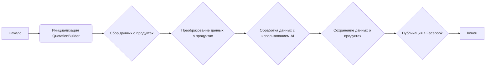
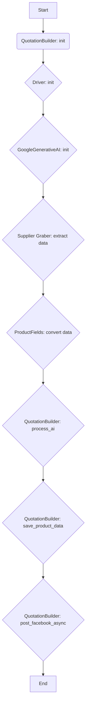
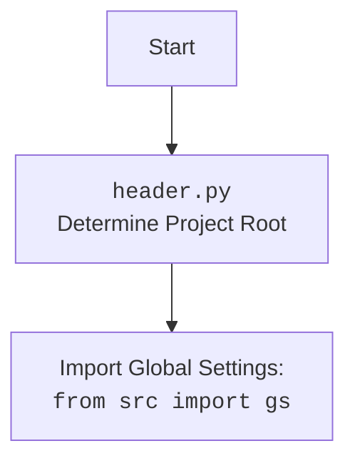

## Алгоритм

1. **Инициализация QuotationBuilder**:
   - Создается экземпляр класса `QuotationBuilder`.
   - Инициализируется веб-драйвер (`Firefox` или `Playwright`) для взаимодействия с веб-страницами.
   - Загружается конфигурация из `kazarinov.json`.
   - Инициализируется модель `GoogleGenerativeAI` для обработки текста.

2. **Сбор данных о продуктах**:
   - Используются классы грабберов поставщиков (`MorleviGraber`, `KspGraber`, `IvoryGraber`, `GrandadvanceGraber`) для извлечения данных о продуктах с веб-сайтов.
   - Данные о продуктах извлекаются и преобразуются в формат `ProductFields`.

3. **Преобразование данных о продуктах**:
   - Функция `convert_product_fields` преобразует поля продукта из объекта `ProductFields` в словарь.
   - Выполняется очистка и экранирование текста с использованием функции `escape_and_strip`.

4. **Обработка данных с использованием AI**:
   - Функция `process_ai` отправляет данные о продуктах в модель `GoogleGenerativeAI` для обработки.
   - Модель генерирует описание продукта на основе предоставленных данных.
   - Если модель возвращает невалидный результат, функция повторяет запрос несколько раз.

5. **Сохранение данных о продуктах**:
   - Функция `save_product_data` сохраняет обработанные данные о продуктах в JSON-файл.
   - Файл сохраняется в каталоге `export_path`.

6. **Публикация в Facebook**:
   - Функция `post_facebook_async` публикует данные о продуктах на странице Facebook.
   - Используются функции `post_message_title`, `upload_post_media` и `message_publish` для публикации сообщения, загрузки медиафайлов и публикации поста.

Пример блок-схемы:

## Mermaid

**Объяснение зависимостей:**

- `QuotationBuilder` является центральным классом, который координирует все этапы процесса.
- `Driver` используется для управления веб-браузером и взаимодействия с веб-страницами.
- `GoogleGenerativeAI` используется для обработки текста и генерации описаний продуктов.
- Классы грабберов поставщиков (`MorleviGraber`, `KspGraber`, `IvoryGraber`, `GrandadvanceGraber`) используются для извлечения данных о продуктах с веб-сайтов.
- `ProductFields` используется для представления данных о продуктах в структурированном формате.
- `post_message_title`, `upload_post_media` и `message_publish` используются для публикации данных на странице Facebook.

Дополнительный блок `mermaid` для `header.py`:

## Объяснение

**Импорты:**

- `re`: Модуль для работы с регулярными выражениями. Используется для очистки и экранирования текста.
- `bs4.BeautifulSoup`: Библиотека для парсинга HTML и XML. Используется для извлечения данных из веб-страниц.
- `jinja2.utils.F`: Утилиты Jinja2.
- `pydantic.type_adapter.P`: Pydantic адаптер типов.
- `requests`: Библиотека для отправки HTTP-запросов. Используется для загрузки изображений.
- `asyncio`: Библиотека для асинхронного программирования.
- `random`: Модуль для генерации случайных чисел.
- `shutil`: Модуль для работы с файлами и каталогами.
- `pathlib.Path`: Класс для представления путей к файлам и каталогам.
- `typing.Optional, List, Any`: Типы для аннотаций.
- `types.SimpleNamespace`: Класс для создания объектов с произвольными атрибутами.
- `dataclasses.field`: Функция для создания полей данных в классах данных.
- `telebot`: Библиотека для создания Telegram-ботов.
- `header`: Модуль для определения корневой директории проекта.
- `src.gs`: Глобальные настройки проекта.
- `src.endpoints.prestashop.product_fields.ProductFields`: Класс для представления полей продукта.
- `src.webdriver.driver.Driver`: Класс для управления веб-драйвером.
- `src.webdriver.firefox.Firefox`: Класс для управления браузером Firefox.
- `src.webdriver.playwright.Playwrid`: Класс для управления браузером Playwright.
- `src.ai.gemini.GoogleGenerativeAI`: Класс для взаимодействия с моделью Google Gemini AI.
- `src.endpoints.advertisement.facebook.scenarios`: Модуль, содержащий функции для публикации данных на странице Facebook.
- `src.suppliers.*.graber.Graber`: Классы для извлечения данных о продуктах с веб-сайтов различных поставщиков.
- `src.endpoints.kazarinov.report_generator.ReportGenerator`: Класс для генерации отчетов.
- `src.utils.jjson.j_loads, j_loads_ns, j_dumps`: Функции для работы с JSON-файлами.
- `src.utils.file.read_text_file, save_text_file, recursively_get_file_path`: Функции для работы с файлами.
- `src.utils.image.save_image_from_url_async, save_image`: Функции для сохранения изображений.
- `src.utils.printer.pprint`: Функция для красивой печати данных.
- `src.logger.logger.logger`: Объект логгера для записи сообщений о событиях.

**Классы:**

- `QuotationBuilder`:
    - **Роль**: Обрабатывает извлечение, разбор и сохранение данных о продуктах поставщиков.
    - **Атрибуты**:
        - `driver`: Экземпляр Selenium WebDriver.
        - `export_path`: Путь для экспорта данных.
        - `products_list`: Список обработанных данных о продуктах.
        - `base_path`: Базовый путь к каталогу.
        - `config`: Конфигурация из JSON-файла.
        - `html_path`, `pdf_path`, `docx_path`: Пути для сохранения отчетов.
        - `mexiron_name`: Название процесса Mexiron.
        - `price`: Цена продукта.
        - `timestamp`: Временная метка.
        - `model`: Экземпляр модели Google Gemini AI.
        - `translations`: Переводы.
        - `required_fields`: Кортеж необходимых полей товара.
    - **Методы**:
        - `__init__`: Инициализирует класс.
        - `convert_product_fields`: Преобразует поля продукта в словарь.
        - `process_ai`: Обрабатывает данные с использованием AI.
        - `save_product_data`: Сохраняет данные о продуктах в файл.
        - `post_facebook_async`: Публикует данные на странице Facebook.

**Функции:**

- `escape_and_strip(text: str) -> str`:
    - **Аргументы**:
        - `text`: Строка для очистки и экранирования.
    - **Возвращаемое значение**:
        - Очищенная и экранированная строка.
    - **Назначение**: Очищает и экранирует строку, заменяя символы `\'` и `\"` на `\\\'` и `\\"`, удаляя пробелы в начале и конце.
- `main()`:
    - **Назначение**:  Основная функция для запуска процесса создания отчетов.

**Переменные:**

- `ENDPOINT`: Константа, определяющая название endpoint (`kazarinov`).
- `gs`: Объект с глобальными настройками.
- `__root__`: Корневая директория проекта.

**Потенциальные ошибки и области для улучшения:**

- Обработка исключений: В коде встречаются блоки `try...except`, но обработка исключений не всегда полная.
- Логирование: Не все ошибки логируются.
- Асинхронность: В коде используются асинхронные функции, но не все операции выполняются асинхронно.
- Дублирование кода: В коде есть повторяющиеся блоки, которые можно вынести в отдельные функции.
- Отсутствие документации: Не все функции и классы имеют документацию.

**Взаимосвязи с другими частями проекта:**

- Модуль использует классы грабберов поставщиков (`src.suppliers.*.graber.Graber`) для извлечения данных о продуктах.
- Модуль использует класс `GoogleGenerativeAI` (`src.ai.gemini.GoogleGenerativeAI`) для обработки текста и генерации описаний продуктов.
- Модуль использует функции из модуля `src.endpoints.advertisement.facebook.scenarios` для публикации данных на странице Facebook.
- Модуль использует функции из модуля `src.utils.jjson` для работы с JSON-файлами.
- Модуль использует функции из модуля `src.utils.file` для работы с файлами.
- Модуль использует объект логгера `logger` (`src.logger.logger.logger`) для записи сообщений о событиях.