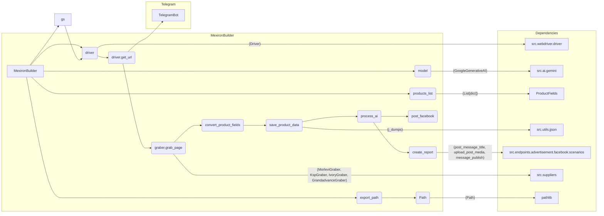

```MD
# Анализ кода сценария pricelist для Казаринова

## <input code>

```python
from __future__ import annotations
## \file hypotez/src/endpoints/kazarinov/scenarios/scenario_pricelist.py
# -*- coding: utf-8 -*-\
#! venv/Scripts/python.exe
#! venv/bin/python/python3.12

"""
Модуль исполнения сценария создания мехирона для Сергея Казаринова
==================================================================

```rst
.. module: src.endpoints.kazarinov.scenarios 
	:platform: Windows, Unix
	:synopsis: Provides functionality for extracting, parsing, and processing product data from 
various suppliers. The module handles data preparation, AI processing, 
and integration with Facebook for product posting.
```

"""
MODE = 'dev'

import asyncio
import random
import shutil
from pathlib import Path
from typing import Optional, List
from types import SimpleNamespace
from dataclasses import field

import header
from src import gs
from src.bots.telegram.bot import TelegramBot
from src.product.product_fields import ProductFields
from src.webdriver.driver import Driver
from src.ai.gemini import GoogleGenerativeAI
from src.endpoints.advertisement.facebook.scenarios import (
    post_message_title, upload_post_media, message_publish
)
from src.suppliers.morlevi.graber import Graber as MorleviGraber
from src.suppliers.ksp.graber import Graber as KspGraber
from src.suppliers.ivory.graber import Graber as IvoryGraber
from src.suppliers.grandadvance.graber import Graber as GrandadvanceGraber
from src.endpoints.kazarinov.pricelist_generator import ReportGenerator
from telegram import Update
from telegram.ext import CallbackContext

from src.utils.jjson import j_loads, j_loads_ns, j_dumps
from src.utils.file import read_text_file, save_text_file, recursively_get_file_path
from src.utils.image import save_png_from_url, save_png
from src.utils.convertors.unicode import decode_unicode_escape
from src.utils.printer import pprint
from src.logger import logger


# ... (rest of the code)
```

## <algorithm>

**Блок-схема:**

```mermaid
graph TD
    A[Инициализация MexironBuilder] --> B{Получение конфига};
    B -- Успех --> C[Формирование export_path];
    B -- Ошибка --> D[Логирование ошибки и выход];
    C --> E[Загрузка system_instruction];
    E --> F[Инициализация GoogleGenerativeAI];
    F --> G[Получение списка URL'ов];
    G --> H[Цикл по URL'ам];
    H --> I[Получение Graber];
    I -- Успех --> J[Парсинг данных];
    I -- Неудача --> K[Логирование ошибки и переход к следующему URL];
    J --> L[Конвертация в dict];
    L --> M[Сохранение данных];
    M -- Успех --> H;
    M -- Ошибка --> N[Логирование ошибки и переход к следующему URL];
    H --> O[Обработка данных через AI (he)];
    O --> P[Сохранение результатов (he)];
    O --> Q[Обработка данных через AI (ru)];
    Q --> R[Сохранение результатов (ru)];
    Q --> S[Генерация отчетов (ru)];
    P -- Успех --> S;
    P -- Ошибка --> T[Логирование ошибки];
    R -- Успех --> S;
    R -- Ошибка --> T;
    S --> U[Возврат True];
    T --> U;
```

**Пример:**

Предположим, `urls` содержит `['https://morlevi.co.il/product1', 'https://ksp.co.il/product2']`. Алгоритм обрабатывает каждый URL последовательно, получая соответствующий `Graber` (MorleviGraber для первого URL), парсит данные, сохраняет их в `products_list`, обрабатывает данные через AI (получая `he` и `ru` результаты), сохраняет результаты и генерирует отчеты.


## <mermaid>



**Объяснение диаграммы:**

Диаграмма показывает взаимосвязь классов и функций в `scenario_pricelist.py`.
`MexironBuilder` (А) взаимодействует с `Driver` (B), `export_path` (C), списком продуктов (D), моделью `GoogleGenerativeAI` (E) и т.д.
`Driver` (N) из `src.webdriver.driver` отвечает за взаимодействие с веб-драйвером.
`GoogleGenerativeAI` (O) из `src.ai.gemini` отвечает за работу с моделью Gemini.
`ProductFields` (P) определяет поля продукта.
`j_dumps` (Q) из `src.utils.jjson` используется для сериализации данных.
Функции из `src.endpoints.advertisement.facebook.scenarios` (R) отвечают за взаимодействие с Facebook.
Классы граберов (S) реализуют парсинг данных с различных сайтов.
`pathlib` (T) для работы с путями.
`gs` (V) содержит глобальные настройки.

## <explanation>

**Импорты:**

- `from __future__ import annotations`:  Улучшает работу с типизацией.
- `import asyncio`: Для асинхронных операций.
- `import random`: Для случайных чисел (если используются).
- `import shutil`: Для работы с файлами (скорее всего не используется напрямую).
- `from pathlib import Path`: Для работы с путями.
- `from typing import Optional, List`: Для определения типов данных.
- `from types import SimpleNamespace`: Для работы с объектами, имеющими атрибуты.
- `from dataclasses import field`: Для определения атрибутов класса.
- `import header`: Этот импорт обычно содержит общие настройки или функции для проекта, но без подробностей его трудно проанализировать.
- `from src import gs`: Доступ к глобальным настройкам и вспомогательным функциям.
- `from src.bots.telegram.bot import TelegramBot`: Возможно, для взаимодействия с Telegram.
- `from src.product.product_fields import ProductFields`: Определяет структуру данных о продуктах.
- `from src.webdriver.driver import Driver`: Для управления веб-драйвером.
- `from src.ai.gemini import GoogleGenerativeAI`: Для доступа к модели Gemini.
- `from src.endpoints.advertisement.facebook.scenarios import ...`: Функции для работы с Facebook.
- `from src.suppliers.* import Graber`: Для работы с разными поставщиками (Morlevi, KSP, etc.).
- `from src.endpoints.kazarinov.pricelist_generator import ReportGenerator`: Для создания отчетов.
- `from telegram import Update`: Если используется Telegram.
- `from telegram.ext import CallbackContext`: Для обработки Telegram обновлений.
- `from src.utils.*`: Различные вспомогательные функции (парсинг JSON, работа с файлами, обработка изображений, вывод в консоль).
- `from src.logger import logger`: Модуль для логирования.

**Классы:**

- `MexironBuilder`: Центральный класс, отвечающий за всю обработку. Имеет атрибуты `driver`, `export_path`, `products_list`, `model` (для Gemini), `config` и т.д. `__init__` инициализирует эти атрибуты. Методы `run_scenario`, `get_graber_by_supplier_url`, `convert_product_fields`, `save_product_data`, `process_ai`, `post_facebook`, `create_report` определяют поведение класса.

**Функции:**

- `run_scenario`:  Главная функция сценария, обрабатывающая список URL'ов. Обрабатывает данные от поставщиков, передает их в AI, сохраняет результат и публикует в Facebook.
- `get_graber_by_supplier_url`: Выбирает нужный грабер для конкретного поставщика по URL.
- `convert_product_fields`: Преобразует данные о продуктах в подходящий для AI формат.
- `save_product_data`: Сохраняет обработанные данные о продуктах в файлы.
- `process_ai`: Обрабатывает список продуктов через AI, получает ответ в формате JSON.  Важный момент – функция может рекурсивно вызывать себя для обработки возможных ошибок AI.
- `post_facebook`: Публикует информацию о продуктах в Facebook.
- `create_report`: Создает отчеты в формате HTML и PDF.

**Возможные ошибки и улучшения:**

- **Обработка исключений:** В коде есть обработка исключений (`try...except`), но местами она неполная или неэффективная.  Необходимо улучшить обработку ошибок на всех этапах (например, при чтении конфигураций, работе с поставщиками, обработке ответа AI). Дополнить логирование об ошибках.
- **Передача данных:** Некоторые части кода используют `products_list` (список данных о продуктах) без явной типизации. Нужно использовать `List[dict]` для лучшей ясности.
- **Управление рекурсией:**  В функции `process_ai` возможно бесконечное рекурсивное обращение, если модель всегда возвращает ошибочный результат. Необходимо установить предел рекурсии или более надежную стратегию обработки ошибок AI.
- **Использование `logger`:** Логирование должно быть более подробным, позволяя отслеживать каждый этап выполнения.
- **Обработка пустых значений:** Необходимо добавить проверки на пустые значения (списки `urls`, результаты парсинга, ответ от модели AI) в соответствующих местах для предотвращения ошибок.
- **Необработанный код `...`:** В коде присутствуют участки с `...`, что требует дополнительной информации для полного понимания логики и обработки ошибок.

**Взаимосвязи с другими частями проекта:**

Код сильно зависит от различных модулей из пакета `src`.  Например, `gs` содержит глобальные конфигурации, `src.webdriver.driver` используется для управления веб-драйвером, `src.ai.gemini` — для взаимодействия с моделью Gemini, а `src.suppliers.*` предоставляют инструменты для взаимодействия с поставщиками.  `ReportGenerator` демонстрирует связь с компонентами для создания отчетов.  Взаимодействие с Telegram и Facebook также присутствует, но требует больше информации о структуре проекта для более подробного анализа.