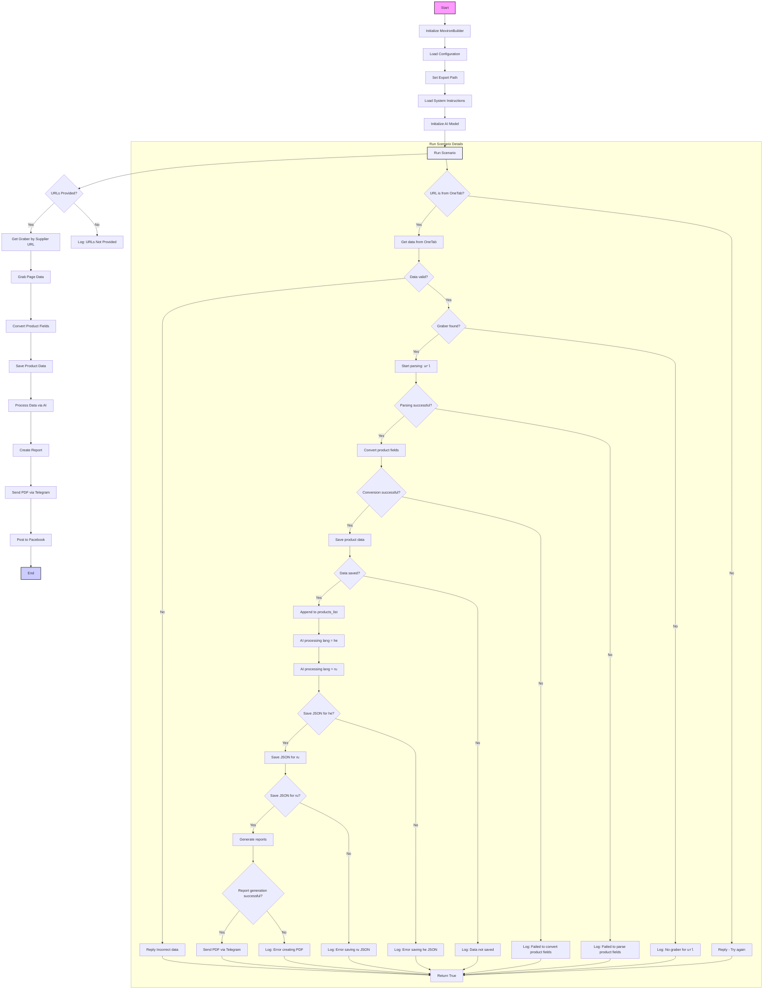

## Анализ кода `scenario_pricelist.md`

### <алгоритм>
1. **Инициализация**:
   - Создается экземпляр класса `MexironBuilder`, который отвечает за весь процесс создания мехирона.
   - Загружается конфигурация из JSON файла, которая содержит различные параметры для работы.
   - Устанавливается путь для экспорта данных.
   - Загружаются системные инструкции для AI модели, которые будут использоваться при обработке данных.
   - Инициализируется AI модель (Google Gemini).

2. **Запуск сценария (`run_scenario`)**:
   - Проверяется наличие URL для парсинга.
     - Если URL есть, то начинается процесс обработки.
     - Если URL нет, то в лог записывается сообщение об отсутствии URL.

3. **Обработка URL**:
   - Для каждого URL определяется соответствующий грабер (модуль для извлечения данных с сайта).
   - Запускается процесс парсинга страницы с использованием грабера.
   - Извлеченные данные конвертируются в словарь.
   - Сохраненные данные записываются в файл.

4. **AI Обработка**:
   - Обрабатывает список продуктов через AI модель (Google Gemini) для двух языков (русский и иврит).
   - Результат сохраняется в JSON формате.

5. **Генерация отчетов**:
   - Создаются HTML и PDF отчеты.
   - Если отчеты создаются успешно, PDF отправляются через Telegram.
   - Если возникают ошибки при создании отчетов, информация об ошибке логируется.

6. **Публикация в Facebook**:
   - Данные публикуются в Facebook.

7. **Завершение**:
   - Завершается сценарий.

Пример:

1.  **Инициализация:** Создаем `MexironBuilder` с драйвером Selenium.
2.  **Запуск сценария:**  `run_scenario` получает список URL (`['https://example.com/product1', 'https://example.com/product2']`).
3.  **Обработка URL:** Для `https://example.com/product1` определяется грабер, данные с сайта извлекаются и конвертируются в словарь.
4.  **AI обработка**: Данные отправляются в AI модель для обработки на русском и иврите.
5.  **Сохранение и генерация отчетов**: Данные сохраняются в JSON формате, создаются HTML и PDF отчеты.
6.  **Публикация в Facebook**: Данные публикуются в Facebook.

### <mermaid>

**Объяснение зависимостей `mermaid`:**

*   `Start`: Начало выполнения скрипта.
*   `InitMexironBuilder`: Инициализирует класс `MexironBuilder`, который управляет всем процессом.
*   `LoadConfig`: Загружает настройки из файла конфигурации, влияющие на работу скрипта.
*   `SetExportPath`: Устанавливает путь, куда будут сохраняться результаты работы скрипта.
*   `LoadSystemInstruction`: Загружает инструкции для AI модели, используемые при обработке данных.
*   `InitModel`: Инициализирует AI модель (Google Gemini), которая используется для обработки данных.
*   `RunScenario`: Запускает основной сценарий, который выполняет все шаги по созданию мехирона.
*   `CheckURLs`: Проверяет, предоставлены ли URL для обработки.
*   `GetGraber`: Получает экземпляр грабера для извлечения данных с сайта на основе URL.
*   `GrabPage`: Извлекает данные со страницы сайта, используя полученный грабер.
*   `ConvertFields`: Конвертирует извлеченные данные в словарь для дальнейшей обработки.
*   `SaveData`: Сохраняет обработанные данные в файл.
*    `ProcessAI`: Обрабатывает данные с помощью AI модели, предоставляя результаты в формате JSON.
*   `CreateReport`: Генерирует HTML и PDF отчеты на основе обработанных данных.
*   `SendPDF`: Отправляет созданные PDF-отчеты через Telegram.
*   `PostFacebook`: Публикует данные в Facebook.
*   `End`: Конец выполнения скрипта.
*   **`Run Scenario Details`**: Содержит подробности сценария `run_scenario`.
    *   `IsOneTab`: Проверка на то, является ли URL страницей OneTab.
    *   `GetDataFromOneTab`: Получение данных с OneTab.
    *   `ReplyTryAgain`: Ответ с просьбой попробовать еще раз.
    *   `IsDataValid`: Проверка на валидность полученных данных.
    *   `ReplyIncorrectData`: Ответ с информацией о некорректных данных.
    *   `IsGraberFound`: Проверяет, найден ли грабер для данного URL.
    *   `StartParsing`: Начинает процесс парсинга данных со страницы.
    *   `IsParsingSuccessful`: Проверка успешности парсинга.
    *   `ConvertProductFields`: Конвертация данных о продуктах.
    *    `IsConversionSuccessful`: Проверка успешности конвертации данных.
    *   `SaveProductData`: Сохранение данных продукта.
    *   `IsDataSaved`: Проверка успешности сохранения данных.
    *   `AppendToProductsList`: Добавление данных в список продуктов.
    *   `ProcessAIHe`: AI обработка данных на иврите.
    *   `ProcessAIRu`: AI обработка данных на русском.
    *    `SaveHeJSON`: Сохранение данных в JSON для иврита.
    *   `SaveRuJSON`: Сохранение данных в JSON для русского.
    *   `IsRuJSONSaved`: Проверка успешности сохранения JSON для русского.
    *   `GenerateReports`: Генерация отчетов.
     * `IsReportGenerationSuccessful`: Проверка успешности генерации отчетов.
    *   `SendPDFTelegram`: Отправка PDF отчета через телеграм.
    *   `LogNoGraber`: Запись в лог об отсутствии грабера.
    *   `LogParsingFailed`: Запись в лог об ошибке парсинга.
    *   `LogConversionFailed`: Запись в лог об ошибке конвертации.
    *   `LogDataNotSaved`: Запись в лог о неудачном сохранении данных.
    *   `LogHeJSONError`: Запись в лог об ошибке сохранения JSON для иврита.
    *   `LogRuJSONError`: Запись в лог об ошибке сохранения JSON для русского.
    *   `ReturnTrue`: Возвращает `True`, завершая выполнение сценария.
    *   `LogPDFError`: Запись в лог об ошибке создания PDF.

### <объяснение>

**Импорты:**

*   `selenium`: Используется для автоматизации браузера, в основном для взаимодействия с веб-страницами и извлечения данных.
*   `asyncio`:  Используется для асинхронных операций, позволяя скрипту выполнять несколько задач параллельно, не блокируя выполнение других операций.
*    `pathlib`: Обеспечивает удобную работу с путями к файлам и каталогам.
*   `types`:  Используется для создания простых пространств имен (SimpleNamespace), что позволяет удобно обращаться к атрибутам объектов.
*   `typing`: Используется для аннотации типов, что улучшает читаемость кода и упрощает отладку.
*   `src.ai.gemini`: Пакет, содержащий функциональность для взаимодействия с Google Gemini AI, который используется для обработки данных.
*   `src.suppliers.*.graber`: Пакеты, содержащие граберы для различных поставщиков, которые используются для извлечения данных с их веб-страниц.
*   `src.endpoints.advertisement.facebook.scenarios`: Пакет, содержащий функциональность для публикации обработанных данных в Facebook.

**Классы:**

*   `MexironBuilder`:
    *   **Роль**: Основной класс, управляющий процессом создания мехирона (прайс-листа). Он содержит методы для загрузки конфигураций, обработки данных, сохранения результатов и публикации в Facebook.
    *   **Атрибуты**:
        *   `driver`: Экземпляр Selenium WebDriver для управления браузером.
        *   `export_path`: Путь для сохранения обработанных данных.
        *   `mexiron_name`: Пользовательское имя для мехирона.
        *   `price`: Цена обработки данных.
        *   `timestamp`: Временная метка для отслеживания процесса.
        *   `products_list`: Список обработанных данных о продуктах.
        *   `model`: Экземпляр Google Generative AI model для обработки текста.
        *   `config`: Конфигурация, загруженная из JSON.
    *   **Методы**:
        *   `__init__(self, driver: Driver, mexiron_name: Optional[str] = None)`: Инициализирует класс, устанавливая начальные значения атрибутов.
        *   `run_scenario(self, system_instruction: Optional[str] = None, price: Optional[str] = None, mexiron_name: Optional[str] = None, urls: Optional[str | List[str]] = None, bot = None) -> bool`: Запускает основной сценарий обработки данных: парсинг, AI-обработка, сохранение и генерация отчетов.
        *  `get_graber_by_supplier_url(self, url: str)`: Возвращает соответствующий грабер для заданного URL.
        *   `convert_product_fields(self, f: ProductFields) -> dict`: Преобразует данные продукта из объекта `ProductFields` в словарь.
        *   `save_product_data(self, product_data: dict)`: Сохраняет данные продукта в файл.
        *   `process_ai(self, products_list: List[str], lang: str, attempts: int = 3) -> tuple | bool`: Обрабатывает список продуктов через AI модель.
        *   `post_facebook(self, mexiron: SimpleNamespace) -> bool`: Публикует обработанные данные в Facebook.
        *   `create_report(self, data: dict, html_file: Path, pdf_file: Path)`: Генерирует HTML и PDF отчеты из обработанных данных.

**Функции:**

*   Методы класса `MexironBuilder` выполняют конкретные задачи по обработке, сохранению данных, взаимодействию с AI, созданию отчетов и публикации в Facebook.

**Переменные:**

*   `driver`: Экземпляр `Driver` класса из `src.webdriver.driver`, необходимый для управления браузером.
*   `export_path`: Строка, содержащая путь к каталогу, в котором будут сохраняться результаты.
*   `mexiron_name`: Строка, представляющая имя мехирона.
*   `price`: Строка, представляющая стоимость обработки.
*   `timestamp`: Число с плавающей точкой, представляющее временную метку.
*   `products_list`: Список словарей, содержащих данные о товарах после обработки.
*   `model`: Экземпляр AI модели из `src.ai.gemini`.
*   `config`: Словарь, содержащий конфигурации загруженные из JSON файла.
*   `urls`: Строка или список строк, содержащие URL для парсинга.

**Потенциальные ошибки и области для улучшения:**

*   **Отсутствие обработки исключений:** В коде есть логирование ошибок, но нет обработки исключений, что может привести к аварийному завершению скрипта. Необходимо добавить `try-except` блоки для обработки возможных ошибок при парсинге, работе с AI и файловой системой.
*   **Жесткая привязка к Telegram:** Отправка PDF через Telegram может быть нежелательной для всех пользователей.  Возможно стоит добавить настройки отправки отчетов или использовать другие каналы для доставки отчетов.
*   **Зависимость от API Facebook:** Проблемы с API Facebook могут повлиять на функциональность публикации. Следует предусмотреть fallback-механизмы или оповещения об ошибках.
*   **Управление асинхронностью:** В коде используется `asyncio`, но конкретные детали асинхронных операций не описаны. Необходимо убедиться, что асинхронные операции обрабатываются правильно, чтобы избежать проблем с конкурентным доступом к ресурсам.
*   **Масштабируемость:** Текущая архитектура может быть недостаточно масштабируемой при работе с большим количеством URL и данных. Можно рассмотреть использование механизмов очередей и распределенной обработки.

**Взаимосвязи с другими частями проекта:**

*   **`src.webdriver.driver`:** Используется для управления браузером Selenium, необходим для автоматического сбора данных с веб-страниц.
*   **`src.ai.gemini`:** Используется для обработки текста с использованием AI, что позволяет анализировать и извлекать необходимую информацию из данных о продуктах.
*   **`src.suppliers.*.graber`:** Модули, предназначенные для парсинга сайтов конкретных поставщиков. Они используются для извлечения данных о товарах с различных веб-ресурсов.
*    **`src.endpoints.advertisement.facebook.scenarios`**: Используется для публикации данных в Facebook, обеспечивая взаимодействие с социальной сетью.

Этот скрипт является частью более крупного проекта, и его функциональность интегрирована с другими модулями для обеспечения полного цикла обработки данных, от извлечения до публикации.