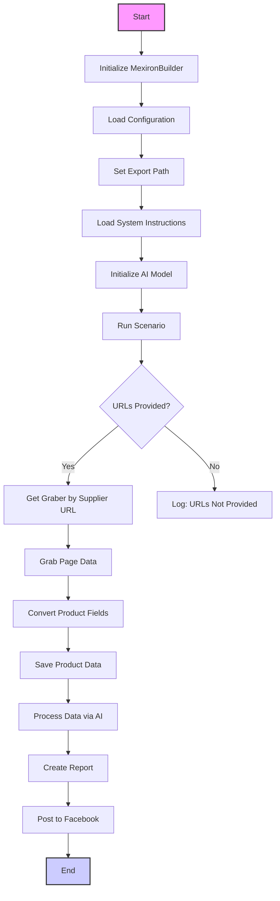
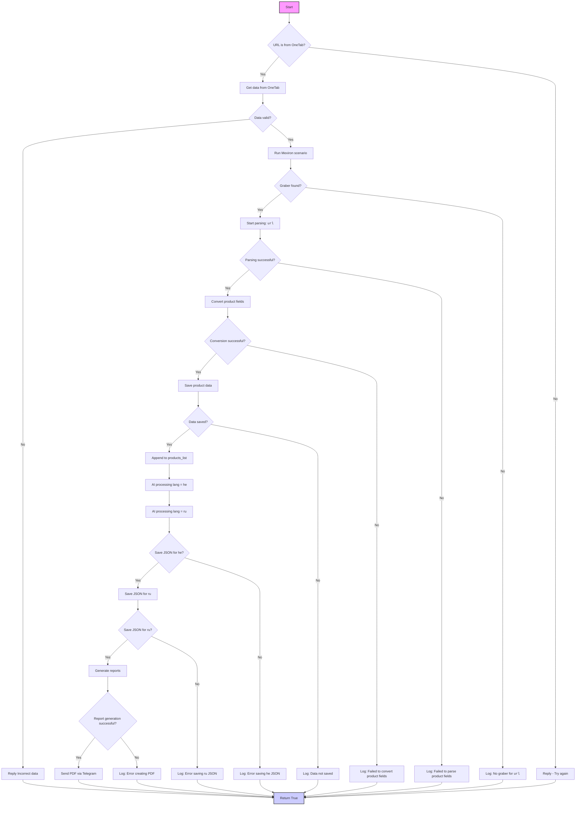
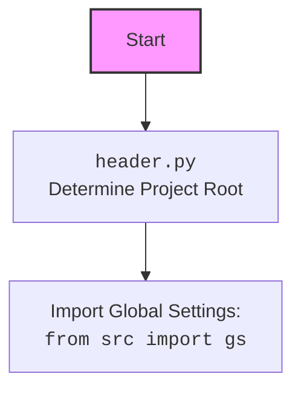

## АНАЛИЗ КОДА: `hypotez/src/endpoints/kazarinov/scenarios/scenario_pricelist.md`

### 1. <алгоритм>

**Описание рабочего процесса:**

1. **Инициализация:**
   - Создается экземпляр класса `MexironBuilder`, который управляет всем процессом.
   - Загружается конфигурация из JSON файла.
   - Устанавливается путь для экспорта данных.
   - Загружаются системные инструкции для AI модели.
   - Инициализируется AI модель.

2. **Выполнение сценария:**
   - Проверяется наличие предоставленных URL для парсинга. Если URL не предоставлены, скрипт завершается с соответствующей записью в лог.
   - Если URL есть, то выполняется итерация по каждому URL:
     - Определяется соответствующий грабер (инструмент для сбора данных) на основе URL поставщика.
     - С помощью грабера извлекаются данные со страницы.
     - Происходит конвертация полей продукта в формат словаря.
     - Сохраняются полученные данные.
     - Данные обрабатываются через AI модель (Google Gemini) на двух языках: иврит (`he`) и русский (`ru`).
     - Генерируются HTML и PDF отчеты.
     - При успешной генерации PDF, отчет отправляется через Telegram.
     - Данные публикуются в Facebook (если это предусмотрено).

**Примеры:**

*   **Инициализация:**
    ```python
    driver = Driver(...)  # Создание экземпляра драйвера Selenium
    mexiron_builder = MexironBuilder(driver) # Создание экземпляра MexironBuilder
    ```
*   **Загрузка конфигурации:**
    ```python
    # Конфигурационный файл: config.json
    {
      "export_path": "/path/to/export",
      "ai_model": {
        "model_name": "gemini-pro",
        "api_key": "your_api_key"
      }
    }
    ```

*   **Извлечение данных:**
    ```python
    # URL поставщика: https://example.com/product1
    graber = mexiron_builder.get_graber_by_supplier_url("https://example.com/product1")
    product_data = graber.grab_page("https://example.com/product1")
    ```

*   **Обработка AI:**
    ```python
    product_list = [
        "{'name': 'Product 1', 'price': '100', 'description': 'Test description 1'}",
        "{'name': 'Product 2', 'price': '200', 'description': 'Test description 2'}"
    ]
    ai_response_he, ai_response_ru = mexiron_builder.process_ai(product_list, "he", attempts=3)
    ```

*   **Генерация отчета:**
    ```python
    data = {'product_1': {'ai_description_he': 'descr1', 'ai_description_ru': 'descr1_ru'}}
    html_file = Path("./report.html")
    pdf_file = Path("./report.pdf")
    mexiron_builder.create_report(data, html_file, pdf_file)
    ```

**Поток данных:**

1.  URL -> `get_graber_by_supplier_url` -> Graber instance
2.  Graber instance, URL -> `grab_page` -> Product data
3.  Product data -> `convert_product_fields` -> Dict (formatted product data)
4.  Dict -> `save_product_data` -> File (saved product data)
5.  List of formatted product data -> `process_ai` -> Tuple (AI-processed data in `ru` and `he`)
6.  AI-processed data -> `create_report` -> HTML, PDF reports
7.  Report data -> `post_facebook` -> Facebook post (if any)

### 2. <mermaid>







**Зависимости:**

*   Диаграмма показывает последовательность шагов, выполняемых скриптом `scenario_pricelist`.
*   Каждый блок представляет отдельную операцию или проверку.
*   **`Start`**: Начало выполнения скрипта.
*   **`InitMexironBuilder`**: Инициализация класса `MexironBuilder`, который управляет всем процессом.
*   **`LoadConfig`**: Загрузка конфигурационных параметров из JSON файла.
*    **`SetExportPath`**: Установка пути для сохранения экспортированных данных.
*    **`LoadSystemInstruction`**: Загрузка системных инструкций для модели AI.
*    **`InitModel`**: Инициализация AI модели, которая будет использоваться для обработки данных.
*   **`RunScenario`**: Запуск основного сценария обработки данных.
*   **`CheckURLs`**: Проверка, предоставлены ли URL для обработки.
*   **`GetGraber`**: Получение нужного грабера для обработки данных с сайта, используя URL поставщика.
*    **`LogNoURLs`**: Запись в лог об отсутствии URL адресов.
*   **`GrabPage`**: Получение данных со страницы, используя грабер.
*   **`ConvertFields`**: Преобразование полученных данных в нужный формат.
*   **`SaveData`**: Сохранение преобразованных данных.
*   **`ProcessAI`**: Обработка данных с использованием AI модели.
*   **`CreateReport`**: Создание отчетов (HTML и PDF).
*   **`PostFacebook`**: Публикация данных в Facebook.
*   **`End`**: Завершение работы скрипта.
*   Вторая диаграмма детализирует `RunScenario`, показывая все проверки и обработки данных.
*   Третья диаграмма показывает работу `header.py`, который определяет корень проекта и импортирует глобальные настройки.

### 3. <объяснение>

#### Импорты:

*   `selenium`: Используется для автоматизации веб-браузера, что необходимо для взаимодействия с веб-страницами и сбора данных.
*   `asyncio`: Позволяет выполнять асинхронные операции, что может улучшить производительность при параллельной обработке данных.
*   `pathlib`: Предоставляет удобный способ работы с путями файлов и директорий, упрощая манипуляции с файловой системой.
*   `types`: Используется для создания простых пространств имен (`SimpleNamespace`), что позволяет удобно хранить и передавать данные.
*   `typing`: Предоставляет средства для аннотирования типов, что помогает сделать код более читаемым и обнаруживать ошибки на ранних этапах разработки.
*   `src.ai.gemini`: Содержит классы и функции для взаимодействия с моделью Google Gemini, используемой для обработки текста.
*    `src.suppliers.*.graber`:  Содержит специализированные классы для парсинга данных с сайтов разных поставщиков.
*   `src.endpoints.advertisement.facebook.scenarios`: Включает сценарии для публикации данных в Facebook.

#### Класс `MexironBuilder`:

*   **Роль**: Основной класс, управляющий процессом создания "мехирона" (прайс-листа). Он отвечает за координацию загрузки данных, их обработки и публикации.
*   **Атрибуты**:
    *   `driver`: Экземпляр WebDriver для управления браузером.
    *   `export_path`: Путь для сохранения сгенерированных отчетов и данных.
    *   `mexiron_name`: Пользовательское имя для процесса создания мехирона.
    *   `price`: Цена для обработки данных.
    *   `timestamp`: Метка времени для отслеживания процесса.
    *   `products_list`: Список обработанных данных о продуктах.
    *   `model`: Экземпляр AI модели (Google Gemini).
    *   `config`: Загруженная конфигурация из JSON.
*   **Методы**:
    *   `__init__`: Инициализирует класс, устанавливая необходимые параметры и загружая конфигурацию.
    *   `run_scenario`: Запускает основной сценарий: извлекает данные из URL, обрабатывает их с помощью AI, сохраняет и публикует. Включает проверку валидности данных, поиск граббера, парсинг, конвертацию, сохранение и обработку AI.
    *   `get_graber_by_supplier_url`: Определяет и возвращает соответствующий грабер для заданного URL.
    *   `convert_product_fields`: Преобразует полученные данные о продукте в словарь.
    *   `save_product_data`: Сохраняет обработанные данные в файл.
    *   `process_ai`: Обрабатывает список продуктов с помощью AI модели, используя `src.ai.gemini`.
    *   `post_facebook`: Запускает процесс публикации обработанных данных в Facebook, используя `src.endpoints.advertisement.facebook.scenarios`.
    *   `create_report`: Генерирует HTML и PDF отчеты на основе обработанных данных.

#### Функции:

*   `__init__(self, driver: Driver, mexiron_name: Optional[str] = None)`:
    *   **Аргументы:**
        *   `driver`: Экземпляр `Driver` для управления браузером.
        *   `mexiron_name`: Необязательное имя мехирона.
    *   **Назначение**: Инициализирует объект `MexironBuilder`, настраивает драйвер и имя.
*   `run_scenario(...)`:
    *   **Аргументы**:
        *   `system_instruction`: Инструкции для AI модели.
        *   `price`: Цена для обработки.
        *   `mexiron_name`: Имя мехирона.
        *   `urls`: Список URL страниц продуктов.
        *   `bot`: Объект бота (вероятно для Telegram).
    *   **Назначение**: Запускает основной сценарий, включая извлечение данных, AI обработку, сохранение и публикацию. Возвращает `True` при успехе, `False` при ошибке.
*   `get_graber_by_supplier_url(self, url: str)`:
    *   **Аргументы**:
        *   `url`: URL поставщика.
    *   **Назначение**: Возвращает экземпляр соответствующего грабера на основе URL поставщика.
*   `convert_product_fields(self, f: ProductFields) -> dict`:
    *   **Аргументы**:
        *   `f`: Объект с данными о продукте.
    *   **Назначение**: Преобразует данные о продукте в словарь.
*   `save_product_data(self, product_data: dict)`:
    *   **Аргументы**:
        *   `product_data`: Словарь с данными о продукте.
    *   **Назначение**: Сохраняет данные о продукте в файл.
*   `process_ai(self, products_list: List[str], lang: str, attempts: int = 3) -> tuple | bool`:
    *   **Аргументы**:
        *   `products_list`: Список словарей с данными продукта.
        *   `lang`: Язык обработки AI (`he` или `ru`).
        *   `attempts`: Количество попыток при ошибке.
    *   **Назначение**: Обрабатывает данные с помощью AI модели на заданном языке. Возвращает результат в виде кортежа для `ru` и `he`, или `False` при ошибке.
*  `post_facebook(self, mexiron: SimpleNamespace) -> bool`:
    *   **Аргументы**:
        *   `mexiron`: Данные для публикации в Facebook.
    *   **Назначение**: Публикует обработанные данные в Facebook. Возвращает `True` при успехе, `False` при ошибке.
*   `create_report(self, data: dict, html_file: Path, pdf_file: Path)`:
    *   **Аргументы**:
        *   `data`: Данные для отчета.
        *   `html_file`: Путь к HTML файлу.
        *   `pdf_file`: Путь к PDF файлу.
    *   **Назначение**: Создает HTML и PDF отчеты из данных.

#### Переменные:

*   `driver`: Объект WebDriver, используемый для управления браузером.
*   `export_path`: Путь к директории для сохранения данных.
*   `mexiron_name`: Имя текущего процесса.
*    `price`: Цена обработки.
*   `timestamp`: Отметка времени начала процесса.
*   `products_list`: Список обработанных данных о продуктах.
*   `model`: Объект AI модели.
*   `config`: Словарь с параметрами конфигурации.
*   `urls`: Список URL страниц продуктов.
*   `graber`: Экземпляр класса для парсинга страниц.
*  `product_data`: Словарь с данными о продукте.
*  `ai_response_he, ai_response_ru`: Ответы от AI модели на иврите и русском.

#### Потенциальные ошибки и области для улучшения:

*   **Обработка ошибок:** Хотя есть логирование ошибок, более детальная обработка исключений могла бы улучшить стабильность скрипта, например, предусмотреть повторные попытки при сбоях сети или AI модели.
*   **Динамическая настройка граберов:** Возможность динамической загрузки граберов на основе настроек, а не статически заданных в коде, сделает систему более гибкой.
*   **Параллелизация:** Использование `asyncio` можно расширить для параллельной обработки нескольких URL или AI запросов.
*   **Мониторинг:** Добавление мониторинга процесса, такого как прогресс выполнения и логирование важных событий, поможет в отладке и анализе работы скрипта.
*   **Конфигурация:**  Добавление более гибких настроек через конфигурационный файл или аргументы командной строки позволит настраивать поведение скрипта без необходимости изменения кода.
*   **Тестирование**:  Повышение покрытия кода тестами поможет выявлять проблемы на ранних стадиях разработки и повысит уверенность в работоспособности скрипта.

#### Взаимосвязи с другими частями проекта:

*   `src.webdriver.driver`: Используется для создания и управления экземпляром браузера Selenium.
*   `src.ai.gemini`: Предоставляет функции для взаимодействия с AI моделью Google Gemini.
*   `src.suppliers.*.graber`: Различные модули, которые предоставляют граберы для конкретных поставщиков.
*  `src.endpoints.advertisement.facebook.scenarios`: Модуль для публикации данных на Facebook.

Этот скрипт предназначен для автоматизации обработки данных, их интеллектуального анализа и публикации, используя различные части проекта. Он наглядно демонстрирует интеграцию нескольких компонентов проекта для достижения бизнес-цели - создания "мехирона" с применением AI и автоматизации.