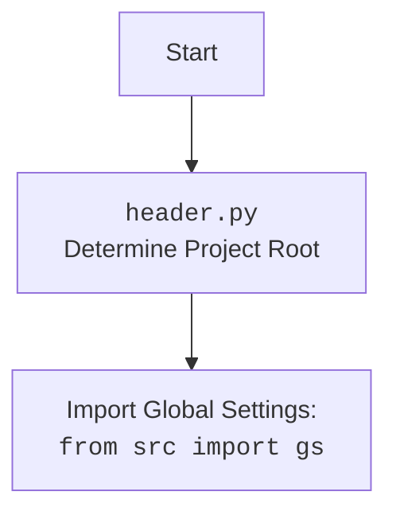

## АНАЛИЗ КОДА: `hypotez/src/endpoints/kazarinov/scenarios/scenario_pricelist.py`

### <алгоритм>

1.  **Инициализация `MexironBuilder`:**
    *   Создается экземпляр класса `MexironBuilder` с передачей `driver` (Selenium WebDriver) и `mexiron_name` (необязательное имя мехирона).
    *   Загружается конфигурация из JSON (`kazarinov.json`). Если не удалось загрузить, возвращается.
    *   Определяется `timestamp` (текущее время).
    *   Формируется путь для экспорта данных в зависимости от конфигурации (`storage`) и имени мехирона. Если не удалось - возвращается.
    *   Загружается системная инструкция для модели Gemini (`system_instruction_mexiron.md`). Если не удалось загрузить, возвращается.
    *   Инициализируется модель `GoogleGenerativeAI` с ключом API, системной инструкцией и конфигурацией ответа. Если не удалось инициализировать модель - возвращается.
    *   Инициализируется `translations` как `SimpleNamespace` через `j_loads_ns`.

2.  **Выполнение сценария `run_scenario`:**
    *   Принимает `update` (объект Telegram Update), `context` (контекст Telegram), `urls` (список URL-адресов продуктов), `price` (необязательная цена) и `mexiron_name` (необязательное имя мехирона).
    *   Устанавливает атрибуты `update` и `context`.
    *   Определяются необходимые поля товара `required_fields` (`id_product`, `name`, `description_short`, `description`, `specification`, `local_image_path`).
    *   Итерируется по списку `urls`:
        *   Получает грабер (`get_graber_by_supplier_url`) в зависимости от URL. Если грабер не найден, пропускает URL.
        *   Отправляет уведомление в Telegram о начале обработки URL.
        *   Использует грабер для извлечения данных о товаре (`grab_page`) и ждёт.
        *   Конвертирует полученные поля в словарь (`convert_product_fields`). Если конвертация не удалась, пропускает товар.
        *   Сохраняет данные о товаре в JSON файл (`save_product_data`). Если сохранение не удалось, пропускает товар.
        *   Добавляет данные о товаре в `products_list`.
    *   Итерируется по языкам в `langs_list` (`he`, `ru`):
        *   Отправляет уведомление в Telegram о начале обработки языка.
        *   Вызывает `process_ai` для обработки данных с помощью ИИ и получения перевода. Если `process_ai` возвращает ошибку, пропускает язык.
        *   Добавляет цену и валюту в данные для текущего языка.
        *   Сохраняет данные в JSON файл для текущего языка.
        *   Формирует пути для `html` и `pdf` файлов отчета.
        *   Создает отчёт (`create_report`) в формате HTML и PDF.
        *   Если отчет успешно создан и отправлен, уведомляет об этом пользователя.

3.  **Получение грабера `get_graber_by_supplier_url`:**
    *   Принимает URL-адрес.
    *   Переходит по URL-адресу с помощью драйвера.
    *   Проверяет, с какого сайта URL, и возвращает соответствующий грабер:
        *   `MorleviGraber` для `morlevi.co.il`.
        *   `KspGraber` для `ksp.co.il`.
        *   `GrandadvanceGraber` для `grandadvance.co.il`.
        *   `IvoryGraber` для `ivory.co.il`.
    *   Если ни один грабер не подошел, возвращает `None`.

4.  **Конвертация полей `convert_product_fields`:**
    *   Принимает объект `ProductFields`.
    *   Если `id_product` не существует, возвращает пустой словарь.
    *   Формирует словарь с данными о товаре:
        *   `product_title`: название товара.
        *   `product_id`: ID товара.
        *   `description_short`: краткое описание.
        *   `description`: полное описание.
        *   `specification`: спецификация.
        *    `local_image_path`: путь к локально сохраненному изображению.
    *   Возвращает сформированный словарь.

5.  **Сохранение данных `save_product_data`:**
    *   Принимает словарь с данными товара.
    *   Формирует путь для сохранения JSON файла.
    *   Сохраняет JSON файл с данными товара.
    *   Возвращает `True` если сохранение прошло успешно, `None` в случае ошибки.

6.  **Обработка AI `process_ai`:**
    *   Принимает список товаров и язык.
    *   Загружает инструкцию для AI (`command_instruction_mexiron_{lang}.md`).
    *   Отправляет запрос в AI модель.
    *   Парсит ответ JSON.
    *   Если парсинг не удался или модель вернула невалидный ответ - рекурсивно вызывается сама с уменьшенным количеством попыток.
    *   Возвращает словарь с переведенными данными.

7.  **Публикация в Facebook `post_facebook`:**
    *   Переходит по URL-адресу профиля Facebook.
    *   Формирует заголовок сообщения на основе данных `mexiron`.
    *   Публикует заголовок сообщения, медиа и само сообщение.
    *   Возвращает `True` в случае успеха, иначе `None`.

8.  **Создание отчёта `create_report`:**
    *   Принимает словарь с данными, язык, пути к `html` и `pdf` файлам.
    *   Создает экземпляр `ReportGenerator`.
    *   Вызывает метод `create_report` для создания HTML и PDF отчетов.
    *   Отправляет PDF-файл боту через `reply_document` если файл создан, и уведомляет об успехе.
    *   В случае если файл не создан, логгирует ошибку.

### <mermaid>

```mermaid
flowchart TD
    subgraph MexironBuilder
        Start(Start MexironBuilder) --> LoadConfig[Load Configuration\nfrom `kazarinov.json`]
         LoadConfig -- Error --> End(Return)
         LoadConfig --> SetTimestamp[Set Timestamp\n`gs.now`]
        SetTimestamp --> SetExportPath[Set Export Path\naccording to config]
        SetExportPath -- Error --> End
        SetExportPath --> LoadSystemInstruction[Load System Instruction\nfrom `system_instruction_mexiron.md`]
        LoadSystemInstruction -- Error --> End
        LoadSystemInstruction --> InitGemini[Initialize GoogleGenerativeAI]
        InitGemini -- Error --> End
        InitGemini --> SetTranslations[Set Translations \nfrom `mexiron.json`]
        SetTranslations --> RunScenario[Run Scenario]
        RunScenario --> LoopUrls[Loop through URLs]
        LoopUrls -- for each url --> GetGraber[Get Graber\nby supplier URL]
        GetGraber -- No Graber --> NextUrl[Next URL]
        GetGraber --> GrabPage[Grab Product Fields\n`graber.grab_page()`]
        GrabPage -- Error --> NextUrl
        GrabPage --> ConvertFields[Convert Product Fields\n`convert_product_fields()`]
        ConvertFields -- No Data --> NextUrl
        ConvertFields --> SaveProductData[Save Product Data\n`save_product_data()`]
        SaveProductData -- Error --> NextUrl
        SaveProductData --> AppendProduct[Append to `products_list`]
         AppendProduct --> NextUrl
        NextUrl --> LoopUrls
        LoopUrls -- end loop --> LoopLangs[Loop through Languages\n`he`, `ru`]
        LoopLangs -- for each lang --> ProcessAI[Process with AI\n`process_ai()`]
        ProcessAI -- No Data --> NextLang[Next Lang]
        ProcessAI --> AddPriceCurrency[Add Price and Currency]
        AddPriceCurrency --> SaveJSON[Save JSON File]
        SaveJSON --> CreateReport[Create Report\n`create_report()`]
         CreateReport  --> SendReport[Send Report]
          SendReport --> NextLang
        NextLang --> LoopLangs
        LoopLangs -- end loop --> PostFacebookCheck{Post Facebook?}
        PostFacebookCheck -- Yes --> PostFacebook[Post to Facebook]
        PostFacebookCheck -- No --> End
        PostFacebook --> End
    end
    
    subgraph Graber
        GetGraber --> MorleviGraber[Morlevi Graber]
        GetGraber --> KspGraber[Ksp Graber]
         GetGraber --> GrandadvanceGraber[Grandadvance Graber]
        GetGraber --> IvoryGraber[Ivory Graber]
    end
    
    
     subgraph Report
        CreateReport --> ReportGenerator[Report Generator]
     ReportGenerator --> CreateHTMLPDF[Create HTML & PDF\n`create_report()`]
     CreateHTMLPDF -- Success --> ReplyDocument[Reply with PDF \nto Telegram Chat]
     CreateHTMLPDF -- Fail --> ReportFail[Report Generation Fail]
    end

    style End fill:#f9f,stroke:#333,stroke-width:2px
```



### <объяснение>

**Импорты:**

*   `from __future__ import annotations`: Обеспечивает возможность использования аннотаций типов, которые могут ссылаться на класс, который еще не определен.
*   `import asyncio`: Для асинхронного программирования.
*   `import random`:  Для генерации случайных чисел. (В коде не используется).
*    `import shutil`: Для работы с файлами и каталогами (В коде не используется).
*   `from pathlib import Path`: Для работы с путями файлов и каталогов.
*   `from typing import Optional, List`: Для определения типов переменных и функций.
*    `from types import SimpleNamespace`: Для создания простых объектов, к атрибутам которых можно обращаться как к атрибутам объекта.
*   `from dataclasses import field`:  Для создания полей в dataclass.
*   `import header`: Пользовательский модуль для определения корня проекта (объяснение ниже).
*   `from src import gs`: Импортирует глобальные настройки приложения (объяснение ниже).
*   `from src.endpoints.prestashop.product_fields import ProductFields`:  Импортирует класс `ProductFields`, определяющий структуру данных о товаре.
*   `from src.webdriver.driver import Driver`: Импортирует класс `Driver` для управления браузером через Selenium.
*   `from src.ai.gemini import GoogleGenerativeAI`: Импортирует класс `GoogleGenerativeAI` для взаимодействия с AI моделью Gemini.
*   `from src.endpoints.advertisement.facebook.scenarios import post_message_title, upload_post_media, message_publish`: Импортирует функции для взаимодействия с Facebook.
*   `from src.suppliers.morlevi.graber import Graber as MorleviGraber`: Импортирует класс `Graber` для парсинга данных с сайта Morlevi.
*    `from src.suppliers.ksp.graber import Graber as KspGraber`: Импортирует класс `Graber` для парсинга данных с сайта KSP.
*   `from src.suppliers.ivory.graber import Graber as IvoryGraber`: Импортирует класс `Graber` для парсинга данных с сайта Ivory.
*   `from src.suppliers.grandadvance.graber import Graber as GrandadvanceGraber`: Импортирует класс `Graber` для парсинга данных с сайта Grandadvance.
*   `from src.endpoints.kazarinov.pricelist_generator import ReportGenerator`: Импортирует класс `ReportGenerator` для создания отчётов.
*   `from telegram import Update`: Импортирует класс `Update` для работы с Telegram-ботом.
*   `from telegram.ext import CallbackContext`: Импортирует класс `CallbackContext` для работы с контекстом Telegram-бота.
*    `from src.utils.jjson import j_loads, j_loads_ns, j_dumps`: Импортирует функции для работы с JSON.
*    `from src.utils.file import read_text_file, save_text_file, recursively_get_file_path`: Импортирует функции для работы с файлами.
*   `from src.utils.image import save_png_from_url, save_png`: Импортирует функции для работы с изображениями.
*   `from src.utils.convertors.unicode import decode_unicode_escape`: Импортирует функцию для декодирования escape-последовательностей Unicode. (в коде не используется)
*   `from src.utils.printer import pprint`: Импортирует функцию `pprint` для красивого вывода данных в консоль.
*   `from src.logger.logger import logger`: Импортирует объект `logger` для логирования.

**`header.py`**


*   `header.py` - это модуль, который отвечает за определение корня проекта. Он используется для того, чтобы получить абсолютный путь к папке проекта, независимо от того, где запускается скрипт. Это позволяет использовать относительные пути для доступа к файлам и папкам внутри проекта.
*   Этот модуль обычно содержит код, который определяет корень проекта на основе местоположения файла `header.py` и сохраняет эту информацию в глобальных настройках `gs`.

**`src.gs`**

*   `src.gs`  - это модуль, который содержит глобальные настройки проекта. Этот модуль используется для хранения настроек, которые используются во всем проекте. Например, в этом файле могут храниться пути к файлам и папкам, настройки подключения к базе данных, ключи API и т.д.
*   Модуль `gs` предоставляет доступ к этим настройкам через атрибуты. Например, `gs.path` может содержать пути к различным папкам проекта, а `gs.credentials` может содержать ключи API.

**Класс `MexironBuilder`:**

*   **Роль:** Управляет процессом создания мехирона, включая извлечение данных о продуктах, их обработку с помощью ИИ, сохранение и генерацию отчетов.
*   **Атрибуты:**
    *   `driver` (`Driver`): Экземпляр Selenium WebDriver для управления браузером.
    *   `export_path` (`Path`): Путь к папке для экспорта данных.
    *   `mexiron_name` (`str`): Имя мехирона.
    *   `price` (`float`): Цена, связанная с мехироном.
    *    `timestamp` (`str`): Временная метка создания.
    *   `products_list` (`List`): Список обработанных данных о продуктах.
    *   `model` (`GoogleGenerativeAI`): Экземпляр модели AI.
    *   `config` (`SimpleNamespace`): Объект с настройками из файла конфигурации.
    *   `translations` (`SimpleNamespace`): Объект с переводами из файла `mexiron.json`.
    *   `update` (`Update`): Объект Telegram Update.
    *    `context` (`CallbackContext`): Контекст Telegram-бота.
*   **Методы:**
    *   `__init__`: Конструктор, инициализирует атрибуты класса.
    *   `run_scenario`: Основной метод, который выполняет сценарий создания мехирона.
    *   `get_graber_by_supplier_url`: Возвращает грабер для заданного URL.
    *    `convert_product_fields`: Преобразует объект ProductFields в словарь.
    *   `save_product_data`: Сохраняет данные о товаре в JSON файл.
    *   `process_ai`: Отправляет запрос в AI модель.
    *   `post_facebook`: Публикует информацию в Facebook.
    *   `create_report`: Создает отчет в формате HTML и PDF.

**Функции:**

*   `run_scenario`:
    *   **Аргументы:** `update` (объект Telegram Update), `context` (контекст Telegram), `urls` (список URL-адресов), `price` (необязательная цена) ,`mexiron_name` (необязательное имя мехирона).
    *   **Возвращаемое значение:** `bool`.
    *   **Назначение:** Запускает сценарий создания мехирона.
*   `get_graber_by_supplier_url`:
    *   **Аргументы:** `url` (URL-адрес страницы товара).
    *   **Возвращаемое значение:** `object` или `None`.
    *   **Назначение:** Возвращает объект грабера на основе URL.
*   `convert_product_fields`:
    *   **Аргументы:** `f` (`ProductFields`).
    *   **Возвращаемое значение:** `dict`.
    *   **Назначение:** Преобразует данные из объекта `ProductFields` в словарь.
*   `save_product_data`:
    *   **Аргументы:** `product_data` (`dict`).
    *   **Возвращаемое значение:** `bool`
    *   **Назначение:** Сохраняет данные о товаре в JSON файл.
*   `process_ai`:
    *   **Аргументы:** `products_list` (`List[str]`), `lang` (`str`), `attempts` (`int` по умолчанию 3).
    *   **Возвращаемое значение:** `tuple | bool`.
    *   **Назначение:** Отправляет данные в AI для обработки и перевода.
* `post_facebook`:
    *  **Аргументы:** `mexiron` (SimpleNamespace).
    *  **Возвращаемое значение:** `bool`.
    *   **Назначение:** Отправляет сообщение в Facebook.
*   `create_report`:
    *   **Аргументы:** `data` (`dict`), `lang` (`str`), `html_file` (`Path`), `pdf_file` (`Path`).
    *   **Возвращаемое значение:** `bool`.
    *   **Назначение:** Создает отчет в формате HTML и PDF.

**Переменные:**

*   `driver` (`Driver`): Экземпляр Selenium WebDriver.
*   `export_path` (`Path`): Путь для экспорта данных.
*   `products_list` (`List`): Список обработанных данных о продуктах.
*   `model` (`GoogleGenerativeAI`): Экземпляр AI модели.
*   `config` (`SimpleNamespace`): Объект с настройками из файла конфигурации.
*   `required_fields` (`tuple`): Необходимые поля товара для парсинга.
*   `langs_list` (`list`): Список языков для перевода.
*   `file_path` (`Path`): Путь к файлу.
*   `response` (`str`): Ответ от AI модели.
*    `response_dict` (`dict`): Ответ от AI модели, преобразованный в словарь.
*   `generator` (`ReportGenerator`): Экземпляр генератора отчетов.
*    `mexiron` (`SimpleNamespace`): Объект с данными для Facebook.
*   `title` (`str`): Заголовок сообщения Facebook.
*  `currency` (`str`): Валюта.

**Потенциальные ошибки и области для улучшения:**

*   **Обработка ошибок:** В некоторых случаях при возникновении ошибки функция просто возвращается, что может затруднить отладку. Лучше использовать исключения, чтобы более точно определить, где произошла ошибка.
*   **Логирование:** Не всегда используются логирование. Добавить логирование в начале и в конце каждой функции. Также добавить логирование важных переменных.
*   **Замедлитель:** В коде есть комментарий "Замедлитель", указывающий на необходимость задержки при работе с Selenium. Можно рассмотреть использование более продвинутых стратегий ожидания элементов.
*   **Обработка ошибок AI:** Повторный вызов `process_ai` в случае ошибки не гарантирует, что ошибка будет устранена. Можно добавить более сложную логику для обработки ошибок AI (например, попытку переформулировать запрос).
*   **Публикация в Facebook:** Функция `post_facebook` имеет жестко заданный URL профиля Facebook, что делает её менее гибкой. Можно добавить возможность передачи URL через параметры.
*   **Структура кода:** Некоторые участки кода могут быть вынесены в отдельные функции для улучшения читаемости и поддерживаемости.
*   **Обработка исключений:** Не везде используется `try except`, что может привести к неожиданным ошибкам.
*   **Безопасность**: Жестко прописанные URL для Facebook, API Keys в коде.

**Взаимосвязи с другими частями проекта:**

*   **`src.webdriver.driver`**: Этот модуль предоставляет функциональность для управления веб-браузером, что необходимо для работы граберов.
*   **`src.ai.gemini`**: Этот модуль предоставляет функциональность для взаимодействия с AI моделью Gemini, которая используется для обработки данных.
*   **`src.suppliers.*.graber`**: Эти модули предоставляют функциональность для парсинга данных с веб-сайтов различных поставщиков.
*   **`src.endpoints.advertisement.facebook.scenarios`**: Этот модуль предоставляет функциональность для публикации сообщений в Facebook.
*    **`src.endpoints.kazarinov.pricelist_generator`**: Этот модуль предоставляет функциональность для создания отчетов.
*   **`src.utils.*`**:  Эти модули предоставляют различные утилиты для работы с JSON, файлами, изображениями и т.д.
*   **`src.product.product_fields`**: Этот модуль определяет структуру данных о товаре, которая используется для парсинга и обработки данных.
*   **`src.logger.logger`**: Этот модуль предоставляет функциональность для логирования событий в приложении.

Этот анализ предоставляет подробное описание функциональности кода, его структуры, а также возможных проблем и областей для улучшения.