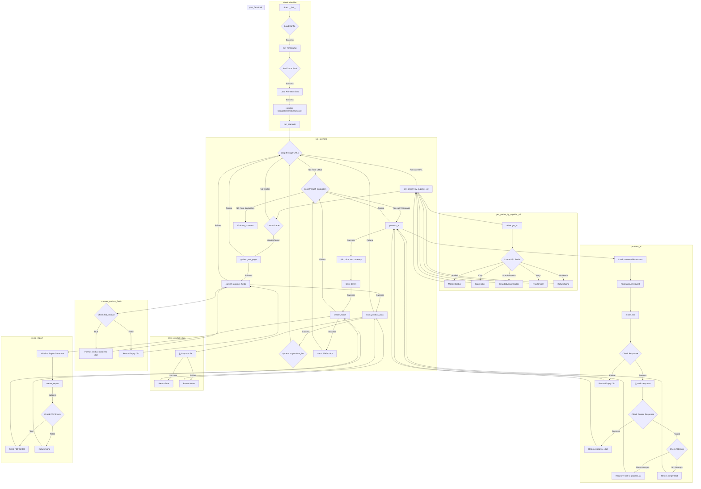
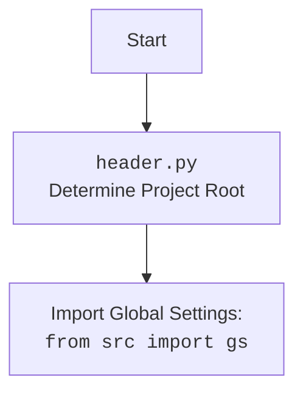

## АНАЛИЗ КОДА: `hypotez/src/endpoints/kazarinov/scenarios/scenario_pricelist.py`

### <алгоритм>

1. **Инициализация `MexironBuilder`:**
   - Создается экземпляр класса `MexironBuilder`, который принимает `driver` (экземпляр веб-драйвера Selenium) и опциональное имя для мехирона.
   - Загружаются конфигурации из `kazarinov.json`.
   - Определяется путь для экспорта данных на основе конфигурации (внешнее хранилище, локальное хранилище данных или goog).
   - Инициализируется модель `GoogleGenerativeAI` с инструкциями из файла `system_instruction_mexiron.md` и ключом API.

2. **`run_scenario` (основной сценарий):**
   - Принимает `update`, `context` для Telegram bot, список URL-адресов товаров, цену и имя мехирона.
   - Итерируется по списку URL-адресов товаров.
   - **Для каждого URL:**
     - Определяется `graber` (обработчик HTML страницы) на основе URL поставщика.
       - **Пример:** Если URL начинается с `https://morlevi.co.il`, используется `MorleviGraber`.
     - Вызывается метод `grab_page` у грабера для извлечения необходимых полей товара (например, `id_product`, `name`, `description_short`, `description`, `specification`, `local_image_path`).
     - Извлеченные поля товара конвертируются в словарь с помощью `convert_product_fields`.
       - **Пример:** Поле `name` преобразуется в `product_title`, а `description_short` в `description_short` и т.д.
     - Данные сохраняются в JSON-файл с помощью `save_product_data` в каталог `products`.
     - Добавление словаря товара в список `products_list`.
   - **После обработки всех URL:**
     - Итерируется по списку языков `langs_list` (`he`, `ru`).
     - Запускается процесс обработки с помощью `process_ai`, передавая список продуктов `products_list` и текущий язык.
        - **Пример:** Запрос к `GoogleGenerativeAI` с инструкцией из `command_instruction_mexiron_{lang}.md` и списком товаров.
     - Возвращается словарь с переведенными полями на запрошенный язык.
     - Добавляется цена и валюта в словарь.
     - Сохраняется JSON-файл с данными для каждого языка.
     - Создается отчет в формате `html` и `pdf` с помощью `create_report` и `ReportGenerator`.
       - **Пример:** Данные, язык и путь к файлам `html` и `pdf` передаются в `create_report`.
   - Если отчет создан успешно, отправляется PDF документ пользователю через бота.

3. **`get_graber_by_supplier_url`:**
   - Принимает URL-адрес товара и возвращает соответствующий объект-грабер для этого поставщика.

4. **`convert_product_fields`:**
   - Принимает объект `ProductFields` и возвращает словарь, содержащий отформатированные данные о продукте.

5. **`save_product_data`:**
   - Принимает словарь с данными о продукте и сохраняет его в JSON-файл.

6. **`process_ai`:**
    - Принимает список словарей с данными продуктов и язык.
    - Загружает из файла инструкцию для модели ИИ для конкретного языка.
    - Формирует запрос для модели, объединяя инструкцию и данные продуктов.
    - Запрашивает у модели ИИ обработанные данные (перевод и форматирование).
    - Обрабатывает ответ модели, возвращая словарь. В случае ошибки, делает несколько попыток.

7. **`post_facebook`:**
    - Загружает страницу facebook.com.
    - Передает в `post_message_title` заголовок мехирона.
    - Загружает медиа файлы с помощью `upload_post_media`.
    - Публикует сообщение с помощью `message_publish`.

8. **`create_report`:**
    - Инициализирует `ReportGenerator`.
    - Создает `html` и `pdf` отчет.
    - Отправляет `pdf` отчет через бота, если он успешно создан.

### <mermaid>

#### **Объяснение зависимостей:**

- **`src`**: Корневой пакет проекта, содержащий основные модули и настройки.
- **`gs`**:  Глобальные настройки проекта, такие как пути к файлам, API ключи.
- **`src.endpoints.prestashop.product_fields`**: Модуль, определяющий структуру данных о товарах.
- **`src.webdriver.driver`**: Модуль, управляющий Selenium WebDriver.
- **`src.ai.gemini`**: Модуль для взаимодействия с моделью Google Gemini AI.
- **`src.endpoints.advertisement.facebook.scenarios`**: Модуль для управления публикациями в Facebook.
- **`src.suppliers.morlevi.graber`**: Модуль для парсинга данных с сайта поставщика Morlevi.
- **`src.suppliers.ksp.graber`**: Модуль для парсинга данных с сайта поставщика KSP.
- **`src.suppliers.ivory.graber`**: Модуль для парсинга данных с сайта поставщика Ivory.
- **`src.suppliers.grandadvance.graber`**: Модуль для парсинга данных с сайта поставщика Grandadvance.
- **`src.endpoints.kazarinov.pricelist_generator`**: Модуль для генерации отчетов.
- **`telegram`**: Библиотека для работы с Telegram ботом.
- **`src.utils.jjson`**: Модуль для работы с JSON.
- **`src.utils.file`**: Модуль для работы с файловой системой.
- **`src.utils.image`**: Модуль для работы с изображениями.
- **`src.utils.convertors.unicode`**: Модуль для работы с unicode.
- **`src.utils.printer`**: Модуль для красивого вывода в консоль.
- **`src.logger.logger`**: Модуль для логирования событий.
- **`header.py`**: Модуль для определения корня проекта.

### <объяснение>

#### **Импорты:**

-   `asyncio`: Библиотека для работы с асинхронным кодом.
-   `random`: Генерация случайных чисел.
-   `shutil`: Работа с файловой системой (копирование, перемещение).
-   `pathlib.Path`: Работа с путями к файлам и каталогам.
-   `typing.Optional, List`: Типизация данных.
-   `types.SimpleNamespace`: Создание простого пространства имен для атрибутов.
-   `dataclasses.field`: Для определения полей в dataclass.
-   `header`: Пользовательский модуль для определения корня проекта.
-   `src.gs`: Глобальные настройки проекта.
-   `src.endpoints.prestashop.product_fields`: Класс `ProductFields` для представления данных о продукте.
-   `src.webdriver.driver.Driver`: Класс для управления Selenium WebDriver.
-   `src.ai.gemini.GoogleGenerativeAI`: Класс для взаимодействия с моделью Google Gemini AI.
-   `src.endpoints.advertisement.facebook.scenarios`: Функции для работы с Facebook.
-   `src.suppliers.morlevi.graber.Graber`, `src.suppliers.ksp.graber.Graber`, `src.suppliers.ivory.graber.Graber`, `src.suppliers.grandadvance.graber.Graber`: Классы для сбора данных о товарах с разных сайтов.
-   `src.endpoints.kazarinov.pricelist_generator.ReportGenerator`: Класс для создания отчетов.
-   `telegram.Update`, `telegram.ext.CallbackContext`: Объекты для работы с Telegram API.
-   `src.utils.jjson.j_loads, j_loads_ns, j_dumps`: Функции для работы с JSON.
-   `src.utils.file.read_text_file, save_text_file, recursively_get_file_path`: Функции для работы с файлами.
-   `src.utils.image.save_image_from_url, save_image`: Функции для работы с изображениями.
-   `src.utils.convertors.unicode.decode_unicode_escape`: Функция для декодирования unicode.
-   `src.utils.printer.pprint`: Функция для красивого вывода данных.
-   `src.logger.logger.logger`: Логгер.

#### **Класс `MexironBuilder`:**

-   **Роль**: Организует сбор, обработку и сохранение данных о товарах поставщиков, создает отчеты, публикует в Facebook.
-   **Атрибуты:**
    -   `driver`: Экземпляр `Driver` для управления браузером.
    -   `export_path`: Путь для сохранения данных.
    -   `mexiron_name`: Имя мехирона (формируется из timestamp, если не передано).
    -   `price`: Цена.
    -    `timestamp`: Временная метка для создания имени мехирона.
    -   `products_list`: Список словарей с данными о продуктах.
    -   `model`: Экземпляр `GoogleGenerativeAI` для обработки данных с помощью ИИ.
    -   `config`: Конфигурация приложения, загружается из JSON.
    -   `translations`: Переводы строк.
    -   `update`:  Объект `telegram.Update` для ответа через telegram bot.
    -   `context`: Объект `telegram.ext.CallbackContext` для работы с ботом.
-   **Методы:**
    -   `__init__`: Инициализирует объект, загружает конфигурации, определяет путь для экспорта и настраивает модель ИИ.
    -   `run_scenario`: Основной метод, который запускает процесс сбора данных, их обработку и сохранение.
    -   `get_graber_by_supplier_url`: Выбирает нужный грабер в зависимости от URL поставщика.
    -   `convert_product_fields`: Конвертирует объект `ProductFields` в словарь.
    -   `save_product_data`: Сохраняет данные о продукте в JSON-файл.
    -   `process_ai`: Обрабатывает данные с помощью модели ИИ.
    -   `post_facebook`: Публикует сообщение и медиа на Facebook.
    -   `create_report`: Создает `html` и `pdf` отчет и отправляет его пользователю через бот.

#### **Функции:**

-   **`run_scenario`**:
    -   **Аргументы**: `update`, `context`, `urls` (список URL товаров), `price`, `mexiron_name`.
    -   **Возвращает**: `bool` (успех или неудача выполнения сценария).
    -   **Назначение**: Запускает основной процесс сбора данных, обработки ИИ, сохранения и создания отчетов.
-   **`get_graber_by_supplier_url`**:
    -   **Аргументы**: `url` (URL страницы товара).
    -   **Возвращает**: Объект грабера или `None`, если грабер для данного URL не найден.
    -   **Назначение**: Выбирает грабер в зависимости от URL поставщика.
-   **`convert_product_fields`**:
    -   **Аргументы**: `f` (объект `ProductFields`).
    -   **Возвращает**: Словарь с данными о продукте.
    -   **Назначение**: Конвертирует данные о продукте из `ProductFields` в словарь.
-   **`save_product_data`**:
    -   **Аргументы**: `product_data` (словарь с данными о продукте).
    -   **Возвращает**: `bool` (успех или неудача сохранения).
    -   **Назначение**: Сохраняет данные о продукте в JSON-файл.
-   **`process_ai`**:
    -   **Аргументы**: `products_list` (список словарей продуктов), `lang` (язык), `attempts` (количество попыток).
    -   **Возвращает**: Обработанный ответ от ИИ в виде словаря, или пустой словарь в случае неудачи.
    -   **Назначение**: Обрабатывает данные с помощью модели ИИ.
-   **`post_facebook`**:
    -    **Аргументы**: `mexiron` (объект с данными о мехироне).
    -    **Возвращает**: `bool` (успех или неудача публикации).
    -    **Назначение**: Публикует сообщение и медиа на Facebook.
-   **`create_report`**:
    -    **Аргументы**: `data` (словарь с данными), `lang` (язык), `html_file`, `pdf_file` (пути к файлам).
    -    **Возвращает**: `bool` (успех или неудача создания отчета).
    -    **Назначение**: Создает `html` и `pdf` отчет и отправляет его пользователю через бот.

#### **Переменные:**

-   `required_fields`: Кортеж необходимых полей товара.
-   `langs_list`: Список языков для перевода (`he`, `ru`).

#### **Потенциальные ошибки и области для улучшения:**

-   Обработка ошибок в методах `__init__` и `run_scenario`.
-   Проверка на наличие нужных полей в `ProductFields` перед их использованием.
-   Улучшение логики выбора грабера (возможно, использовать регулярные выражения).
-   Реализация механизма для обработки ошибок при взаимодействии с AI моделью.
-   Добавить логирование всех ключевых шагов, особенно ошибок.
-   Улучшить механизм повторных попыток в `process_ai`.
-   Рассмотреть возможность использования асинхронных функций в граберах для ускорения сбора данных.

#### **Взаимосвязь с другими частями проекта:**

-   Использует `src.gs` для доступа к глобальным настройкам и путям.
-   Использует `src.webdriver.driver` для управления браузером и получения HTML.
-   Использует `src.ai.gemini` для обработки текста с помощью модели ИИ.
-   Использует `src.suppliers.*.graber` для парсинга данных с разных сайтов.
-   Использует `src.endpoints.kazarinov.pricelist_generator` для генерации отчетов.
-   Использует `telegram` для отправки сообщений пользователю.
-   Использует `src.utils.*` для работы с JSON, файлами и изображениями.

В целом, код представляет собой хорошо структурированный сценарий для сбора и обработки данных о товарах, и имеет четко определенные области ответственности.