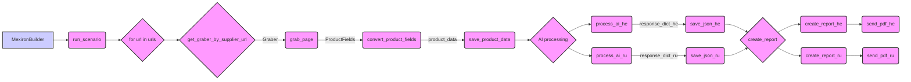

## Анализ кода `hypotez/src/endpoints/kazarinov/scenarios/scenario_pricelist.py`

### 1. <алгоритм>

**Блок-схема:**

1.  **Инициализация `MexironBuilder`**:
    *   Создается экземпляр `MexironBuilder` с передачей `driver` и опционально `mexiron_name`.
    *   Загружается конфигурация из `kazarinov.json`.
    *   Инициализируется `timestamp`, `driver`, `mexiron_name`, и `export_path` (путь сохранения данных).
    *   Загружаются инструкции для `GoogleGenerativeAI` и создается экземпляр модели.
2.  **Запуск сценария `run_scenario`**:
    *   Принимает список URL-адресов (`urls`), цену (`price`), имя мехирона (`mexiron_name`), `update` и `context` для взаимодействия с Telegram.
    *   Итерируется по каждому URL:
        *   Определяет грабер (класс, извлекающий данные) на основе URL (`get_graber_by_supplier_url`).
        *   Вызывает `grab_page` у грабера для извлечения полей продукта.
        *   Преобразует полученные поля в словарь `product_data` с помощью `convert_product_fields`.
        *   Сохраняет `product_data` в файл JSON с помощью `save_product_data`.
        *   Добавляет `product_data` в `products_list`.
    *   Запускает обработку AI для языка `he` (`process_ai`).
    *   Запускает обработку AI для языка `ru` (`process_ai`).
    *   Сохраняет результаты AI в JSON файлы (`_he.json` и `_ru.json`).
    *   Создает отчеты в формате HTML и PDF для `he` и `ru`, используя `ReportGenerator`, и отправляет PDF-файлы боту.
3.  **Выбор грабера `get_graber_by_supplier_url`**:
    *   Принимает URL.
    *   Проверяет начало URL на соответствие известным поставщикам (Morlevi, Ksp, Grandadvance, Ivory).
    *   Возвращает соответствующий экземпляр грабера или `None`, если поставщик не найден.
4.  **Конвертация полей продукта `convert_product_fields`**:
    *   Принимает объект `ProductFields`.
    *   Преобразует поля продукта в словарь, подготавливая их к передаче в AI.
5.  **Сохранение данных продукта `save_product_data`**:
    *   Принимает словарь `product_data`.
    *   Сохраняет `product_data` в JSON файл по пути `export_path/products/{product_id}.json`.
6.  **Обработка AI `process_ai`**:
    *   Принимает `products_list` и язык (`lang`).
    *   Формирует команду для AI на основе файла `command_instruction_mexiron_{lang}.md` и списка продуктов.
    *   Отправляет запрос в `GoogleGenerativeAI`.
    *   Обрабатывает ответ и возвращает словарь `response_dict`, или `False` если произошла ошибка.
7. **Создание и отправка PDF-отчета**
    * Итерирует по языкам `he` и `ru`.
    * Создаёт HTML и PDF файлы для каждого языка.
    * Отправляет PDF-файл через бота.

**Примеры:**

*   **Инициализация**:
    ```python
    driver_instance = Driver()  # предполагается, что Driver инициализируется где-то
    mexiron_builder = MexironBuilder(driver_instance, mexiron_name="test_mexiron")
    ```
*   **`run_scenario`**:
    ```python
    urls = ["https://www.morlevi.co.il/product1", "https://www.ksp.co.il/product2"]
    await mexiron_builder.run_scenario(update, context, urls, price="100", mexiron_name="test_mexiron")
    ```
*   **`get_graber_by_supplier_url`**:
    ```python
    graber = mexiron_builder.get_graber_by_supplier_url("https://www.ksp.co.il/product2") # вернет KspGraber
    graber = mexiron_builder.get_graber_by_supplier_url("https://example.com/product") # вернет None
    ```

### 2. <mermaid>



**Анализ зависимостей:**

*   **`MexironBuilder`**: Главный класс, управляющий всем процессом. Зависит от `Driver` для управления браузером и от `GoogleGenerativeAI` для обработки AI.
*   **`run_scenario`**: Метод, который координирует последовательность шагов: извлечение данных, обработка AI, сохранение и создание отчетов.
*   **`get_graber_by_supplier_url`**: Определяет, какой грабер использовать на основе URL поставщика. Зависит от конкретных классов граберов (`MorleviGraber`, `KspGraber`, `GrandadvanceGraber`, `IvoryGraber`).
*   **`grab_page`**: Метод граберов для извлечения данных со страниц. Зависит от `ProductFields` для структуры данных.
*   **`convert_product_fields`**: Преобразует поля продукта в удобный для AI формат. Зависит от структуры `ProductFields`.
*   **`save_product_data`**: Сохраняет данные в файл. Зависит от `j_dumps` для записи JSON.
*  **`process_ai`**: Метод для обработки текста через AI. Зависит от `GoogleGenerativeAI`.
*  **`create_report`**: Отвечает за генерацию отчётов. Зависит от `ReportGenerator`.
*  **`send_pdf`**: Отправляет сгенерированные отчёты боту. Зависит от `telegram`.

### 3. <объяснение>

#### Импорты:

*   `from __future__ import annotations`:  Используется для отложенной оценки аннотаций типов.
*   `asyncio`: Для асинхронного программирования.
*   `random`: Для генерации случайных чисел (не используется напрямую в показанном коде, возможно, используется в других частях проекта).
*   `shutil`: Для операций с файлами и директориями (не используется напрямую в показанном коде).
*   `pathlib.Path`: Для работы с путями файлов и директорий.
*   `typing.Optional`, `typing.List`: Для аннотаций типов.
*   `types.SimpleNamespace`: Для создания простых объектов, используется для хранения конфигурации.
*   `dataclasses.field`: Для создания полей данных в `dataclass` (хотя `MexironBuilder` не является `dataclass`, `field` используется для инициализации `products_list`).
*   `header`: Предположительно содержит общие константы и настройки (не используется напрямую в показанном коде).
*   `src.gs`: Глобальные настройки и константы проекта.
*    `src.product.product_fields.ProductFields`: Структура для хранения данных о товарах.
*   `src.webdriver.driver.Driver`: Класс для управления браузером.
*   `src.ai.gemini.GoogleGenerativeAI`: Класс для взаимодействия с моделью Google Gemini.
*   `src.endpoints.advertisement.facebook.scenarios`: Модуль для работы с Facebook (используется `post_message_title`, `upload_post_media`, `message_publish`).
*   `src.suppliers.*.graber.Graber`: Классы для извлечения данных о продуктах с сайтов разных поставщиков.
*   `src.endpoints.kazarinov.pricelist_generator.ReportGenerator`: Класс для генерации отчетов в формате HTML и PDF.
*   `telegram.Update`, `telegram.ext.CallbackContext`: Классы для работы с Telegram Bot API.
*    `src.utils.jjson`: Функции для работы с JSON.
*   `src.utils.file`: Функции для работы с файлами.
*   `src.utils.image`: Функции для работы с изображениями (не используется напрямую в показанном коде).
*    `src.utils.convertors.unicode`: Функции для работы с unicode.
*   `src.utils.printer.pprint`: Для красивого вывода данных.
*   `src.logger.logger.logger`: Для логирования событий.

**Взаимосвязи с другими пакетами `src.`:**

*   `src.gs`: Содержит глобальные настройки, пути к файлам, и API-ключи, используется для доступа к конфигурации, путям и аутентификации.
*   `src.product`: Определяет структуру данных продукта (`ProductFields`) и, вероятно, содержит логику обработки продукта.
*   `src.webdriver`: Отвечает за взаимодействие с веб-браузером, необходим для парсинга сайтов.
*   `src.ai`: Содержит классы для взаимодействия с AI-моделями, используется для обработки текста.
*   `src.endpoints.advertisement.facebook`: Позволяет публиковать рекламные объявления в Facebook.
*   `src.suppliers`: Содержит граберы для конкретных поставщиков, адаптированные к структуре их сайтов.
*   `src.endpoints.kazarinov`: Содержит логику, специфичную для данного эндпоинта (обработка мехирона).
*    `src.utils`: Содержит утилитарные функции для работы с JSON, файлами, изображениями и т.д.
*   `src.logger`: Отвечает за логирование событий, ошибок и т.д.

#### Классы:

*   **`MexironBuilder`**:
    *   **Роль**: Организует процесс извлечения, обработки и сохранения данных о продуктах.
    *   **Атрибуты**:
        *   `driver`: Экземпляр `Driver` для управления браузером.
        *   `export_path`: Путь, куда будут сохраняться данные.
        *   `mexiron_name`: Название процесса мехирона.
        *   `price`: Цена продукта.
        *   `timestamp`: Время запуска процесса.
        *   `products_list`: Список обработанных данных продуктов.
        *   `model`: Экземпляр `GoogleGenerativeAI` для обработки AI.
        *   `config`: Конфигурация из файла `kazarinov.json`
        * `update`: Объект для взаимодействия с Telegram
        * `context`: Контекст для взаимодействия с Telegram
    *   **Методы**:
        *   `__init__`: Инициализирует объект, загружает конфигурацию и создает пути.
        *   `run_scenario`: Запускает основной сценарий, обрабатывает URLs, данные, AI и создает отчеты.
        *   `get_graber_by_supplier_url`: Возвращает грабер для данного URL.
        *   `convert_product_fields`: Преобразует `ProductFields` в словарь для обработки AI.
        *   `save_product_data`: Сохраняет данные продукта в JSON файл.
        *   `process_ai`: Обрабатывает список продуктов через AI.
         *  `post_facebook`: Публикует результаты в Facebook.
         * `create_report`: Создает отчет в формате HTML и PDF.

#### Функции:

*   `get_graber_by_supplier_url(self, url: str) -> Optional[object]`:
    *   **Аргументы**: `url` (строка) - URL страницы поставщика.
    *   **Возвращаемое значение**: Экземпляр грабера (например, `MorleviGraber`) или `None`.
    *   **Назначение**: Определяет, какой грабер использовать, основываясь на URL.
*   `convert_product_fields(self, f: ProductFields) -> dict`:
    *   **Аргументы**: `f` (объект `ProductFields`) - объект с данными о продукте.
    *   **Возвращаемое значение**: Словарь с данными о продукте.
    *   **Назначение**: Преобразует данные `ProductFields` в формат, удобный для AI.
*   `save_product_data(self, product_data: dict) -> bool`:
    *   **Аргументы**: `product_data` (словарь) - данные о продукте.
    *   **Возвращаемое значение**: `True` в случае успешного сохранения, иначе `None`.
    *   **Назначение**: Сохраняет данные продукта в JSON файл.
*   `process_ai(self, products_list: List[str], lang:str, attempts: int = 3) -> tuple | bool`:
    *   **Аргументы**: `products_list` (список словарей) - список данных о продуктах, `lang` (строка) - язык обработки, `attempts` (целое) - количество попыток обработки.
    *   **Возвращаемое значение**: Словарь с результатами обработки AI или `None` в случае ошибки.
    *   **Назначение**: Обрабатывает список продуктов через AI, делая переводы.
* `create_report(self, data: dict, html_file: Path, pdf_file: Path)`
  * **Аргументы**: `data` (словарь), `html_file` (путь к html файлу), `pdf_file` (путь к pdf файлу).
  * **Возвращаемое значение**: `None`
  * **Назначение**: Создаёт отчёт в формате `html` и `pdf`.
*  `post_facebook(self, mexiron: SimpleNamespace) -> bool`
    *   **Аргументы**:  `mexiron` (SimpleNamespace)
    *   **Возвращаемое значение**:  `True` если всё ок, `None` если ошибка
    *   **Назначение**:  Публикует данные о мехироне в Facebook.

#### Переменные:

*   `MODE`: Глобальная переменная, определяющая режим работы ('dev' или другой режим).
*   `driver`, `export_path`, `mexiron_name`, `price`, `timestamp`, `products_list`, `model`, `config`: Атрибуты класса `MexironBuilder` для хранения данных и состояния.
*   `urls`, `price`, `mexiron_name`: Аргументы функции `run_scenario`, содержащие данные для выполнения сценария.
*   `required_fields`: Кортеж строк, содержащий названия полей, которые должны быть извлечены грабером.
*   `url`: Переменная цикла, содержащая текущий обрабатываемый URL.
*   `graber`: Экземпляр грабера, возвращенный из `get_graber_by_supplier_url`.
*   `f`: Объект `ProductFields`, полученный от грабера.
*   `product_data`: Словарь, содержащий данные о продукте.
*   `he`, `ru`: Словари, содержащие результаты AI обработки на языках иврит и русский, соответственно.
* `generator`: Экземпляр класса `ReportGenerator` для создания отчётов
* `html_file`, `pdf_file`: Переменные цикла, содержащие пути до созданных файлов.
*  `lang`: Язык для обработки AI (например, 'he', 'ru').
*  `attempts`: Количество попыток отправки запроса в AI.
* `model_command`: Инструкция для AI модели.
* `response`: Ответ от AI модели.
* `response_dict`: Словарь, полученный из JSON ответа AI модели.
* `currency`: Валюта для публикаций в Facebook.
* `title`: Заголовок для публикации в Facebook.

#### Потенциальные ошибки и области для улучшения:

*   **Обработка ошибок**: В коде есть блоки `try...except`, но не всегда есть четкое возвращение `False` или `None` при ошибке, что может усложнить отладку.
*   **Логирование**:  Нужно добавить логирование перед каждым `return False`, чтобы было понятно, где именно возникла проблема.
*   **Обработка ошибок AI**: Модель `gemini` может возвращать неверный результат. В коде предусмотрены повторные запросы, но, возможно, нужны более сложные механизмы обработки ошибок AI (например, проверка валидности ответа).
*   **Зависимости**: Есть много зависимостей, которые нужно отслеживать. Возможно, стоит рассмотреть возможность использования dependency injection для управления зависимостями.
*   **Тестирование**: Необходимы автоматизированные тесты для проверки работы основных функций и классов.
* **Отсутствует обработка ошибок в Facebook**
    * Метод `post_facebook` не возвращает значение, если есть ошибки публикации.

#### Цепочка взаимосвязей с другими частями проекта:

1.  **Запуск**: Сценарий запускается через вызов `MexironBuilder` и его метода `run_scenario`.
2.  **Парсинг сайтов**: Используется `src.webdriver.driver.Driver` для управления браузером, а `src.suppliers.*.graber.Graber` для извлечения данных с сайтов поставщиков.
3.  **Обработка AI**: Данные передаются в `src.ai.gemini.GoogleGenerativeAI` для обработки естественного языка.
4.  **Сохранение данных**:  Результаты сохраняются с помощью функций из `src.utils.jjson` и `src.utils.file`.
5.  **Генерация отчетов**: Используется `src.endpoints.kazarinov.pricelist_generator.ReportGenerator` для создания HTML и PDF отчетов.
6.  **Взаимодействие с Telegram**: Результаты отправляются боту через `telegram.Update` и `telegram.ext.CallbackContext`.
7. **Публикация в Facebook**: Используются функции из `src.endpoints.advertisement.facebook` для публикации данных.
8. **Логирование**: Все важные действия и ошибки логируются с помощью `src.logger.logger.logger`.

Этот сценарий является частью более крупной системы, где каждый компонент выполняет свою задачу, обеспечивая гибкость и масштабируемость.