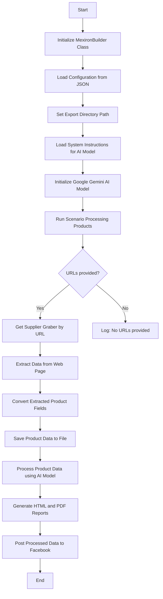

## АНАЛИЗ КОДА: `hypotez/src/endpoints/kazarinov/scenarios/scenario_pricelist.ru.md`

### 1. <алгоритм>

**Начало**
   - Инициализация объекта `MexironBuilder`.
   - Загрузка конфигурации из JSON файла.
   - Установка пути для экспорта данных.
   - Загрузка системных инструкций для модели AI.
   - Инициализация модели Google Generative AI.

**Запуск сценария**
   - Проверка, переданы ли URL для парсинга.
   - Если URL не предоставлены:
     - Логирование отсутствия URL.
   - Если URL предоставлены:
     - Определение поставщика по URL.
     - Получение соответствующего грабера.
     - Извлечение данных со страницы.
     - Преобразование полученных данных в словарь.
     - Сохранение данных продукта в файл.
     - Обработка данных через модель AI.
     - Создание отчетов HTML и PDF.
     - Публикация в Facebook.

**Завершение**

**Примеры для каждого блока:**

1.  **Инициализация:** `mexiron_builder = MexironBuilder(driver)` - создается объект `MexironBuilder` с драйвером Selenium.
2.  **Загрузка конфигурации:** Конфигурация может содержать параметры для AI модели или пути к файлам, например: `{ "ai_model": "gemini-pro", "export_dir": "/tmp/export" }`.
3.  **Установка пути экспорта:** `mexiron_builder.set_export_path("/tmp/export")` - устанавливается путь для сохранения отчетов.
4.  **Загрузка системных инструкций:** Инструкции для AI, например: "Составь подробное описание товара...".
5.  **Инициализация модели AI:** Создается экземпляр `src.ai.gemini.GeminiModel` для работы с AI.
6.  **Проверка URL:** Проверяется, передан ли список URL, например, `urls = ["https://example.com/1", "https://example.com/2"]`.
7.  **Получение грабера:** Выбор грабера на основе URL: `graber = mexiron_builder.get_graber_by_supplier_url("https://example.com/1")`.
8.  **Извлечение данных страницы:** Извлечение данных с веб-страницы с помощью грабера.
9.  **Преобразование данных:** Данные преобразуются в словарь, например: `{"name": "Product 1", "price": "100$", "description": "..."}`.
10. **Сохранение данных:** Данные сохраняются в JSON файл, например: `/tmp/export/product_1_data.json`.
11. **Обработка данных через AI:** AI добавляет описания, переводит, структурирует данные, например: `ai_response = mexiron_builder.process_ai(data, "ru")`.
12. **Создание отчетов:** Создаются HTML и PDF отчеты на основе полученных данных.
13. **Публикация в Facebook:** Данные публикуются в Facebook через API.
14. **Завершение:** Сценарий завершается.

**Поток данных:**
- Данные начинаются с загрузки конфигурации и инструкций, затем передаются в `MexironBuilder`.
- URL страниц поставщиков передаются в `run_scenario`.
- `get_graber_by_supplier_url` определяет правильный грабер для URL.
- Грабер извлекает данные, которые затем передаются в `convert_product_fields` для форматирования.
- Данные о продуктах сохраняются через `save_product_data`.
- Обработка данных через AI в `process_ai`.
- `create_report` создает отчеты.
- `post_facebook` публикует данные.

### 2. <mermaid>

#### **Объяснение:**

1.  **Start:** Начало процесса.

2.  **InitMexironBuilder:** Создание экземпляра класса `MexironBuilder`, который управляет всем процессом обработки данных.

3.  **LoadConfig:** Загрузка конфигурационных параметров из JSON-файла, например, путей к файлам, параметров AI.

4.  **SetExportPath:** Установка пути, по которому будут сохранены результаты обработки (файлы JSON, отчеты).

5.  **LoadSystemInstruction:** Загрузка инструкций для AI модели, например, как генерировать описание товара.

6.  **InitModel:** Инициализация модели Google Gemini AI, которая будет обрабатывать текстовую информацию.

7.  **RunScenario:** Запуск основного сценария обработки данных, который включает парсинг, обработку AI и сохранение результатов.

8.  **CheckURLs:** Проверка, предоставлен ли список URL-адресов для парсинга.

9.  **GetGraber:** Если URLs предоставлены, на основе URL выбирается соответствующий грабер (инструмент для парсинга данных).

10. **LogNoURLs:** Если URLs не предоставлены, регистрируется ошибка.

11. **GrabPage:** С помощью грабера извлекаются данные со страницы продукта.

12. **ConvertFields:** Полученные данные преобразуются в стандартный формат словаря.

13. **SaveData:** Сохранение преобразованных данных в JSON файл.

14. **ProcessAI:** Обработка данных с помощью AI для генерации описаний, переводов и т.д.

15. **CreateReport:** Создание HTML и PDF отчетов на основе обработанных данных.

16. **PostFacebook:** Публикация обработанных данных в Facebook.

17. **End:** Конец процесса.

#### Зависимости
-  Диаграмма показывает последовательность операций в рамках сценария, но не все зависимости кода.
-  Зависимости, такие как `selenium`, `asyncio`, `pathlib`, `typing` и импорты из `src` не отражены напрямую в этой диаграмме, но являются частью контекста выполнения кода.

Дополнительно: `header.py` не импортируется, поэтому нет mermaid для header.py.

### 3. <объяснение>

#### **Импорты:**

-   **`selenium`**: Используется для управления веб-браузером, что позволяет автоматизировать действия, такие как переход по страницам и извлечение данных. В данном контексте `selenium` используется через абстракцию `Driver`.
-   **`asyncio`**: Модуль для написания асинхронного кода, что позволяет параллельно обрабатывать несколько задач и повышает производительность. Может использоваться для обработки запросов к AI или загрузки веб-страниц.
-   **`pathlib`**: Предоставляет удобный способ работать с путями к файлам и каталогам. Используется для создания и управления путями к файлам экспорта, отчетам.
-   **`types`**: Модуль для работы с типами, используется для создания пространств имен, например `SimpleNamespace`.
-   **`typing`**: Модуль для аннотаций типов, улучшает читаемость и позволяет проверять типы данных во время разработки.
-   **`src.ai.gemini`**: Пакет для взаимодействия с моделью Google Gemini AI. Включает в себя логику для отправки запросов и обработки ответов от AI.
-   **`src.suppliers.*.graber`**: Пакеты, содержащие модули для парсинга веб-страниц разных поставщиков. Каждый модуль `graber` отвечает за извлечение данных со страниц определенного поставщика.
-  **`src.endpoints.advertisement.facebook.scenarios`**: Пакет для публикации данных в Facebook.

#### **Класс: `MexironBuilder`**

-   **Роль**: Центральный класс, управляющий всем процессом создания мехирона. Он отвечает за инициализацию, загрузку данных, обработку AI, создание отчетов и публикацию.
-   **Атрибуты**:
    -   `driver`: Экземпляр `Driver` из `src.webdriver.driver`, позволяющий взаимодействовать с веб-браузером.
    -   `export_path`: Путь к каталогу, куда сохраняются все экспортированные данные.
    -   `mexiron_name`: Пользовательское имя для данного мехирона, полезно для идентификации и отслеживания.
    -   `price`: Цена для обработки продукта, используется как один из параметров для AI.
    -   `timestamp`: Метка времени, когда был запущен мехирон.
    -   `products_list`: Список всех обработанных данных продуктов.
    -   `model`: Экземпляр модели AI для обработки данных.
    -   `config`: Конфигурация, загруженная из JSON файла, используется для различных настроек.
-   **Методы**:
    -   **`__init__(self, driver: Driver, mexiron_name: Optional[str] = None)`**: Инициализирует класс, принимает драйвер и необязательное имя мехирона.
    -   **`run_scenario(...)`**: Главный метод, управляющий всем процессом. Принимает параметры, такие как системные инструкции, цены, URL страниц, и запускает процесс парсинга, обработки AI и сохранения данных.
    -   **`get_graber_by_supplier_url(self, url: str)`**: Возвращает экземпляр грабера на основе URL. Реализует логику выбора подходящего парсера для каждого поставщика.
    -   **`convert_product_fields(self, f: ProductFields) -> dict`**: Конвертирует поля продукта в словарь. Используется для стандартизации данных.
    -   **`save_product_data(self, product_data: dict)`**: Сохраняет данные о продукте в файл.
    -   **`process_ai(self, products_list: List[str], lang: str, attempts: int = 3) -> tuple | bool`**: Обрабатывает данные через AI. Принимает список продуктов, язык и количество попыток запроса к AI.
    -    **`post_facebook(self, mexiron: SimpleNamespace) -> bool`**: Публикует данные в Facebook.
    -    **`create_report(self, data: dict, html_file: Path, pdf_file: Path)`**: Генерирует отчеты в форматах HTML и PDF на основе обработанных данных.

#### **Функции:**

-   **`run_scenario`**: Центральная функция, управляющая всем процессом: парсинг, обработка AI, создание отчетов и публикация в Facebook. Логика обработки ошибок и отслеживание ошибок также являются важной частью этой функции.
-   **`get_graber_by_supplier_url`**: Определяет и возвращает соответствующий грабер для парсинга данных с различных URL поставщиков.
-   **`convert_product_fields`**: Преобразует извлеченные данные в формат словаря.
-   **`save_product_data`**: Сохраняет обработанные данные в файлы, обычно JSON.
-   **`process_ai`**: Отвечает за взаимодействие с моделью AI для обработки данных.
-   **`post_facebook`**: Публикует обработанные данные в Facebook.
-   **`create_report`**: Генерирует отчеты в HTML и PDF форматах.

#### **Переменные:**

-   `driver`: Экземпляр класса `Driver`, используемый для взаимодействия с веб-браузером.
-   `export_path`: Строка, представляющая путь к директории экспорта.
-   `mexiron_name`: Строка, представляющая имя текущего мехирона.
-   `price`: Строка, представляющая цену для обработки.
-   `timestamp`: Метка времени создания мехирона.
-   `products_list`: Список словарей, содержащих данные о продуктах.
-   `model`: Экземпляр класса модели AI, используемый для обработки данных.
-   `config`: Словарь, содержащий параметры конфигурации, загруженные из JSON.

#### **Потенциальные ошибки и области для улучшения:**

1.  **Обработка ошибок в `process_ai`**: Функция использует `attempts` для повторных запросов, но можно добавить более продвинутую логику обработки ошибок, включая логирование ошибок для отслеживания проблем с AI.
2.  **Гибкость граберов**: Текущая система полагается на жестко заданные граберы для каждого поставщика. Было бы полезно добавить механизм для динамического добавления новых граберов.
3.  **Расширение функциональности `create_report`**: Можно добавить дополнительные форматы отчетов, такие как CSV или Excel.
4.  **Обработка исключений**: Необходимо убедиться, что все потенциальные исключения, возникающие при работе с веб-страницами, обработкой AI или файловой системой, должным образом перехвачены и зарегистрированы.
5.  **Более детальное логирование**: Добавить подробное логирование на каждом этапе выполнения сценария, чтобы упростить отладку и мониторинг.

#### **Цепочка взаимосвязей с другими частями проекта:**

-   `src.webdriver.driver`: Используется для управления браузером и сбора данных.
-   `src.ai.gemini`: Используется для обработки данных через модель AI.
-   `src.suppliers.*.graber`: Используется для парсинга данных с веб-страниц различных поставщиков.
-   `src.endpoints.advertisement.facebook.scenarios`: Используется для публикации данных в Facebook.

В заключение, этот скрипт представляет собой сложный процесс, который интегрирует несколько модулей проекта для автоматизации сбора данных, обработки через AI и публикации в Facebook. Для дальнейшего улучшения кода необходимо сосредоточиться на обработке ошибок, расширении функциональности и повышении гибкости.