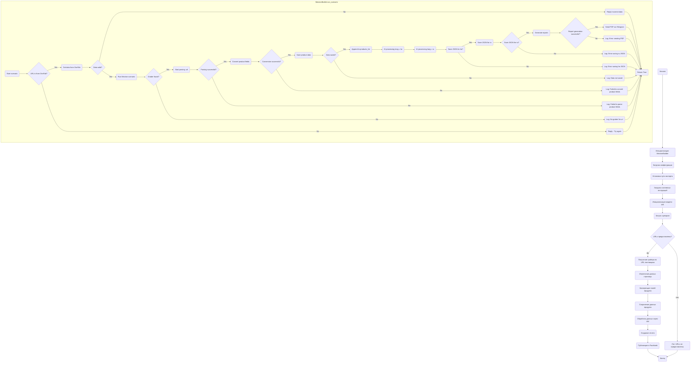

## Анализ кода `scenario_pricelist.ru.md`

### 1. **<алгоритм>**

**Описание рабочего процесса:**

Скрипт `scenario_pricelist.ru.md` предназначен для автоматизации создания мехирона (прайс-листа) для Сергея Казаринова. Он выполняет следующие шаги:

1.  **Инициализация:**
    *   Инициализируется класс `MexironBuilder`.
    *   Загружается конфигурация из JSON файла.
    *   Устанавливается путь для сохранения экспортируемых данных.
    *   Загружаются системные инструкции для модели ИИ.
    *   Инициализируется модель Google Generative AI.
2.  **Запуск сценария:**
    *   Проверяется наличие URL-адресов для парсинга.
        *   Если URL-адреса есть:
            *   Определяется грабер (парсер) для каждого URL на основе поставщика.
            *   Данные извлекаются с веб-страниц с помощью грабера.
            *   Поля продукта конвертируются в словарь.
            *   Данные сохраняются в файл.
            *   Данные обрабатываются с использованием ИИ.
        *   Если URL-адреса отсутствуют, в лог записывается сообщение об этом.
3.  **Обработка данных:**
    *   Извлеченные данные проходят обработку с помощью модели ИИ (Google Generative AI).
4.  **Сохранение и генерация отчетов:**
    *   Обработанные данные сохраняются в файлы JSON на двух языках (русском и иврите).
    *   Генерируются HTML и PDF отчеты из обработанных данных.
5.  **Публикация в Facebook:**
    *   Обработанные данные публикуются в Facebook (если необходимо).

**Примеры:**

*   **Инициализация:** Создается экземпляр `MexironBuilder` с экземпляром `Driver` (Selenium WebDriver).
*   **Загрузка конфигурации:** Из JSON-файла считываются параметры, например, путь для сохранения файлов, настройки для модели ИИ.
*   **Парсинг данных:** URL `https://example.com/product1` обрабатывается грабером, который извлекает название, цену и описание товара. Эти данные преобразуются в словарь.
*   **Обработка ИИ:** Список товаров и системная инструкция отправляются в Google Generative AI, который, например, может улучшить описания товаров.
*   **Генерация отчетов:** Создается HTML-файл со списком товаров и их обработанными описаниями, а также PDF-версия этого отчета.

**Поток данных:**

1.  **URL-адреса** -> `get_graber_by_supplier_url` -> **Грабер**
2.  **Грабер** -> `grab_page` -> **Данные со страницы**
3.  **Данные со страницы** -> `convert_product_fields` -> **Словарь продукта**
4.  **Словарь продукта** -> `save_product_data` -> **Файл с данными**
5.  **Список словарей продуктов** -> `process_ai` -> **Обработанные данные ИИ**
6.  **Обработанные данные ИИ** -> `create_report` -> **HTML/PDF отчеты**
7. **Обработанные данные ИИ** -> `post_facebook` -> **Публикация в Facebook**

### 2. **<mermaid>**

**Анализ зависимостей `mermaid`:**

*   Диаграмма показывает последовательность действий, начиная с инициализации `MexironBuilder` и заканчивая публикацией данных в Facebook.
*   Подграф `MexironBuilder.run_scenario` детализирует выполнение основного сценария, включая проверку источника URL, парсинг, обработку ИИ, сохранение JSON и создание отчетов.
*   Используются осмысленные имена переменных, такие как `InitMexironBuilder`, `LoadConfig`, `ProcessAI`, `SaveData`, и т.д., что повышает читаемость диаграммы.
*   Диаграмма ясно показывает потоки данных и логические развилки (например, проверки условий).
*  Управляющие структуры (ветвления и циклы) также показаны на блок-схеме, помогая понять поток управления.

### 3. **<объяснение>**

**Импорты:**

*   `selenium`: Используется для автоматизации браузера, что необходимо для веб-скрейпинга и взаимодействия с веб-страницами. `src.webdriver.driver`
*   `asyncio`: Библиотека для асинхронного программирования, позволяющая параллельно выполнять несколько задач и повысить эффективность.
*   `pathlib`: Используется для работы с путями к файлам и каталогам, обеспечивая более удобный и кроссплатформенный способ управления файловой системой.
*   `types`: Используется для создания простых пространств имен (`SimpleNamespace`), которые могут использоваться для хранения и передачи данных.
*   `typing`: Используется для аннотаций типов, что помогает сделать код более читаемым и обеспечивает проверку типов во время разработки.
*  `src.ai.gemini`: Используется для интеграции с моделью Google Generative AI, которая будет обрабатывать текстовые данные для, например, улучшения описаний товаров.
*  `src.suppliers.*.graber`: Используются для извлечения данных с различных сайтов поставщиков.
*  `src.endpoints.advertisement.facebook.scenarios`: Используется для публикации обработанных данных в Facebook.

**Класс: `MexironBuilder`**

*   **Роль:**  Основной класс, координирующий весь процесс создания "мехирона". Он инкапсулирует логику парсинга данных, их обработки с помощью ИИ, сохранения, генерации отчетов и публикации в Facebook.
*   **Атрибуты:**
    *   `driver`: Экземпляр `selenium.webdriver`, используемый для взаимодействия с браузером.
    *   `export_path`: Путь к директории, куда будут сохраняться результаты.
    *   `mexiron_name`: Название мехирона, используемое для идентификации процесса.
    *   `price`: Цена, которая будет использоваться в процессе обработки данных.
    *   `timestamp`: Временная метка, используемая для уникальной идентификации процесса.
    *   `products_list`: Список словарей, содержащий данные о продуктах после обработки.
    *   `model`: Экземпляр модели Google Generative AI.
    *   `config`: Словарь конфигурации, загруженный из JSON.
*   **Методы:**
    *   `__init__(self, driver: Driver, mexiron_name: Optional[str] = None)`:
        *   **Назначение**: Конструктор класса, устанавливает начальные значения атрибутов.
        *   **Аргументы**:
            *   `driver`: Экземпляр `Driver`, используемый для управления браузером.
            *   `mexiron_name`: Название мехирона, может быть `None`.
    *   `run_scenario(self, system_instruction: Optional[str] = None, price: Optional[str] = None, mexiron_name: Optional[str] = None, urls: Optional[str | List[str]] = None, bot = None) -> bool`:
        *   **Назначение**: Запускает основной сценарий обработки данных.
        *   **Аргументы**:
            *   `system_instruction`: Системные инструкции для модели ИИ.
            *   `price`: Цена, которая может быть применена к товарам.
            *   `mexiron_name`: Название мехирона.
            *   `urls`: Список URL-адресов, с которых необходимо извлечь данные.
        *   **Возвращает**: `True`, если сценарий выполнен успешно, иначе `False`.
    *   `get_graber_by_supplier_url(self, url: str)`:
        *   **Назначение**: Определяет и возвращает грабер, соответствующий URL-адресу поставщика.
        *   **Аргументы**:
            *   `url`: URL-адрес страницы поставщика.
        *   **Возвращает**: Экземпляр грабера, если найден, иначе `None`.
    *   `convert_product_fields(self, f: ProductFields) -> dict`:
        *   **Назначение**: Преобразует поля продукта из объекта `ProductFields` в словарь.
        *   **Аргументы**:
            *   `f`: Объект, содержащий данные о продукте.
        *   **Возвращает**: Словарь с данными о продукте.
    *   `save_product_data(self, product_data: dict)`:
        *   **Назначение**: Сохраняет данные о продукте в файл JSON.
        *   **Аргументы**:
            *   `product_data`: Словарь с данными о продукте.
    *   `process_ai(self, products_list: List[str], lang: str, attempts: int = 3) -> tuple | bool`:
        *   **Назначение**: Обрабатывает список продуктов с помощью модели ИИ.
        *   **Аргументы**:
            *   `products_list`: Список словарей, содержащий данные о продуктах.
            *    `lang`: Язык для обработки.
            *   `attempts`: Количество попыток запроса в случае неудачи.
        *   **Возвращает**: Обработанный ответ в форматах `ru` и `he` или `False`.
    *   `post_facebook(self, mexiron: SimpleNamespace) -> bool`:
        *   **Назначение**: Публикует данные на Facebook.
        *   **Аргументы**:
            *   `mexiron`: Пространство имен с данными для публикации.
        *   **Возвращает**: `True`, если публикация успешна, иначе `False`.
    *   `create_report(self, data: dict, html_file: Path, pdf_file: Path)`:
        *   **Назначение**: Генерирует HTML и PDF отчеты из обработанных данных.
        *   **Аргументы**:
            *   `data`: Словарь с обработанными данными.
            *   `html_file`: Путь к файлу для сохранения HTML отчета.
            *   `pdf_file`: Путь к файлу для сохранения PDF отчета.

**Переменные:**

*   Переменные в основном используются внутри методов, например:
    *   `driver` (selenium.webdriver.Chrome): Экземпляр драйвера для браузера Chrome.
    *   `export_path` (str): Путь для экспорта данных.
    *   `mexiron_name` (str): Имя мехирона.
    *   `products_list` (list): Список обработанных продуктов.
    *   `url` (str): URL-адрес для парсинга.
    *   `graber` (Graber instance): Экземпляр грабера для парсинга.
    *   `product_data` (dict): Данные продукта в виде словаря.

**Потенциальные ошибки и области для улучшения:**

*   **Обработка ошибок:**
    *   Хотя скрипт и включает логирование ошибок, можно улучшить обработку исключений для более надежной работы (например, использовать блоки `try-except`).
    *   Необходимо добавить больше валидации входных данных, например, проверять, что URL являются валидными.
*   **Асинхронность:**
    *   Многократное использование WebDriver внутри одного потока может замедлить выполнение, особенно при обработке большого количества URLs. Следует использовать асинхронные операции.
*   **Конфигурация:**
    *   Конфигурация может быть расширена для поддержки большего количества параметров, таких как настройки Facebook API, параметры ИИ модели и другие.
*   **Управление граберами:**
    *   Необходимо более гибко управлять граберами (например, загружать граберы динамически).
*  **Масштабируемость**: При обработки больших объемов данных следует использовать очереди сообщений для распределения нагрузки между обработчиками.

**Взаимосвязи с другими частями проекта:**

*   Скрипт использует `src.webdriver.driver.Driver` для управления браузером.
*   Данные обрабатываются через `src.ai.gemini` для работы с моделью ИИ.
*   Используются граберы из `src.suppliers.*.graber` для извлечения данных с веб-сайтов.
*   Для публикации в Facebook используются функции из `src.endpoints.advertisement.facebook.scenarios`.

**Заключение:**

Скрипт `scenario_pricelist.ru.md` представляет собой мощный инструмент для автоматизации создания мехирона. Он хорошо структурирован, имеет четкую логику и включает в себя все необходимые этапы: от парсинга данных до публикации в Facebook.  Тем не менее, есть области для улучшения, особенно в части обработки ошибок и использования асинхронного программирования.