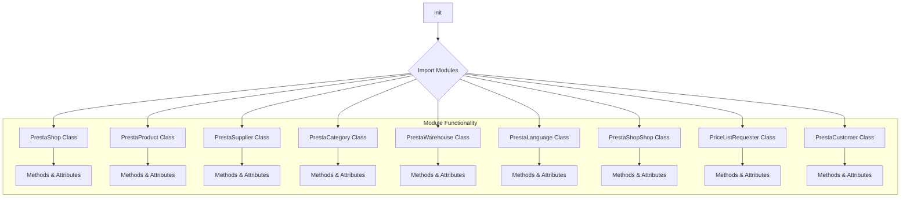
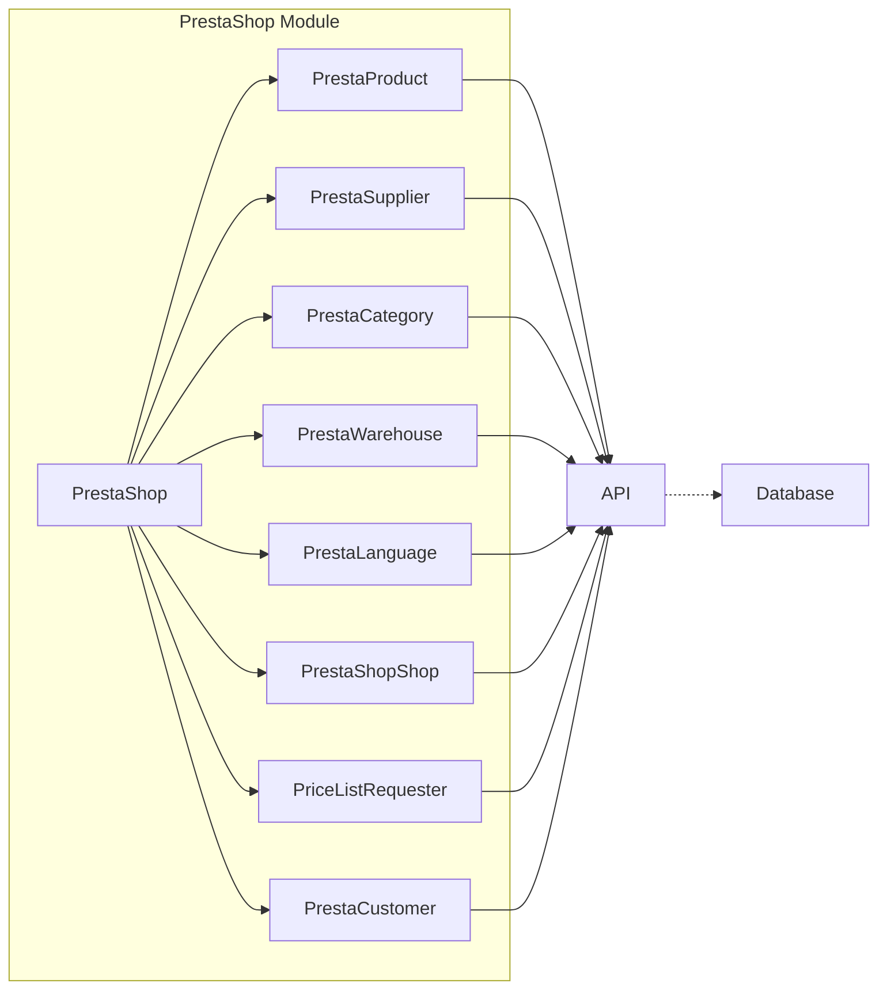

# <input code>

```python
## \file hypotez/src/endpoints/prestashop/__init__.py
# -*- coding: utf-8 -*-
#! venv/Scripts/python.exe
#! venv/bin/python/python3.12

"""
.. module: src.endpoints.prestashop 
	:platform: Windows, Unix
	:synopsis:

"""
MODE = 'dev'

from .api import PrestaShop
from .product import PrestaProduct
from .supplier import PrestaSupplier
from .category import PrestaCategory
from .warehouse import PrestaWarehouse
from .language import PrestaLanguage
from .shop import PrestaShopShop
from .pricelist import PriceListRequester
from .customer import PrestaCustomer
```

# <algorithm>



Example:  The `PrestaShop` class likely has methods to interact with the PrestaShop API (e.g., fetching data, creating resources).  `PrestaProduct` would have methods for product-specific operations.  This structure implies a modular design for handling various PrestaShop entities.


# <mermaid>



The `PrestaShop` module imports other modules that likely handle specific types of interaction (e.g., products, customers, suppliers). Each of those modules might interact with an API (likely a client library) to send and receive data from a PrestaShop instance, potentially interacting with a database to store or retrieve data.

# <explanation>

* **Импорты**:  The code imports various classes from sub-modules within the `prestashop` directory.  This suggests a modular design for interacting with PrestaShop API, separating concerns for various entities (products, suppliers, etc.).

    * `from .api import PrestaShop`: Imports the `PrestaShop` class, presumably from the `api.py` file within the `prestashop` directory. This is the likely entry point for interacting with the PrestaShop API.
    * `from .product import PrestaProduct`: Imports the `PrestaProduct` class to manage products.  Similarly, each module manages a specific aspect of the PrestaShop API interaction.
* **Классы**: These are likely Python classes used to encapsulate data and methods for handling specific PrestaShop entities.
    * `PrestaShop`: This class likely encapsulates high-level interactions with the PrestaShop API.
    * `PrestaProduct`, `PrestaSupplier`, etc.: These classes are likely designed to interact with their corresponding PrestaShop entities (e.g., retrieving, creating, updating products).
* **Функции**:  No functions are explicitly defined in this file. The file's purpose is to define the structure/modules for interacting with PrestaShop through various classes, which can contain functions.
* **Переменные**: `MODE = 'dev'`. This variable likely controls the application's behavior (e.g., switching between development and production modes).
* **Возможные ошибки или области для улучшений**:
    * The code lacks any error handling.  Adding `try...except` blocks around API calls or database queries is crucial to prevent unexpected crashes.
    * Robust documentation for the classes and methods (docstrings) would significantly improve maintainability and usability.
    * Clear separation of concerns should be maintained, possibly by organizing logic more efficiently.
    * The usage of `#!` lines (`#! venv/Scripts/python.exe` and `#! venv/bin/python/python3.12`) is unusual and perhaps not needed in modern projects. They are likely used to specify the interpreter that runs the script in the first place (but `#!/usr/bin/env python3` is generally preferred).
* **Взаимосвязи с другими частями проекта**: This file is part of a larger project dealing with PrestaShop integration. Other files (likely controllers or services) might use these imported classes to interact with the PrestaShop API and process data.