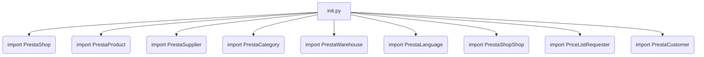
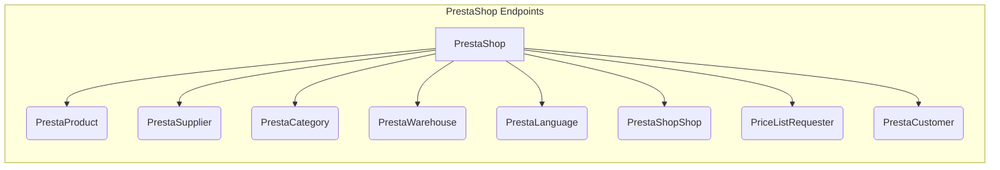

```MD
# Анализ файла `hypotez/src/endpoints/prestashop/__init__.py`

## <input code>

```python
## \file hypotez/src/endpoints/prestashop/__init__.py
# -*- coding: utf-8 -*-
#! venv/Scripts/python.exe
#! venv/bin/python/python3.12

"""
.. module:: src.endpoints.prestashop 
	:platform: Windows, Unix
	:synopsis:

"""
MODE = 'dev'

from .api import PrestaShop
from .product import PrestaProduct
from .supplier import PrestaSupplier
from .category import PrestaCategory
from .warehouse import PrestaWarehouse
from .language import PrestaLanguage
from .shop import PrestaShopShop
from .pricelist import PriceListRequester
from .customer import PrestaCustomer
```

## <algorithm>

Этот файл является файлом инициализации для пакета `prestashop`.  Он импортирует различные классы и объекты, относящиеся к взаимодействию с API платформы PrestaShop.  Блок-схема проста:



В данном случае алгоритм не подразумевает каких-либо вычислений или сложной логики.  Он только предоставляет доступ к указанным модулям.

## <mermaid>



## <explanation>

**Импорты:**

Этот файл импортирует модули из подпапок `hypotez/src/endpoints/prestashop`.  Это позволяет использовать классы и функции, определенные в этих модулях, в других частях проекта.  Например, `from .api import PrestaShop` импортирует класс `PrestaShop` из файла `api.py` внутри папки `prestashop`.  Все импорты относятся к модулям, которые, скорее всего, содержат классы для работы с разными аспектами API PrestaShop, такими как управление продуктами, поставщиками, категориями и т.д.  "`.`" перед именем файла указывает, что модули находятся в той же директории, что и текущий файл.

**Классы (предположительно):**

- `PrestaShop`: Предположительно, класс для взаимодействия с основными функциями API PrestaShop.
- `PrestaProduct`: Класс для работы с продуктами.
- `PrestaSupplier`: Класс для работы с поставщиками.
- `PrestaCategory`: Класс для работы с категориями.
- `PrestaWarehouse`: Класс для работы с складами.
- `PrestaLanguage`: Класс для работы с языками.
- `PrestaShopShop`: Класс для работы с магазинами PrestaShop.
- `PriceListRequester`: Класс для запроса прайс-листов.
- `PrestaCustomer`: Класс для работы с клиентами.

**Функции (предположительно):**

Предполагается, что в соответствующих импортированных файлах (`.api`, `.product`, и т.д.) будут определены методы этих классов, реализующие взаимодействие с API PrestaShop. Эти методы будут выполнять запросы, парсить ответы и т.д.

**Переменные:**

- `MODE = 'dev'`: Скорее всего, переменная, определяющая режим работы приложения (например, 'dev', 'prod').  Она может использоваться для настройки поведения кода (например, использования тестовых данных или других конфигураций).

**Возможные ошибки и улучшения:**

- Нет явных ошибок, но требуется информация о реализации `api.py` и других подключаемых модулях для более глубокой оценки. Было бы желательно увидеть код этих файлов, чтобы понять, как они взаимодействуют с API PrestaShop и какие типы данных они обрабатывают.


**Цепочка взаимосвязей:**

Этот файл является частью архитектуры, организованной вокруг работы с API PrestaShop.  Он связывает различные части кода, связанные с взаимодействием с платформой.  Предположительно, этот файл используется в других частях проекта, например, в контроллерах или задачах, для работы с данными PrestaShop.  Без доступа к другим файлам сложно описать полную цепочку взаимосвязей.