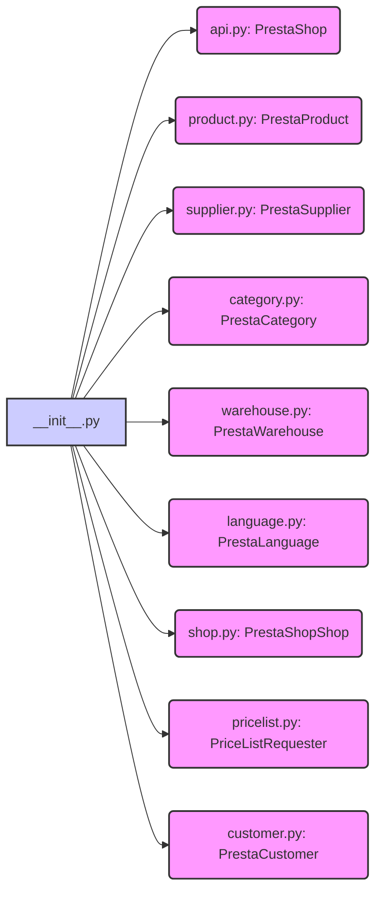

## Анализ кода `hypotez/src/endpoints/prestashop/__init__.py`

### <алгоритм>

1. **Инициализация режима `MODE`**:
    - Устанавливается переменная `MODE` в значение `'dev'`. Это может влиять на поведение приложения в зависимости от среды (например, `dev`, `prod`).
    - Пример: Если `MODE == 'dev'`, может быть включено логирование отладки.

2. **Импорт классов:**
   - Импортируются классы для взаимодействия с PrestaShop API.
      - `PrestaShop` из `api.py`: Класс для базовых запросов к PrestaShop.
      - `PrestaProduct` из `product.py`: Класс для работы с продуктами PrestaShop.
      - `PrestaSupplier` из `supplier.py`: Класс для работы с поставщиками PrestaShop.
      - `PrestaCategory` из `category.py`: Класс для работы с категориями PrestaShop.
      - `PrestaWarehouse` из `warehouse.py`: Класс для работы со складами PrestaShop.
      - `PrestaLanguage` из `language.py`: Класс для работы с языками PrestaShop.
      - `PrestaShopShop` из `shop.py`: Класс для работы с магазинами PrestaShop.
      - `PriceListRequester` из `pricelist.py`: Класс для запросов прайс-листов PrestaShop.
      - `PrestaCustomer` из `customer.py`: Класс для работы с клиентами PrestaShop.

3. **Использование классов:**
   - Импортированные классы могут быть использованы для создания экземпляров и вызова методов для взаимодействия с PrestaShop.
      - Пример: `product = PrestaProduct(api_client)` - создание объекта для работы с продуктами, где `api_client` - экземпляр класса `PrestaShop`.
      - Пример: `products = product.get_products()` - получение списка продуктов PrestaShop.
      - Пример: `customer = PrestaCustomer(api_client)` - создание объекта для работы с клиентами.
      - Пример: `customer.get_customer(customer_id)` - получение информации о конкретном клиенте.

### <mermaid>

**Объяснение `mermaid`:**

-   `__init__.py` (A) импортирует классы из других модулей:
    -   `PrestaShop` из `api.py` (B)
    -   `PrestaProduct` из `product.py` (C)
    -   `PrestaSupplier` из `supplier.py` (D)
    -   `PrestaCategory` из `category.py` (E)
    -   `PrestaWarehouse` из `warehouse.py` (F)
    -   `PrestaLanguage` из `language.py` (G)
    -   `PrestaShopShop` из `shop.py` (H)
    -   `PriceListRequester` из `pricelist.py` (I)
    -   `PrestaCustomer` из `customer.py` (J)
-   Стрелки показывают, что `__init__.py` зависит от каждого из этих модулей.
-   Стили `importFill` и `fill` используются для визуализации импортов и самого файла `__init__.py`.

### <объяснение>

**Импорты:**

-   `from .api import PrestaShop`:
    -   Импортирует класс `PrestaShop` из файла `api.py`, находящегося в той же директории.
    -   Этот класс, вероятно, содержит логику для взаимодействия с PrestaShop API, например, отправку запросов, обработку ответов и аутентификацию.
    -   Связан с другими модулями, поскольку может предоставлять базовый функционал (например, `api_client`) для работы с API, используемый классами для конкретных сущностей (продукты, клиенты).
-   `from .product import PrestaProduct`:
    -   Импортирует класс `PrestaProduct` из файла `product.py`, находящегося в той же директории.
    -   Этот класс предназначен для работы с продуктами PrestaShop (получение, создание, обновление).
    -   Зависит от `PrestaShop`, так как может использовать его методы для запросов к API.
-   `from .supplier import PrestaSupplier`:
    -   Импортирует класс `PrestaSupplier` из файла `supplier.py`, находящегося в той же директории.
    -   Этот класс предназначен для работы с поставщиками PrestaShop (получение, создание, обновление).
    -   Зависит от `PrestaShop`, так как может использовать его методы для запросов к API.
-   `from .category import PrestaCategory`:
    -   Импортирует класс `PrestaCategory` из файла `category.py`, находящегося в той же директории.
    -   Этот класс предназначен для работы с категориями PrestaShop (получение, создание, обновление).
    -   Зависит от `PrestaShop`, так как может использовать его методы для запросов к API.
-   `from .warehouse import PrestaWarehouse`:
    -   Импортирует класс `PrestaWarehouse` из файла `warehouse.py`, находящегося в той же директории.
    -   Этот класс предназначен для работы со складами PrestaShop (получение, создание, обновление).
     -  Зависит от `PrestaShop`, так как может использовать его методы для запросов к API.
-   `from .language import PrestaLanguage`:
    -   Импортирует класс `PrestaLanguage` из файла `language.py`, находящегося в той же директории.
    -   Этот класс предназначен для работы с языками PrestaShop (получение, создание, обновление).
    -   Зависит от `PrestaShop`, так как может использовать его методы для запросов к API.
-   `from .shop import PrestaShopShop`:
    -   Импортирует класс `PrestaShopShop` из файла `shop.py`, находящегося в той же директории.
    -   Этот класс предназначен для работы с магазинами PrestaShop (получение, создание, обновление).
    -   Зависит от `PrestaShop`, так как может использовать его методы для запросов к API.
-   `from .pricelist import PriceListRequester`:
    -   Импортирует класс `PriceListRequester` из файла `pricelist.py`, находящегося в той же директории.
    -   Этот класс предназначен для работы с запросами прайс-листов.
    -   Зависит от `PrestaShop`, так как может использовать его методы для запросов к API.
-   `from .customer import PrestaCustomer`:
    -   Импортирует класс `PrestaCustomer` из файла `customer.py`, находящегося в той же директории.
    -   Этот класс предназначен для работы с клиентами PrestaShop (получение, создание, обновление).
    -   Зависит от `PrestaShop`, так как может использовать его методы для запросов к API.

**Переменные:**

-   `MODE = 'dev'`:
    -   Глобальная переменная, устанавливающая режим работы приложения (в данном случае, режим разработки).
    -   Может использоваться для переключения между различными конфигурациями приложения.
    -   Тип: Строка.

**Классы:**

-   `PrestaShop`, `PrestaProduct`, `PrestaSupplier`, `PrestaCategory`, `PrestaWarehouse`, `PrestaLanguage`, `PrestaShopShop`, `PriceListRequester`, `PrestaCustomer`:
    -   Каждый класс предназначен для инкапсуляции логики взаимодействия с PrestaShop API для конкретной сущности (продукт, поставщик, клиент и т.д.).
    -   Могут иметь методы для выполнения CRUD-операций (создание, чтение, обновление, удаление) над соответствующими ресурсами PrestaShop.
    -   Скорее всего, имеют атрибуты для хранения конфигураций и данных.
    -   Являются частью структуры проекта, предоставляющей абстракцию над API PrestaShop.

**Потенциальные ошибки и области для улучшения:**

-   **Жестко закодированный `MODE`**:  Значение `MODE` задано статически, что может усложнить развертывание в различных средах. Лучше получать значение из переменных окружения или параметров конфигурации.
-   **Отсутствие документации внутри файлов модулей**:  Сложно понять, что именно делают классы, без документации внутри их файлов.
-   **Отсутствие обработки ошибок**:  В файле `__init__.py` отсутствуют механизмы обработки ошибок импорта, что может привести к падениям приложения при проблемах с импортом.
-   **Потенциальные циклические зависимости**: Без детального анализа, потенциально может существовать циклические зависимости между модулями.

**Взаимосвязь с другими частями проекта:**

-   Файл `__init__.py` является точкой входа для пакета `src.endpoints.prestashop`, и предоставляет интерфейс для других частей проекта, желающих взаимодействовать с PrestaShop.
-   Классы из этого пакета, вероятно, используются в других частях проекта для получения, обработки и отправки данных в PrestaShop API, например, в сервисных слоях или в обработчиках запросов.
-   `MODE` может влиять на другие части проекта, изменяя поведение, например, логирование или настройки подключения.