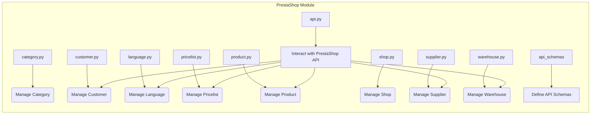

# Анализ кода модуля PrestaShop

## <input code>

```
### Структура каталога

1. **Главный каталог (`PrestaShop`)**:
    - `__init__.py`: Инициализирует модуль.
    - `category.py`: Управляет функциональностью, связанной с категориями.
    - `customer.py`: Управляет функциональностью, связанной с клиентами.
    - `language.py`: Управляет функциональностью, связанной с языками.
    - `pricelist.py`: Управляет функциональностью, связанной с прайслистами.
    - `product.py`: Управляет функциональностью, связанной с продуктами.
    - `shop.py`: Управляет функциональностью, связанной с магазинами.
    - `supplier.py`: Управляет функциональностью, связанной с поставщиками.
    - `version.py`: Управляет информацией о версии модуля.
    - `warehouse.py`: Управляет функциональностью, связанной с складами.

2. **Каталог примеров (`_examples`)**:
    - Содержит примеры скриптов и документацию, помогающую разработчикам эффективно понимать и использовать модуль.
    - `__init__.py`: Инициализирует модуль примеров.
    - `header.py`: Пример скрипта заголовка.
    - `version.py`: Пример скрипта версии.

3. **Каталог API (`api`)**:
    - Содержит файлы, относящиеся к API PrestaShop.
    - `__init__.py`: Инициализирует модуль API.
    - `_dot`: Содержит файлы DOT для графических представлений.
    - `_examples`: Предоставляет примеры скриптов, демонстрирующих использование API.
    - `api.py`: Содержит основную логику взаимодействия с API PrestaShop.
    - `version.py`: Управляет информацией о версии модуля API.

4. **Каталог схем API (`api_schemas`)**:
    - Содержит файлы JSON-схем и скрипты для управления схемами API.
    - `__init__.py`: Инициализирует модуль схем API.
    - `api_resourses_list.py`: Список доступных ресурсов API.
    - `api_schema_category.json`: JSON-схема для категорий.
    - `api_schema_language.json`: JSON-схема для языков.
    - `api_schema_product.json`: JSON-схема для продуктов.
    - `api_schemas_buider.py`: Скрипт для построения схем API.
    - `api_suppliers_schema.json`: JSON-схема для поставщиков.
    - `csv_product_schema.json`: CSV-схема для продуктов.
    - `PrestaShop_product_combinations_fields.json`: JSON-файл для полей комбинаций продуктов.
    - `PrestaShop_product_combinations_sysnonyms_he.json`: JSON-файл для синонимов комбинаций продуктов на иврите.

5. **Каталог доменов (`domains`)**:
    - Содержит подкаталоги для различных доменов, каждый со своими настройками и конфигурациями.
    - `__init__.py`: Инициализирует модуль доменов.
    - `ecat_co_il`: Содержит настройки для `ecat.co.il`.
        - `__init__.py`: Инициализирует домен `ecat.co.il`.
        - `settings.json`: JSON-файл с настройками для `ecat.co.il`.
    - `emildesign_com`: Содержит настройки для `emildesign.com`.
        - `__init__.py`: Инициализирует домен `emildesign.com`.
        - `settings.json`: JSON-файл с настройками для `emildesign.com`.
    - `sergey_mymaster_co_il`: Содержит настройки для `sergey.mymaster.co.il`.
        - `__init__.py`: Инициализирует домен `sergey.mymaster.co.il`.
        - `settings.json`: JSON-файл с настройками для `sergey.mymaster.co.il`.

### Ключевые компоненты

... (описания категорий, клиентов, языков, прайслистов, продуктов, магазинов, поставщиков, складов, API, схем API)

### Пример использования

... (пример использования модуля продуктов)

### Документация

... (ссылки на документацию и примеры)
```

## <algorithm>

(Отсутствует достаточная информация для построения блок-схемы.  Описание функциональности носит общий характер и не содержит деталей реализации.)

## <mermaid>



## <explanation>

Этот код описывает структуру и функциональность модуля PrestaShop.  Он не содержит имплементации, а представляет собой описание *архитектуры* и *целей* модуля.

**Импорты:**

Отсутствуют, так как это описание архитектуры, а не код.


**Классы:**

Описание функциональности представлено в виде компонентов (например, `category.py`, `product.py`), что предполагает наличие классов внутри этих файлов.  Без конкретного кода невозможно более подробно проанализировать классы.


**Функции:**

Нет информации о функциях.


**Переменные:**

Нет информации о переменных.


**Возможные ошибки или области для улучшений:**

* **Недостаточно информации:** Отсутствуют детали реализации, поэтому нет возможности выявить потенциальные ошибки.
* **Отсутствие кода:**  Для детального анализа необходим фактический код (`.py` файлы) модулей.


**Взаимосвязи с другими частями проекта:**

Описание подчеркивает зависимость всех компонентов от API PrestaShop (`api.py`).  Модули `product.py`, `customer.py`, `language.py` и т.д. взаимодействуют с API для доступа к данным.  Также присутствует структура для описания схем API (`api_schemas`). Судя по документации, проект разделен по доменам, что предполагает гибкую конфигурацию для различных целей и реализаций.

**Заключение:**

Этот документ - это проект документации модуля.  Для более детального анализа требуется сам код, а не только описание архитектуры.