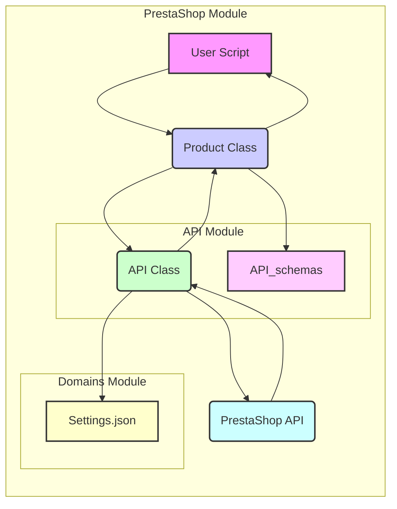

# Анализ структуры и функциональности модуля PrestaShop

## <алгоритм>

1. **Инициализация модуля:**
   - Когда модуль `PrestaShop` импортируется, запускается `__init__.py` в основной директории, а также в поддиректориях `_examples`, `api`, `api_schemas` и `domains` (и поддиректориях доменов). Эти файлы обычно пусты или содержат базовую инициализацию.
   - **Пример:** Импорт модуля `from PrestaShop.product import Product` активирует `__init__.py` в каталоге `PrestaShop` и `PrestaShop/product.py`.

2. **Управление сущностями:**
   - Модуль разделен на файлы, каждый из которых управляет отдельной сущностью PrestaShop (категория, клиент, язык, цена, продукт, магазин, поставщик, склад).
   - Каждый файл (например, `category.py`, `customer.py`) содержит класс (например, `Category`, `Customer`) с методами для взаимодействия с API PrestaShop.
   - **Пример:** `PrestaShop/product.py` содержит класс `Product`, методы которого позволяют получать (`get_product_data`), создавать (`create_product`), обновлять и удалять данные о продуктах.

3. **Взаимодействие с API:**
   - API PrestaShop вынесено в отдельный каталог (`api`).
   - `api/api.py` содержит основной класс (`API`) с методами для выполнения HTTP-запросов к API PrestaShop.
   - Классы сущностей (например, `Product`) используют `api.py` для отправки запросов и получения ответов.
   - **Пример:** Метод `Product.get_product_data()` использует метод `API.get()` для получения данных о продукте.

4. **Управление схемами API:**
   - Каталог `api_schemas` содержит JSON-схемы для API PrestaShop.
   - Схемы используются для валидации данных, отправляемых и получаемых от API.
   - `api_schemas/api_schemas_buider.py` вероятно используется для создания или обновления JSON-схем.
   - **Пример:** `api_schemas/api_schema_product.json` содержит схему для данных продукта.

5. **Управление доменами:**
   - Каталог `domains` содержит подкаталоги для каждого домена, для которого используется модуль.
   - Каждый домен имеет файл `settings.json`, содержащий специфические настройки.
   - **Пример:** `domains/ecat_co_il/settings.json` содержит настройки для домена `ecat.co.il`.

6. **Примеры использования:**
    - Директория `_examples` содержит скрипты, демонстрирующие использование модуля.
    - **Пример**: скрипт `_examples/header.py` показывает как создать и работать с заголовками запросов, а `_examples/version.py` показывает, как проверить версию модуля.

**Поток данных:**

1.  Пользовательский скрипт (например, `example.py`) вызывает класс сущности (например, `Product`).
2.  Класс сущности (например, `Product`) использует `api.py` для отправки запроса к API PrestaShop.
3.  `api.py` отправляет HTTP-запрос к API PrestaShop и получает ответ.
4.  `api.py` возвращает ответ классу сущности.
5.  Класс сущности обрабатывает ответ и возвращает данные пользовательскому скрипту.
6.  JSON-схемы из `api_schemas` могут использоваться для валидации данных на различных этапах.
7. Настройки из `domains` могут использоваться для конфигурации API-клиента.

## <mermaid>

### Объяснение диаграммы mermaid:

-   **User Script (A):** Начальная точка, представляющая пользовательский скрипт, использующий модуль `PrestaShop`.
-   **Product Class (B):**  Класс в модуле `PrestaShop`, предоставляющий функциональность для работы с продуктами. Является посредником для запросов к API. Он использует API Class для связи с PrestaShop API.
-   **API Class (C):** Класс, отвечающий за непосредственное взаимодействие с PrestaShop API. Отправляет запросы и получает ответы.
-   **PrestaShop API (D):** Внешний PrestaShop API, к которому отправляются запросы.
-   **API_schemas (E):**  Директория API_schemas, которая предоставляет JSON схемы для валидации запросов и ответов. Класс `Product` использует `api_schemas` для валидации данных.
-  **Settings.json (F):** Файлы настроек для различных доменов, используемые API Class для конфигурации подключения к PrestaShop.

**Зависимости:**

-   `User Script` зависит от `Product Class`.
-   `Product Class` зависит от `API Class`.
-   `API Class` зависит от `PrestaShop API`.
-   `Product Class` зависит от `API_schemas` для валидации данных.
-   `API Class` зависит от `Settings.json` для конфигурации.

## <объяснение>

### Импорты:
-   В описании не представлены явные импорты в коде, но подразумевается, что каждый файл модуля будет импортировать необходимые классы и модули из `src` (например, `from src.api.api import API` в `product.py` или `from src.api_schemas.api_schema_product import ProductSchema` в `product.py`).
-  Импорт модуля может выглядеть, например, так `from PrestaShop.product import Product`.  Это импортирует класс `Product` из файла `product.py`.

### Классы:

-   **`Category`, `Customer`, `Language`, `Pricelist`, `Product`, `Shop`, `Supplier`, `Warehouse`:**
    -   **Роль**: Каждый из этих классов представляет собой сущность PrestaShop (категория, клиент, язык и т.д.).
    -   **Атрибуты**: Вероятно, будут иметь атрибуты для хранения данных сущности (например, `id`, `name`, `description`).
    -   **Методы**: Методы для выполнения операций над сущностями (например, `get_data()`, `create()`, `update()`, `delete()`), используя API PrestaShop.
    -   **Взаимодействие**: Взаимодействуют с классом `API` для отправки запросов к PrestaShop API.

-   **`API`:**
    -   **Роль**: Класс для взаимодействия с PrestaShop API.
    -   **Атрибуты**: Настройки API (например, URL, токен, данные для подключения).
    -   **Методы**: Методы для выполнения запросов к API (`get()`, `post()`, `put()`, `delete()`), обработка ответов.
    -   **Взаимодействие**: Используется классами сущностей для выполнения API-запросов.

### Функции:
-   В описании не приведены конкретные функции, но предполагается, что классы сущностей содержат методы для работы с данными (например, `get_product_data(product_id)`, `create_product(data)`, `update_product(product_id, data)`, `delete_product(product_id)` в классе `Product`).
    -   **Аргументы**: Зависят от типа операции. Могут включать ID сущности, данные для создания или обновления.
    -   **Возвращаемые значения**: Данные, полученные из API, или результат операции.
    -   **Назначение**: Предоставление высокоуровневого интерфейса для работы с API PrestaShop.
    -   **Пример**: `get_product_data(product_id="12345")` в классе `Product` вернет словарь с данными продукта с ID "12345".

### Переменные:
-   **Типы**: В основном строки (например, URL, токен) и словари (данные сущностей, JSON-ответы API).
-   **Использование**: Для хранения данных конфигурации, API-ответов и данных сущностей PrestaShop.
-   Например, переменная `product_id` в функции `get_product_data` является строкой.

### Потенциальные ошибки и области для улучшения:

1.  **Обработка ошибок:** Не описано, как обрабатываются ошибки API (например, 404 Not Found, 500 Internal Server Error). Необходимо добавить обработку исключений и логирование ошибок.
2.  **Аутентификация:** Не указано, как обрабатывается аутентификация в API. Обычно это OAuth 2.0 или API key. Необходимо добавить механизм аутентификации.
3.  **Валидация данных:** В описании упоминаются JSON-схемы, но не ясно, как и когда они используются для валидации. Необходимо добавить валидацию данных перед отправкой запросов и после получения ответов от API.
4.  **Кеширование:** Не предусмотрено кеширование данных, что может привести к лишним запросам к API. Необходимо добавить механизм кеширования данных.
5.  **Асинхронность**: Операции с API являются блокирующими. Для лучшей производительности можно использовать асинхронный API.
6.  **Конфигурация:** Необходимо использовать переменные среды или файл конфигурации для хранения настроек API (URL, токен), вместо того чтобы хранить их в коде.
7.  **Типизация:** Использование аннотаций типов для улучшения читаемости и безопасности кода.

### Взаимосвязи с другими частями проекта:

-   Модуль `PrestaShop` может быть частью более крупного проекта (например, системы управления контентом, синхронизации данных или интеграции с CRM).
-   Может зависеть от других пакетов внутри проекта (например, `utils` для общих функций, `config` для настроек).
-   Может использовать внешние библиотеки (например, `requests` для HTTP-запросов, `jsonschema` для валидации).