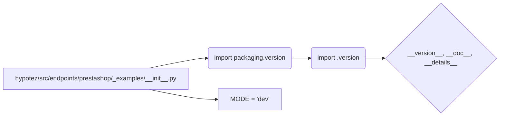

```MD
# Анализ файла hypotez/src/endpoints/prestashop/_examples/__init__.py

## <input code>

```python
## \file hypotez/src/endpoints/prestashop/_examples/__init__.py
# -*- coding: utf-8 -*-
#! venv/Scripts/python.exe
#! venv/bin/python/python3.12

"""
.. module: src.endpoints.prestashop._examples 
	:platform: Windows, Unix
	:synopsis:

"""
MODE = 'dev'

"""
	:platform: Windows, Unix
	:synopsis:

"""


"""
	:platform: Windows, Unix
	:synopsis:

"""


"""
  :platform: Windows, Unix

"""
"""
  :platform: Windows, Unix
  :platform: Windows, Unix
  :synopsis:
"""MODE = 'dev'
  
""" module: src.endpoints.prestashop._examples """


from packaging.version import Version
from .version import __version__, __doc__, __details__
```

## <algorithm>

Алгоритм работы этого файла сводится к импорту модулей и, вероятно, к определению констант и переменных, используемых в других частях проекта.  Пошаговой блок-схемы нет, так как файл содержит только импорты и определения констант без логики выполнения.

## <mermaid>



## <explanation>

**Импорты:**

- `from packaging.version import Version`: Импортирует класс `Version` из пакета `packaging`. Этот пакет используется для работы с версиями программного обеспечения.  В контексте проекта, это, вероятно, используется для обработки версий библиотек или для обеспечения совместимости между версиями разных компонентов.  Этот импорт находится в корневом пространстве имен (src).

- `from .version import __version__, __doc__, __details__`: Импортирует переменные `__version__`, `__doc__` и `__details__` из модуля `version.py` в текущей подпапке `_examples`.  Это предполагает, что в папке `_examples` есть файл `version.py`, содержащий эти переменные, вероятно, определяющие версию модуля, его документацию и дополнительные данные.  Обратите внимание на использование `.` для импорта из текущей подпапки – это типичный способ импорта внутри проекта.

**Классы:**

В данном файле нет классов.

**Функции:**

В данном файле нет функций.

**Переменные:**

- `MODE = 'dev'`:  Глобальная переменная, хранящая строку 'dev'.  Скорее всего, это константа, определяющая режим работы (например, 'dev' – режим разработки, 'prod' – режим производства). Значение этой переменной будет использоваться в других частях проекта для настройки поведения.


**Возможные ошибки или области для улучшений:**

- Отсутствует явное назначение файла `__init__.py`. Файл `__init__.py` в папке `_examples` скорее всего нужен для инициализации этой подпапки, но функционально он не выполняет никаких действий.  В идеале, `__init__.py` должен определять набор функций или классов, которые будут доступны из этой подпапки.

**Цепочка взаимосвязей:**

Файл `hypotez/src/endpoints/prestashop/_examples/__init__.py` зависит от пакета `packaging` и модуля `version.py` в той же подпапке.  Этот модуль, вероятно, используется другими частями кода внутри проекта для получения информации о версии и документации модуля `_examples` или его компонентов.

**Дополнительные замечания:**

Комментарии вида `"""..."""` не несут практической смысловой нагрузки для анализа.  Рекомендуется использовать docstrings для документации функций, классов и модулей.  Комментарии, которые не содержат полезной информации, следует удалять.