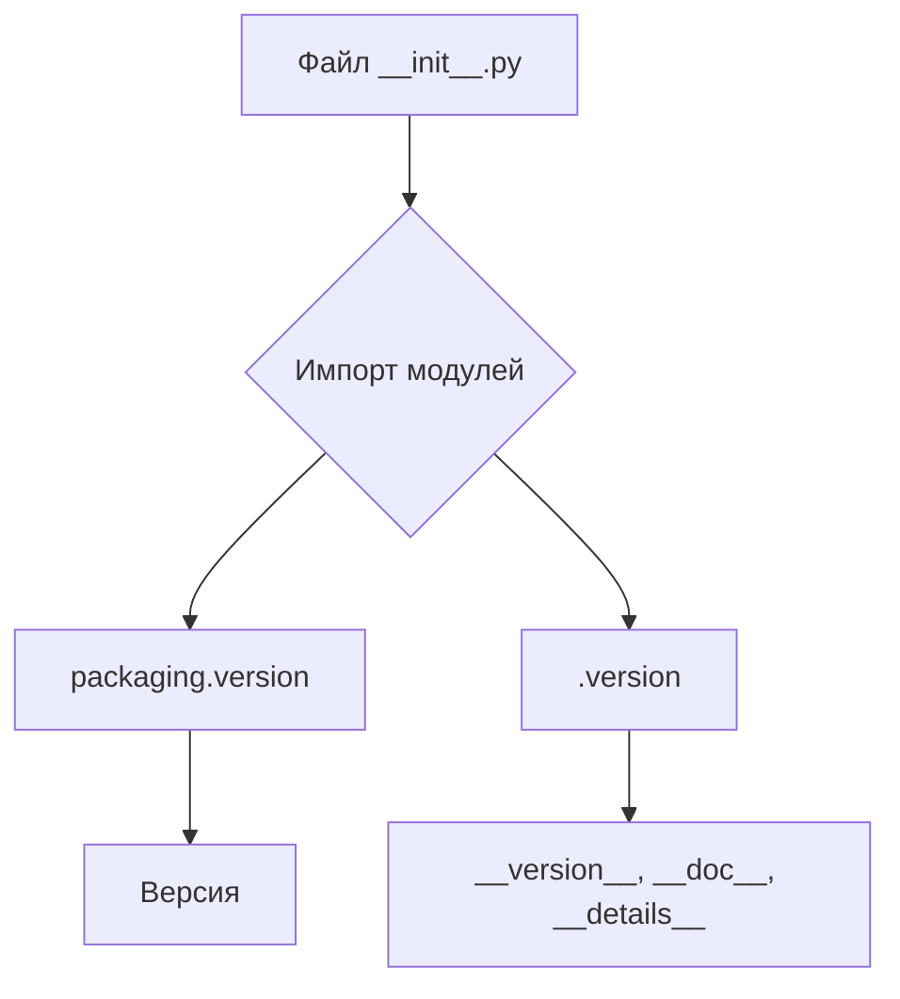
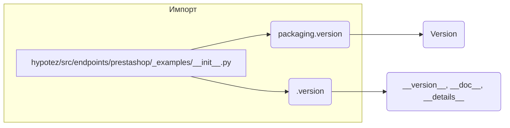

```MD
# Анализ файла `hypotez/src/endpoints/prestashop/_examples/__init__.py`

## <input code>

```python
## \file hypotez/src/endpoints/prestashop/_examples/__init__.py
# -*- coding: utf-8 -*-\
#! venv/Scripts/python.exe
#! venv/bin/python/python3.12

"""
.. module: src.endpoints.prestashop._examples 
	:platform: Windows, Unix
	:synopsis:

"""
MODE = 'dev'

"""
	:platform: Windows, Unix
	:synopsis:

"""


"""
	:platform: Windows, Unix
	:synopsis:

"""


"""
  :platform: Windows, Unix

"""
"""
  :platform: Windows, Unix
  :platform: Windows, Unix
  :synopsis:
"""MODE = 'dev'
  
""" module: src.endpoints.prestashop._examples """


from packaging.version import Version
from .version import __version__, __doc__, __details__
```

## <algorithm>

Этот файл представляет собой инициализирующий модуль (или пакет) для подмодуля `_examples` внутри модуля `prestashop` в пакете `endpoints` проекта `hypotez`.  Алгоритм работы состоит из импорта необходимых модулей.  Пошаговая блок-схема упрощена, так как основной функционал заключается в импорте.



В данном случае, нет сложных вычислений или взаимодействий, только импорт.

## <mermaid>



## <explanation>

**Импорты:**

* `from packaging.version import Version`: Импортирует класс `Version` из пакета `packaging`.  Этот пакет обычно используется для работы с версиями программного обеспечения.  В данном контексте импорт `Version`  предполагает, что в дальнейшем в модуле `_examples` будут использоваться версии и работа с ними.

* `from .version import __version__, __doc__, __details__`: Импортирует переменные `__version__`, `__doc__` и `__details__` из файла `.version` внутри папки `_examples`.  Эти переменные, по всей вероятности, содержат информацию о версии, документации и дополнительных деталях модуля, предоставляя метаданные.  Обратите внимание на относительный импорт (`.version`) – это указывает, что файл `.version` находится в той же директории, что и `__init__.py`.

**Классы:**

В файле нет определений классов.

**Функции:**

Нет определений функций.

**Переменные:**

* `MODE = 'dev'`:  Переменная, вероятно, определяет режим работы (`'dev'`, `'prod'` и т.п.). Она глобально определена в `__init__.py`, что может влиять на поведение связанных компонентов.

**Возможные ошибки или улучшения:**

* **Недостаток документации:** Несмотря на наличие docstrings, они весьма скудны. Дополнительные комментарии к `MODE` и импортированным переменным улучшат понимание кода.
* **Необъяснённые переменные:** Фразы типа `""" :platform: Windows, Unix :synopsis: """` не имеют функционального значения. Эти строки можно убрать для уменьшения избыточности.
* **Дублирование MODE:** Переменная `MODE` определена дважды. Это потенциальная ошибка. Необходимо убедиться, что она используется только в одном экземпляре.

**Взаимосвязи с другими частями проекта:**

Файл `__init__.py` – это точка входа в модуль `_examples`.  Его назначение – инициализация и экспорт элементов (в данном случае переменных) для использования другими частями приложения.  Используя `__init__.py`, проект может определять подмодули и создавать структуру импорта между разными модулями.  Связь с другими частями `hypotez` происходит через импортированные модули (`packaging.version`), и переменные `__version__`, `__doc__`, `__details__`, которые, по всей видимости, передают информацию о версии, документации и детализации к другим частям проекта.