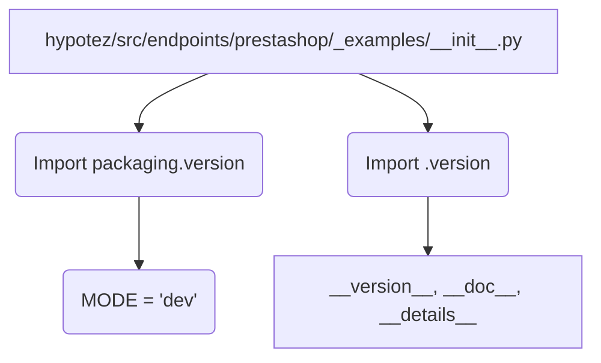

# <input code>

```python
## \file hypotez/src/endpoints/prestashop/_examples/__init__.py
# -*- coding: utf-8 -*-
#! venv/Scripts/python.exe
#! venv/bin/python/python3.12

"""
.. module: src.endpoints.prestashop._examples 
	:platform: Windows, Unix
	:synopsis:

"""
MODE = 'dev'

"""
	:platform: Windows, Unix
	:synopsis:

"""


"""
	:platform: Windows, Unix
	:synopsis:

"""


"""
  :platform: Windows, Unix

"""
"""
  :platform: Windows, Unix
  :platform: Windows, Unix
  :synopsis:
"""MODE = 'dev'
  
""" module: src.endpoints.prestashop._examples """


from packaging.version import Version
from .version import __version__, __doc__, __details__
```

# <algorithm>

Этот код представляет собой модуль Python, вероятно, часть более крупного проекта.  Алгоритм здесь прост: он импортирует необходимые модули и определяет переменные.  Поскольку нет вызова функций или сложных структур управления, блок-схема будет тривиальной.

1. **Импорт:** Модуль `packaging.version` импортируется для работы с версиями пакетов. Модуль `.version` (вероятно, из того же каталога) импортирует __version__, __doc__, __details__ – предположительно для информации о версии и документации.

2. **Переменные:** Переменная `MODE` определена как строка 'dev' (возможно, для режимов работы приложения).

3. **Документация:**  Многочисленные строковые комментарии (`"""Docstrings"""`) скорее всего используются для генерации документации, но сами по себе не выполняют никаких действий.

**Пример данных:**

Нет явных примеров данных, так как код просто импортирует и объявляет переменные.


# <mermaid>



**Объяснение диаграммы:**

Диаграмма показывает импорт модулей `packaging.version` и `.version`.  Переменная `MODE` определяется локально. `__version__`, `__doc__`, `__details__` импортируются из модуля `.version`, который предположительно находится в том же каталоге.


# <explanation>

**Импорты:**

- `from packaging.version import Version`: Импортирует класс `Version` из пакета `packaging.version`. Этот пакет используется для работы с версиями пакетов, позволяя сравнивать и обрабатывать информацию о версиях.  Этот импорт нужен, чтобы иметь возможность работать с версиями. Связь с `src` – косвенная, через стороннюю библиотеку.

- `from .version import __version__, __doc__, __details__`: Импортирует переменные `__version__`, `__doc__`, `__details__` из файла `version.py` внутри подкаталога `_examples` (внутри папки `prestashop`). Вероятно, эти переменные содержат информацию о версии, документацию и метаданные о модуле. Это пример внутренней связи внутри проекта.

**Классы:**

Нет определенных классов в данном коде.

**Функции:**

Нет определенных функций в данном коде.

**Переменные:**

- `MODE = 'dev'`: Строковая переменная, вероятно, используется для выбора режима работы. Это константа, значение которой может использоваться во многих местах проекта для выбора поведения в зависимости от режима.

**Возможные ошибки и улучшения:**

- **Отсутствие логики:** Данный код содержит только импорты и объявления переменных без какой-либо логики. Он не выполняет никаких действий.  Необходим какой-то дополнительный функционал, вызов функций, работа с данными.

- **Имена переменных:** Имя `MODE` немного неинформативно.  Использование более описательного имени, например, `application_mode`, улучшило бы читаемость.

- **Дополнения к __init__.py:** В данном `__init__.py` нет импорта других функций из каталога, это только структура, но в реальном проекте может быть список функций/классов, выносимых на первый план.

**Цепочка взаимосвязей:**

Файл `hypotez/src/endpoints/prestashop/_examples/__init__.py` импортирует переменные из `hypotez/src/endpoints/prestashop/_examples/version.py`.  Эта структура говорит о том, что `version.py` содержит какую-то информацию,  необходимую для модуля `_examples`, что, возможно, связанно с управлением версиями или сборкой.
```