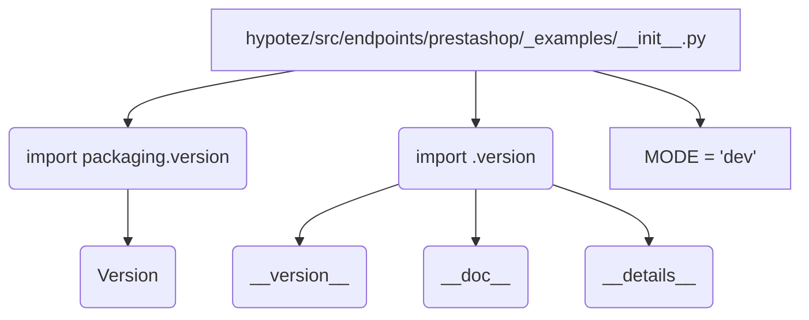

# <input code>

```python
## \file hypotez/src/endpoints/prestashop/_examples/__init__.py
# -*- coding: utf-8 -*-\
#! venv/Scripts/python.exe
#! venv/bin/python/python3.12

"""
.. module:: src.endpoints.prestashop._examples 
	:platform: Windows, Unix
	:synopsis:

"""
MODE = 'dev'

"""
	:platform: Windows, Unix
	:synopsis:

"""


"""
	:platform: Windows, Unix
	:synopsis:

"""


"""
  :platform: Windows, Unix

"""
"""
  :platform: Windows, Unix
  :platform: Windows, Unix
  :synopsis:
"""MODE = 'dev'
  
""" module: src.endpoints.prestashop._examples """


from packaging.version import Version
from .version import __version__, __doc__, __details__
```

# <algorithm>

Этот код представляет собой инициализационную часть модуля `src.endpoints.prestashop._examples`. Алгоритм крайне тривиален: он лишь импортирует необходимую функциональность из другого модуля.  Пошаговая блок-схема:

1. **Импорт**:  Модуль `packaging.version` импортирует функцию `Version`, которая, вероятно, используется для проверки версий пакетов. Модуль `.version` (вероятно, `hypotez/src/endpoints/prestashop/_examples/version.py`) импортирует переменные `__version__`, `__doc__` и `__details__`.

**Пример:**

Если `version.py` содержит:
```python
__version__ = "1.0.0"
__doc__ = "Документация для версии"
__details__ = {"author": "John Doe"}
```
то после импорта в данном файле будут доступны эти значения.

2. **Инициализация**: Переменная `MODE` устанавливается в строку 'dev'.  Этот параметр, скорее всего, используется для выбора режима работы приложения (например, development, production).

**Пример:**
```
MODE = 'dev' 
```

Данные здесь не передаются между функциями или классами.

# <mermaid>



# <explanation>

**Импорты:**

- `from packaging.version import Version`: Импортирует класс `Version` из пакета `packaging`.  Этот пакет используется для работы с версиями пакетов, что позволяет проверять и сравнивать версии, например, в системах управления пакетами.  `src` - это корневой каталог проекта.

- `from .version import __version__, __doc__, __details__`: Импортирует переменные `__version__`, `__doc__` и `__details__` из модуля `.version`, который предположительно находится в том же каталоге, что и текущий файл (`hypotez/src/endpoints/prestashop/_examples/__init__.py`).  Эти переменные, вероятно, содержат метаданные о версии, документации и дополнительных деталях модуля `src.endpoints.prestashop._examples`.  `.` в импорте указывает на текущий каталог, что важно для поиска файлов.


**Классы:**

В данном коде нет определенных классов.  Здесь только импорт данных и инициализация переменной.

**Функции:**

Нет определенных функций.

**Переменные:**

- `MODE`: Строковая переменная, которая устанавливает режим работы.  Используется для конфигурации.  Значение по умолчанию `'dev'`, что говорит о режиме разработки.

**Возможные ошибки или области для улучшений:**

- Отсутствует подробная документация (кроме docstrings). Добавьте подробности о значении `MODE`, например, его возможные значения (`'dev'`, `'prod'`).
- Ненужные комментарии.  Многие строчки комментариев содержат повторяющуюся информацию. Можно сгруппировать их.
- Непонятно назначение переменных `__version__`, `__doc__`, `__details__` без контекста их использования.

**Взаимосвязи с другими частями проекта:**

Модуль `__init__.py` служит точкой входа для подмодулей.  Он подключает метаданные из `version.py` и устанавливает переменные, которые, возможно, используются другими модулями в `src.endpoints.prestashop`, такими как функции для обработки запросов к PrestaShop.   Без доступа к другим файлам трудно проанализировать точное взаимодействие.