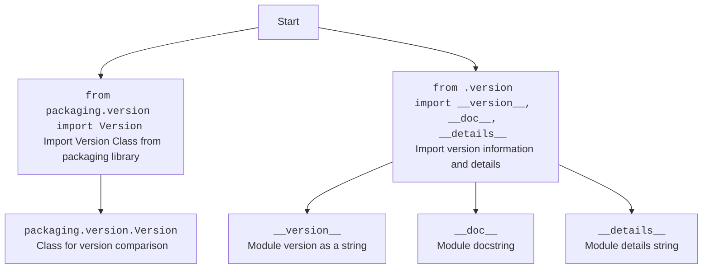

## АНАЛИЗ КОДА: `hypotez/src/endpoints/prestashop/_examples/__init__.py`

### 1. <алгоритм>

1. **Импорт `Version` из `packaging.version`**:
   -  Пример: `from packaging.version import Version`. Эта библиотека предназначена для сравнения версий пакетов.
   -  Используется для создания экземпляров объектов `Version` для сравнения версий.

2. **Импорт переменных из `.version`:**
   - Пример: `from .version import __version__, __doc__, __details__`. Здесь импортируются:
        -  `__version__`: Строка, представляющая текущую версию модуля.
        -  `__doc__`: Документация модуля в виде строки.
        - `__details__`: Более подробные детали о модуле в виде строки.
   -  Эти переменные используются для хранения информации о версиях и документации текущего пакета.
    

### 2. <mermaid>

**Объяснение зависимостей `mermaid`:**

- **`Start`**: Начало процесса.
- **`ImportVersion`**: Импортирует класс `Version` из библиотеки `packaging.version`. Этот класс позволяет сравнивать версии.
- **`VersionClass`**: Представляет класс `Version`, который позволяет сравнивать версии.
- **`ImportModuleData`**: Импортирует переменные `__version__`, `__doc__` и `__details__` из модуля `version.py`, который находится в той же директории. Эти переменные хранят информацию о версии модуля, документации и прочие детали.
- **`ModuleVersion`**: Переменная, представляющая версию модуля как строку.
- **`ModuleDoc`**: Переменная, представляющая документацию модуля.
- **`ModuleDetails`**: Переменная, содержащая подробную информацию о модуле.

### 3. <объяснение>

#### Импорты:
- `from packaging.version import Version`:
  -   **Назначение**: Импортирует класс `Version` из библиотеки `packaging.version`. Этот класс предоставляет инструменты для работы с версиями, например, для сравнения и проверки совместимости версий программного обеспечения.
  -   **Взаимосвязь**: Библиотека `packaging` является внешним пакетом, который нужно установить отдельно. Этот импорт не зависит от других пакетов в `src`.
- `from .version import __version__, __doc__, __details__`:
  -   **Назначение**: Импортирует переменные `__version__`, `__doc__` и `__details__` из модуля `version.py`, который находится в той же директории.
  -   **Взаимосвязь**: Эти импорты связывают данный модуль (`__init__.py`) с модулем `version.py` внутри того же пакета. Переменные используются для отслеживания версии пакета, его документации и других деталей.

#### Классы:
- В этом коде классы не используются напрямую, но импортируется класс `Version`.
  -   **Роль**: Класс `Version` предоставляет функционал для работы с версиями, позволяя сравнивать их, проверять совместимость и т.д.
   - **Взаимодействие**: Этот класс не используется в данном файле, но может быть использован в других частях проекта, которые импортируют его через `from . import Version`.

#### Функции:
- В этом коде не используются функции.

#### Переменные:
- `__version__`:
  -   **Тип**: Строка.
  -   **Использование**: Хранит текущую версию модуля. Обычно имеет формат `X.Y.Z`, где `X`, `Y`, `Z` — это целые числа.
- `__doc__`:
  -   **Тип**: Строка.
  -   **Использование**: Хранит документацию для текущего модуля.
- `__details__`:
  -   **Тип**: Строка.
  -   **Использование**: Хранит более подробные сведения о модуле.

#### Потенциальные ошибки и области для улучшения:
-   **Отсутствие явного использования `Version`**: Класс `Version` импортируется, но не используется в текущем файле. В других файлах, которые импортируют Модуль, может быть его использование.
-   **Неявная связь с `version.py`**:  Зависимость от `version.py` не является явной. Любые изменения в `version.py` могут повлиять на Модуль.
-   **Отсутствие подробной документации**:  Хотя `__doc__` и `__details__` импортируются, их фактическое содержание не отображено в этом файле.

#### Цепочка взаимосвязей:
1.  `__init__.py` импортирует  `Version` из `packaging.version`, что добавляет возможность использования классов для контроля версий.
2.  `__init__.py` зависит от `version.py` внутри своего пакета для получения информации о версии, документации и деталей.
3.  Другие модули в проекте могут импортировать `__init__.py` (например, `from src.endpoints.prestashop._examples import __version__`) и использовать эти данные.

В целом, этот файл устанавливает начальные данные и зависимости для модуля `src.endpoints.prestashop._examples`, предоставляя информацию о версии и обеспечивая возможность контроля версий через класс `Version`.