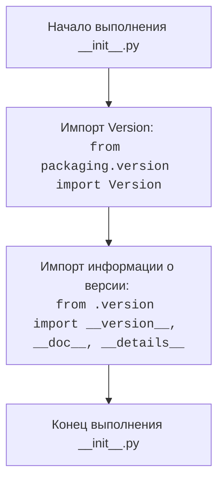

## Анализ кода `hypotez/src/endpoints/prestashop/_examples/__init__.py`

### 1. <алгоритм>
Файл `__init__.py` в Python обычно используется для обозначения того, что директория должна рассматриваться как пакет. В данном случае, файл `__init__.py` в директории `src/endpoints/prestashop/_examples/` инициализирует пакет и импортирует некоторые сущности.

**Блок-схема:**
1. **Старт:** Начало выполнения скрипта `__init__.py`.
2. **Импорт `Version`:** Импорт класса `Version` из пакета `packaging.version`. Этот класс, вероятно, используется для работы с версиями программного обеспечения.
    * **Пример:** `from packaging.version import Version`
3. **Импорт `__version__`, `__doc__`, `__details__`:** Импорт переменных `__version__`, `__doc__` и `__details__` из файла `version.py`, расположенного в той же директории.
    * `__version__`: Строка, представляющая версию пакета. Пример: `"1.0.0"`
    * `__doc__`: Строка, содержащая документацию пакета. Пример: `"Примеры для Prestashop endpoints."`
    * `__details__`: Строка, содержащая дополнительные детали о пакете. Пример: `"Дополнительные детали об примерах"`
    * **Пример:** `from .version import __version__, __doc__, __details__`
4. **Конец:** Завершение выполнения скрипта.

**Поток данных:**

- Нет явных вызовов функций или создания объектов в этом файле, только импорты.
- Данные (`__version__`, `__doc__`, `__details__`) передаются из `version.py` в `__init__.py`.
- Класс `Version` импортируется для дальнейшего использования в других файлах этого пакета.

### 2. <mermaid>

**Объяснение:**

- `Start`: Начало выполнения файла `__init__.py`.
- `ImportVersion`:  Импортирует класс `Version` для работы с версиями. Зависимость `packaging.version` указывает на то, что проект использует внешнюю библиотеку `packaging` для работы с версиями.
- `ImportVersionInfo`: Импортирует переменные `__version__`, `__doc__` и `__details__` из файла `version.py`, которые могут содержать метаданные о пакете.
- `End`: Завершение выполнения файла.

### 3. <объяснение>

**Импорты:**

- `from packaging.version import Version`: Импортирует класс `Version` из библиотеки `packaging`. Эта библиотека предназначена для работы с версиями в соответствии со стандартами. Класс `Version` позволяет сравнивать, сортировать и манипулировать версиями программного обеспечения. Взаимосвязь с другими пакетами проекта `src`: вероятно, используется для управления версиями различных компонентов проекта, если они есть.
- `from .version import __version__, __doc__, __details__`: Импортирует переменные `__version__`, `__doc__`, и `__details__` из файла `version.py` в той же директории. Эти переменные предоставляют метаинформацию о текущем пакете, включая его версию, документацию и дополнительную информацию. Взаимосвязь с другими пакетами проекта `src`: эти данные могут использоваться для отображения информации о версиях при использовании API или в других частях проекта.

**Классы:**

- Класс `Version` не определен в данном файле, а импортируется из библиотеки `packaging`. Он может использоваться в других частях пакета для сравнения версий.

**Функции:**
- В данном коде нет объявленных функций.

**Переменные:**

- `__version__`: Строковая переменная, содержащая текущую версию пакета.
- `__doc__`: Строковая переменная, содержащая строку документации пакета.
- `__details__`: Строковая переменная, содержащая дополнительную информацию о пакете.

**Потенциальные ошибки или области для улучшения:**

-  Файл не содержит никакого кода, кроме импортов и docstring. Этот файл в основном предназначен для инициализации пакета.
- Документация в виде многократных строк `""" """`  не содержат описания.
- Не используется класс `Version` в данном файле.

**Цепочка взаимосвязей:**

1.  `__init__.py` импортирует данные из `version.py` (в той же директории) и `Version` из `packaging`.
2.  Эти импортированные данные доступны для использования в других модулях в пакете `src.endpoints.prestashop._examples`.
3.  Возможно, другие модули используют класс `Version` для сравнения версий, а переменные для отображения метаданных.