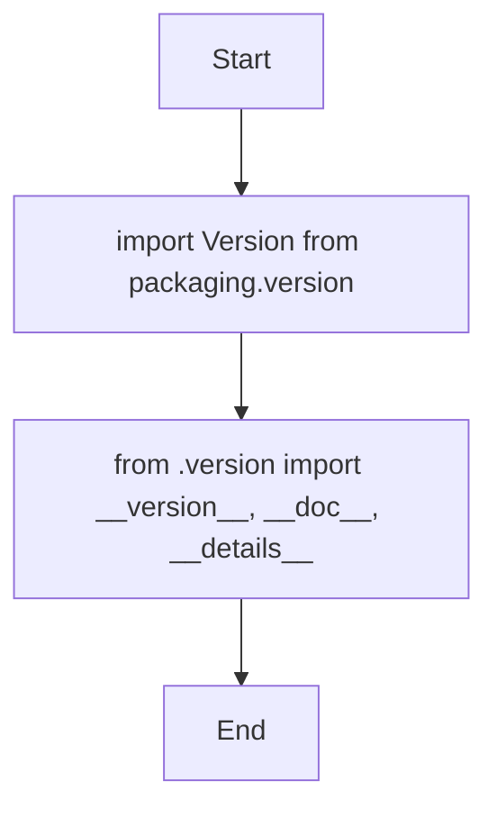

## Анализ кода `hypotez/src/endpoints/prestashop/_examples/__init__.py`

### 1. <алгоритм>

1.  **Импорт модулей:**
    *   Импортируется `Version` из библиотеки `packaging.version`.
    *   Из текущего пакета (`.`) импортируются переменные `__version__`, `__doc__`, и `__details__` из файла `version.py`.

    ```mermaid
    flowchart TD
        Start --> ImportPackagingVersion[import Version from packaging.version]
        ImportPackagingVersion --> ImportVersionDetails[from .version import __version__, __doc__, __details__]
    ```

### 2. <mermaid>



### 3. <объяснение>

**Импорты:**

*   `from packaging.version import Version`: Импортирует класс `Version` из библиотеки `packaging`, который используется для работы с версиями пакетов.
*   `from .version import __version__, __doc__, __details__`: Импортирует переменные `__version__`, `__doc__`, и `__details__` из файла `version.py`, расположенного в том же каталоге. Эти переменные обычно используются для хранения версии пакета, его документации и дополнительной информации о пакете.

**Переменные:**

*   `__version__`: Строка, представляющая версию пакета.
*   `__doc__`: Строка, содержащая документацию к модулю или пакету.
*   `__details__`: Строка, содержащая дополнительную информацию о пакете.

**Функциональность:**

*   Этот файл `__init__.py` в пакете `src.endpoints.prestashop._examples` инициализирует пакет, предоставляя информацию о версии, документацию и детали.
*   Импортируя `__version__`, `__doc__`, и `__details__`, другие модули внутри или за пределами этого пакета могут легко получить доступ к этой информации, что полезно для целей отладки, документирования и управления версиями.
*   `Version` используется для сравнения версий.

**Области для улучшения:**

*   В коде есть много комментариев-заглушек (`"""\n\t:platform: Windows, Unix\n\t:synopsis:\n\n"""` и другие). Их следует заменить реальными описаниями.
*   `...` в коде не имеет смысла, его следует удалить.
*   Файл `version.py`, из которого импортируются переменные, не предоставлен, поэтому более глубокий анализ невозможен. Но обычно, в `version.py` находятся строки вроде `__version__ = "1.0.0"`, `__doc__ = "Описание модуля"`, `__details__ = "Дополнительная информация"`.

**Цепочка взаимосвязей:**

*   Этот файл `__init__.py` является частью пакета `src.endpoints.prestashop._examples`.
*   Он зависит от `packaging.version` для обработки версий.
*   Он также зависит от файла `version.py`, который находится в том же пакете, для определения значений `__version__`, `__doc__` и `__details__`.
*   Другие модули в проекте могут импортировать этот пакет и использовать переменные, определенные в нем.