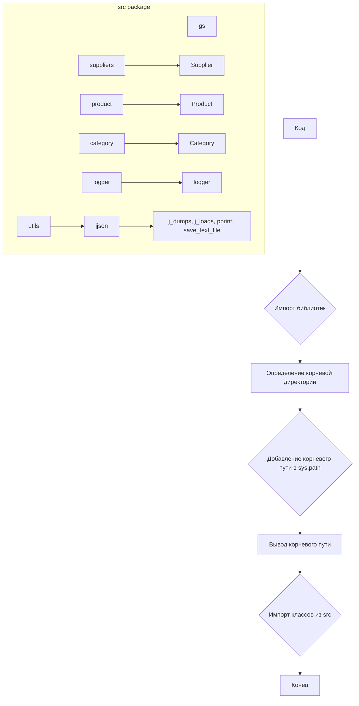

```MD
# <input code>

```python
## \file hypotez/src/endpoints/prestashop/_examples/header.py
# -*- coding: utf-8 -*-\
#! venv/Scripts/python.exe
#! venv/bin/python/python3.12

"""
.. module: src.endpoints.prestashop._examples 
	:platform: Windows, Unix
	:synopsis:

"""
MODE = 'dev'

"""
	:platform: Windows, Unix
	:synopsis:

"""


"""
	:platform: Windows, Unix
	:synopsis:

"""


"""
  :platform: Windows, Unix

"""
"""
  :platform: Windows, Unix
  :platform: Windows, Unix
  :synopsis:
"""MODE = 'dev'
  
""" module: src.endpoints.prestashop._examples """


import sys
import os
from pathlib import Path

dir_root : Path = Path (os.getcwd()[:os.getcwd().rfind('hypotez')+11])
sys.path.append (str (dir_root) )  # Добавляю корневую папку в sys.path
dir_src = Path (dir_root, 'src')
sys.path.append (str (dir_root) ) 
...

print(dir_root)
# ----------------
from pathlib import Path
import json
import re
# ----------------

from src import gs
from src.suppliers import Supplier
from src.product import Product, ProductFields, ProductFieldsLocators
from src.category import Category
from src.utils.jjson import j_dumps, j_loads,   pprint, save_text_file
from src.logger import logger
, StringNormalizer, ProductFieldsValidator
...
```

# <algorithm>

Этот код, являющийся заголовком файла, выполняет следующие действия:

1. **Импорт необходимых библиотек:** Импортирует модули `sys`, `os`, `Path` из `pathlib` для работы с системными путями, `json`, `re` для работы с JSON и регулярными выражениями.  Также импортируются классы и функции из пакета `src`.

2. **Установка пути к корневому каталогу проекта:**  Определяет корневую директорию проекта (`hypotez`) и добавляет ее в `sys.path`. Это необходимо, чтобы Python мог импортировать модули из подкаталогов.

3. **Вывод корневого пути:** Выводит на консоль путь к корневой директории проекта.

4. **Импорт классов из подпапок `src`:** Импортирует необходимые классы и функции из разных модулей `src`.  (например, `Supplier`, `Product`, `Category`, `j_dumps`, `j_loads`, `logger`.)

**Пример:**

Если `os.getcwd()` возвращает `/home/user/project/hypotez`, то `dir_root` будет `/home/user/project/`.  Код добавляет этот путь в `sys.path`, что позволяет импортировать модули из подкаталогов проекта.


# <mermaid>



**Объяснение диаграммы:**

* **Код (A):** Главный блок, выполняющий все действия.
* **Импорт библиотек (B):** Импорт `sys`, `os`, `pathlib`, `json`, `re`.
* **Определение корневой директории (C):** Вычисление пути до корня проекта.
* **Добавление корневого пути в sys.path (D):** Расширение доступного пути поиска модулей.
* **Вывод корневого пути (E):** Отображение пути в консоль.
* **Импорт классов из src (F):** Импорт классов и функций, таких как `Supplier`, `Product`, `Category`.
* **Зависимости в src package (subgraph):**  Иллюстрирует иерархию пакетов.
* **Классы в `src`:** Показываются взаимосвязи между модулями `src`.

# <explanation>

**Импорты:**

Код импортирует необходимые библиотеки (`sys`, `os`, `pathlib`, `json`, `re`) и классы/функции из пакета `src` (например, `gs`, `Supplier`, `Product`, `Category`, `j_dumps`, `j_loads`). Это типичный способ организации кода для использования функций и классов из разных модулей.  Связь с другими частями проекта видна в импортах из папок `src.suppliers`, `src.product`, и других, показывая взаимозависимости между компонентами.

**Классы:**

Код импортирует классы из модулей, таких как `Supplier`, `Product`, `Category`.  Эти классы, вероятно, определены в соответствующих файлах в папке `src`.  Их использование неявно показано, но неявно предполагается, что они представляют сущности (поставщиков, продуктов, категорий).


**Функции:**

Импортируются функции из `src.utils.jjson`  (например, `j_dumps`, `j_loads`), что указывает на утилитарные функции для работы с JSON.


**Переменные:**

`dir_root`: тип `Path` - хранит путь к корневому каталогу проекта.


**Возможные ошибки/улучшения:**

* **Обработка ошибок:**  Нет обработки ошибок при определении `dir_root` (например, если `hypotez` не найден). Рекомендуется добавить проверку, чтобы убедиться, что директория найдена.
* **Ясность кода:** Неясно, какие классы и функции импортируются с помощью `...`. Добавление комментариев к `...` существенно улучшит понимание.
* **Стандартизация импорта:** Импорт библиотек и модулей лучше группировать: `import sys, os, re`,  `from pathlib import Path`, и т.д., для повышения читаемости.
* **Использование `importlib` (необязательно):** Для динамического импорта модулей из `src` в зависимости от контекста.


**Цепочка взаимосвязей:**

Этот код является начальным блоком приложения.  Далее, вероятно, следуют функции, использующие классы из `src`, для обработки данных.   Он напрямую связан с  `src` пакетом, который предоставляет необходимые классы и функции для работы с данными о поставщиках, продуктах и категориях.  Связь осуществляется через импорты, позволяя коду использовать функциональность из `src`.