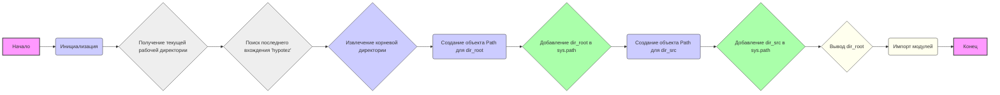

## Анализ кода `hypotez/src/endpoints/prestashop/_examples/header.py`

### <алгоритм>

1. **Инициализация режима:**
   - Устанавливается переменная `MODE` в значение `'dev'`.
   - **Пример**: ``

2. **Определение корневой директории:**
   - Получается текущая рабочая директория с помощью `os.getcwd()`.
   - Используется `rfind('hypotez')` для поиска последнего вхождения строки 'hypotez'.
   - Извлекается корневая директория, добавляя 11 символов к индексу найденной подстроки "hypotez".
   - Создается объект `Path` для представления корневой директории.
   - **Пример**: Если текущая директория `/path/to/my/hypotez/src/endpoints/prestashop`, то `dir_root` будет `/path/to/my/hypotez/`.

3. **Добавление корневой директории в `sys.path`:**
    -  Преобразуем `dir_root` в строку и добавляем в `sys.path`, чтобы можно было импортировать модули из корневой директории.
    -  **Пример**: `sys.path` пополняется значением '/path/to/my/hypotez/'.

4. **Определение директории `src`:**
    - Создается объект `Path` для `src` директории, путем объединения `dir_root` и 'src'.
    - **Пример**: `dir_src` будет `/path/to/my/hypotez/src/`.

5. **Добавление `src` директории в `sys.path`:**
    -  Преобразуем `dir_src` в строку и добавляем в `sys.path`.
    -  **Пример**: `sys.path` пополняется значением '/path/to/my/hypotez/src/'.

6.  **Вывод пути к корневой директории:**
    -  Печатается значение переменной `dir_root`.
    -  **Пример**: выводит `/path/to/my/hypotez/`.

7.  **Импорт модулей:**
    -  Импортируются модули для работы с файловой системой (`pathlib`, `os`), JSON (`json`), регулярными выражениями (`re`).
    - Импортируются модули, определенные в проекте, такие как `gs`, `Supplier`, `Product`, `Category`, `j_dumps`, `j_loads`, `pprint`, `save_text_file`, `logger`, `StringNormalizer`, `ProductFieldsValidator`.
    - Данный блок обеспечивает доступ к функциональности для работы с различными аспектами системы.
   

### <mermaid>

**Анализ зависимостей:**

- **`os`**: Используется для получения текущей рабочей директории (`os.getcwd()`) и манипуляции с путями. Это стандартная библиотека Python.
- **`sys`**: Используется для добавления путей в `sys.path`, что позволяет импортировать модули из указанных директорий. Это стандартная библиотека Python.
- **`pathlib.Path`**: Используется для представления путей к файлам и директориям, упрощая работу с файловой системой. Это стандартная библиотека Python.
- **`json`**: Используется для работы с JSON-данными (сериализация/десериализация). Это стандартная библиотека Python.
- **`re`**: Используется для работы с регулярными выражениями, что может быть полезно при обработке строк. Это стандартная библиотека Python.
- **`src.gs`**: Пользовательский модуль, вероятно, содержащий общие настройки или глобальные переменные проекта.
- **`src.suppliers.Supplier`**: Класс, представляющий поставщика, скорее всего, используется для взаимодействия с поставщиками.
- **`src.product.Product`, `src.product.ProductFields`, `src.product.ProductFieldsLocators`**: Классы для представления и работы с продуктами, включая их поля и локаторы.
- **`src.category.Category`**: Класс, представляющий категорию товаров.
- **`src.utils.jjson.j_dumps`, `src.utils.jjson.j_loads`, `src.utils.jjson.pprint`, `src.utils.jjson.save_text_file`**: Функции для работы с JSON-данными,  включая запись в файл.
- **`src.logger.logger.logger`, `src.logger.logger.StringNormalizer`, `src.logger.logger.ProductFieldsValidator`**: Компоненты для логирования и валидации данных, обеспечивающие возможность отслеживания происходящих событий и проверки корректности данных.

### <объяснение>

**Импорты:**

- **`import sys`**: Модуль `sys` предоставляет доступ к некоторым переменным и функциям, взаимодействующим с интерпретатором Python. В данном коде используется для модификации `sys.path`, что позволяет импортировать модули из других директорий.
- **`import os`**: Модуль `os` предоставляет функции для взаимодействия с операционной системой, такие как работа с файлами, каталогами и процессами. Здесь используется для получения текущей рабочей директории.
- **`from pathlib import Path`**: `Path` из `pathlib` используется для представления путей к файлам и директориям в более объектно-ориентированном стиле, упрощая их обработку.
- **`import json`**: Используется для работы с JSON-данными.
- **`import re`**: Модуль `re` предоставляет операции с регулярными выражениями.
- **`from src import gs`**: Импортируется модуль `gs` из директории `src`. Назначение этого модуля может быть связано с общими настройками или глобальными переменными.
- **`from src.suppliers import Supplier`**: Импортируется класс `Supplier`, представляющий поставщика, из модуля `suppliers` в пакете `src`.
- **`from src.product import Product, ProductFields, ProductFieldsLocators`**: Импортируются классы `Product`, `ProductFields` и `ProductFieldsLocators` из модуля `product` в пакете `src`, отвечающие за представление продукта и его полей.
- **`from src.category import Category`**: Импортируется класс `Category`, представляющий категорию товара, из модуля `category` в пакете `src`.
- **`from src.utils.jjson import j_dumps, j_loads, pprint, save_text_file`**: Импортируются функции `j_dumps`, `j_loads`, `pprint`, `save_text_file` из модуля `jjson` в пакете `src.utils` для работы с JSON и текстом.
- **`from src.logger.logger import logger, StringNormalizer, ProductFieldsValidator`**: Импортируются `logger`, `StringNormalizer`, `ProductFieldsValidator` из модуля `logger` в пакете `src.logger`. Модуль используется для логгирования и валидации данных.

**Переменные:**

-   `MODE`: Указывает на текущий режим работы приложения. В данном случае это `'dev'`, что может указывать на режим разработки.
-   `dir_root`: Объект `pathlib.Path`, представляющий абсолютный путь к корневой директории проекта.
-   `dir_src`: Объект `pathlib.Path`, представляющий абсолютный путь к директории `src`.

**Функции:**

-   **`os.getcwd()`**: Функция модуля `os` возвращает строку, представляющую путь к текущей рабочей директории.
-  **`str()`**: Функция приведения объекта к строковому типу. Используется для  добавления путей в `sys.path`.
- **`print()`**: Функция выводит  значение переменной dir_root.
-   **`sys.path.append()`**: Метод списка `sys.path` добавляет новый путь для поиска модулей.
-  **`Path()`**: Конструктор класса `pathlib.Path`, используется для создания объекта, представляющего путь.
-   `rfind()`: Метод класса String, используется для поиска последнего вхождения подстроки.
-  **`json`**: стандартная библиотека для работы с JSON.
-   **`re`**: стандартная библиотека для работы с регулярными выражениями.
-   **`j_dumps`, `j_loads`, `pprint`, `save_text_file`**: Функции для работы с JSON, специфичные для проекта, находящиеся в `src.utils.jjson`.

**Цепочка взаимосвязей:**

1.  **Зависимости от системы**: Код зависит от операционной системы (пути к файлам) через модули `os` и `pathlib`.
2.  **Импорт пользовательских модулей**: Импортируется много пользовательских модулей и классов из папки `src`, таких как  `gs`, `Supplier`, `Product`, `Category`, `jjson`, `logger`.
3.  **Конфигурация путей**: Пути к корневой директории и директории `src` определяются динамически и добавляются в `sys.path` для корректного импорта модулей.
4.  **Настройки:** Переменная `MODE` задает режим работы приложения.
5.  **JSON и Логирование**: Функции из `jjson` и `logger` используются для работы с JSON и логгирования соответственно.

**Потенциальные ошибки и улучшения:**

-   **Обработка исключений**: В коде отсутствует обработка ошибок при работе с файловой системой или при импорте модулей.
-   **Зависимость от структуры директорий**: Код предполагает наличие директории `hypotez` в пути.
-   **Неиспользуемый код:** Многоточия ( `...` ) указывают на наличие пропущенного кода.
-   **Повторное добавление пути**: Путь к корневой директории добавляется дважды, что является избыточным.
-   **Глобальные переменные**: Использование глобальной переменной `MODE` может усложнить масштабирование проекта.

В целом, этот файл представляет собой часть инициализации проекта, где настраиваются пути к модулям, устанавливается режим работы, импортируются необходимые компоненты для дальнейшей работы приложения.