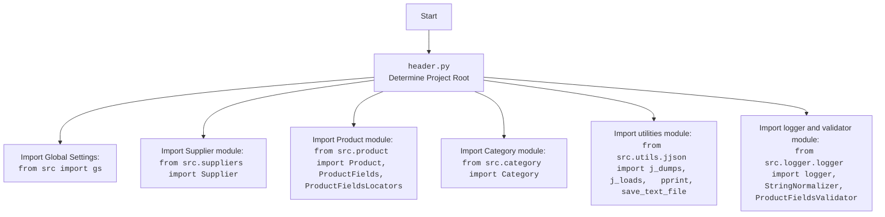

## АНАЛИЗ КОДА: `hypotez/src/endpoints/prestashop/_examples/header.py`

### <алгоритм>

1.  **Определение корневой директории проекта (`dir_root`):**
    *   Получение текущей рабочей директории с помощью `os.getcwd()`.
    *   Поиск последнего вхождения подстроки 'hypotez' в пути и обрезка строки до `hypotez` включительно.
    *   Создание объекта `Path` из полученной строки.
    *   *Пример*: Если текущая рабочая директория `/Users/user/projects/hypotez/src/endpoints/prestashop`, то `dir_root` будет `/Users/user/projects/hypotez`.

2.  **Добавление корневой директории в `sys.path`:**
    *   Преобразование `dir_root` в строку.
    *   Добавление строки в `sys.path`, что позволяет импортировать модули из корневой директории проекта.
    *   *Пример*: `sys.path` будет включать `/Users/user/projects/hypotez`.

3.  **Определение директории `src`:**
    *   Создание объекта `Path` для директории `src`, расположенной внутри `dir_root`.
    *   Добавление `dir_root` в `sys.path` еще раз (это может быть лишним).
    *   *Пример*: `dir_src` будет `/Users/user/projects/hypotez/src`.

4.  **Вывод `dir_root`:**
    *   Вывод строки представляющей корневой путь проекта `dir_root` в консоль, с целью проверки.

5.  **Импорт необходимых библиотек и модулей:**
    *   Импорт библиотек `pathlib`, `json`, `re`.
    *   Импорт внутренних модулей `gs` (глобальные настройки), `Supplier`, `Product`, `ProductFields`, `ProductFieldsLocators`, `Category`, утилит `j_dumps`, `j_loads`, `pprint`, `save_text_file`, `logger`, `StringNormalizer`, `ProductFieldsValidator`.

### <mermaid>

```mermaid
flowchart TD
    Start --> GetCurrentWorkingDirectory[Получить текущую рабочую директорию: <br><code>os.getcwd()</code>]
    GetCurrentWorkingDirectory --> FindHypotezLastOccurrence[Найти последнее вхождение 'hypotez' и обрезать строку]
    FindHypotezLastOccurrence --> CreatePathObjectDirRoot[Создать объект Path для корневой директории проекта: <br><code>dir_root = Path(...)</code>]
    CreatePathObjectDirRoot --> AddRootDirToSysPath[Добавить корневую директорию в sys.path: <br><code>sys.path.append(str(dir_root))</code>]
    AddRootDirToSysPath --> CreatePathObjectDirSrc[Создать объект Path для директории src: <br><code>dir_src = Path(dir_root, 'src')</code>]
     CreatePathObjectDirSrc --> AddRootDirToSysPath2[Добавить корневую директорию в sys.path: <br><code>sys.path.append(str(dir_root))</code>]
    AddRootDirToSysPath2 --> PrintDirRoot[Вывести корневую директорию в консоль: <br><code>print(dir_root)</code>]
    PrintDirRoot --> ImportLibsAndModules[Импорт библиотек и модулей]
    ImportLibsAndModules --> End
    
    
    style GetCurrentWorkingDirectory fill:#f9f,stroke:#333,stroke-width:2px
    style FindHypotezLastOccurrence fill:#f9f,stroke:#333,stroke-width:2px
    style CreatePathObjectDirRoot fill:#ccf,stroke:#333,stroke-width:2px
    style AddRootDirToSysPath fill:#ccf,stroke:#333,stroke-width:2px
    style CreatePathObjectDirSrc fill:#ccf,stroke:#333,stroke-width:2px
    style AddRootDirToSysPath2 fill:#ccf,stroke:#333,stroke-width:2px
    style PrintDirRoot fill:#ccf,stroke:#333,stroke-width:2px
    style ImportLibsAndModules fill:#aaf,stroke:#333,stroke-width:2px
    
    
```


### <объяснение>

#### Импорты:

*   **`import sys`**: Модуль `sys` предоставляет доступ к некоторым переменным и функциям, взаимодействующим с интерпретатором Python. Используется для добавления путей к поиску модулей.
*   **`import os`**: Модуль `os` предоставляет функции для взаимодействия с операционной системой, включая работу с файловой системой. Используется для получения текущей рабочей директории.
*   **`from pathlib import Path`**: Класс `Path` из модуля `pathlib` предоставляет объектно-ориентированный способ работы с путями к файлам и директориям, что упрощает манипуляции с путями.
*    **`import json`**: Модуль для работы с JSON данными.
*   **`import re`**: Модуль для работы с регулярными выражениями.
*   **`from src import gs`**: Импортирует модуль `gs` (предположительно, глобальные настройки) из пакета `src`. Это указывает на использование глобальных параметров или конфигурации проекта.
*   **`from src.suppliers import Supplier`**: Импортирует класс `Supplier` из модуля `suppliers` внутри пакета `src`. Представляет сущность поставщика.
*   **`from src.product import Product, ProductFields, ProductFieldsLocators`**: Импортирует классы `Product`, `ProductFields` и `ProductFieldsLocators` из модуля `product` внутри пакета `src`. Используются для представления продуктов и их атрибутов.
*   **`from src.category import Category`**: Импортирует класс `Category` из модуля `category` внутри пакета `src`. Представляет сущность категории товаров.
*   **`from src.utils.jjson import j_dumps, j_loads, pprint, save_text_file`**: Импортирует функции `j_dumps`, `j_loads`, `pprint` и `save_text_file` из модуля `jjson` внутри пакета `src.utils`.  `j_dumps` и `j_loads` скорее всего аналогичны стандартным `json.dumps` и `json.loads`, но могут иметь дополнительные настройки. `pprint` для форматированного вывода, а `save_text_file` для записи текста в файл.
*   **`from src.logger.logger import logger, StringNormalizer, ProductFieldsValidator`**: Импортирует `logger`, `StringNormalizer`, и `ProductFieldsValidator` из модуля `logger` внутри пакета `src.logger`. `logger` для ведения логов, `StringNormalizer` для обработки строк, а `ProductFieldsValidator` для валидации полей продукта.

#### Классы:

*   **`Path`**:  Предоставляет объектно-ориентированный способ работы с путями к файлам и директориям. Используется для упрощения манипуляций с путями.
*   **`Supplier`**: Представляет поставщика товаров, содержит данные поставщика.
*   **`Product`**:  Представляет продукт, содержит данные продукта и методы работы с ним.
*   **`ProductFields`**:  Содержит поля продукта, возможно, как ENUM или список.
*    **`ProductFieldsLocators`**:  Содержит локаторы для полей продукта (скорее всего для работы с web ui).
*   **`Category`**: Представляет категорию товаров, содержит данные о категории.
*   **`StringNormalizer`**:  Класс для нормализации строк.
*   **`ProductFieldsValidator`**: Класс для валидации полей продукта.

#### Функции:

*   **`os.getcwd()`**: Функция из модуля `os`, возвращает строку, представляющую текущую рабочую директорию.
*   **`str()`**: Преобразует объект `Path` в строку.
*   **`sys.path.append()`**: Функция из модуля `sys` для добавления пути к поиску модулей.
*   **`j_dumps(data)`**: Функция для сериализации данных в JSON.
*   **`j_loads(json_string)`**: Функция для десериализации JSON из строки.
*   **`pprint(data)`**: Функция для форматированного вывода данных.
*   **`save_text_file(file_path, text)`**: Функция для записи текста в файл.

#### Переменные:

*   **`dir_root`**: Переменная типа `Path`, содержит путь к корневой директории проекта.
*   **`dir_src`**: Переменная типа `Path`, содержит путь к директории `src` проекта.

#### Потенциальные ошибки и области для улучшения:

1.  **Повторное добавление `dir_root` в `sys.path`**: Строка `sys.path.append (str (dir_root) )` добавляется дважды, что не имеет смысла и избыточно. Одного раза достаточно, это следует убрать.
2.  **Непоследовательный импорт**: Импорты сгруппированы нелогично: сначала импорты для работы с путями и ОС, потом из stdlib, затем из `src` что затрудняет читаемость.
3.  **Использование не описанных модулей `...`**: Многоточия `...` использованы в коде, что не является синтаксически правильным и не несут смысловой нагрузки.
4.  **Отсутствие проверки корректности пути:** Код предполагает, что 'hypotez' всегда есть в текущей рабочей директории, но не обрабатывает случай, когда это не так, что может привести к ошибке.
5.  **Неоднозначные названия модулей**: Имена типа `gs` могут быть неинформативными. Лучше использовать более явные имена.

#### Взаимосвязи с другими частями проекта:

*   Этот файл `header.py` служит для настройки окружения проекта, добавляя корневую директорию в `sys.path` и подготавливая окружение для импорта модулей.
*   Он используется как заголовочный файл, предоставляя доступ к общим классам и функциям, используемым в других частях проекта, связанных с PrestaShop.
*   Импорты из `src` связывают этот файл с основной бизнес-логикой проекта, включающей работу с поставщиками, продуктами, категориями и общими утилитами.
*   `logger`, `StringNormalizer`, и `ProductFieldsValidator` указывают на наличие в проекте механизмов журналирования и валидации данных.
*   Файл не содержит бизнес-логики, основная задача - настройка и импорт.