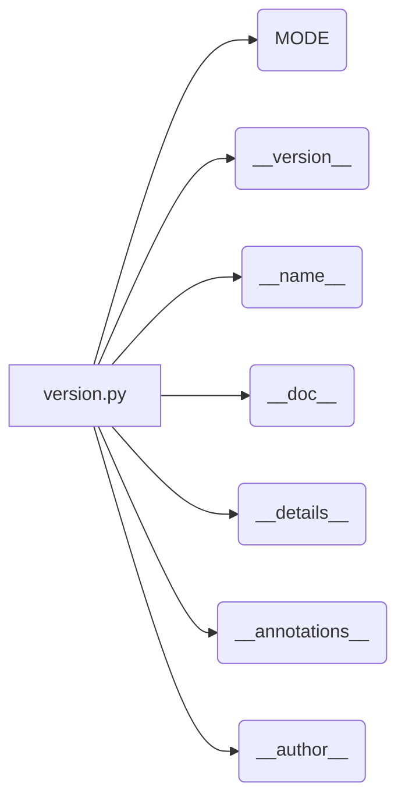

# <input code>

```python
## \file hypotez/src/endpoints/prestashop/_examples/version.py
# -*- coding: utf-8 -*-\n#! venv/Scripts/python.exe\n#! venv/bin/python/python3.12\n
"""
.. module: src.endpoints.prestashop._examples 
	:platform: Windows, Unix
	:synopsis:

"""
MODE = 'dev'

"""
	:platform: Windows, Unix
	:synopsis:

"""


"""
	:platform: Windows, Unix
	:synopsis:

"""


"""
  :platform: Windows, Unix

"""
"""
  :platform: Windows, Unix
  :platform: Windows, Unix
  :synopsis:
"""MODE = 'dev'
  
""" module: src.endpoints.prestashop._examples """


"""
- `__version__`: This variable holds the version of the module or package.
- `__name__`: Contains the name of the module. If the script is being run directly, the value will be `"__main__"`.
- `__doc__`: The module's documentation string.
- `__details__`: This variable likely contains additional details about the module, but the exact purpose depends on the specific module or package.
- `__annotations__`: Contains type annotations for variables and functions in the module.
- `__author__`: The name(s) of the author(s) of the module.
"""
__name__:str
__version__="3.12.0.0.0.4"
__doc__:str
__details__:str="Details about version for module or class"
__annotations__

__author__='hypotez '
```

# <algorithm>

Этот код не содержит алгоритма в традиционном понимании. Он определяет константы, переменные и строковые литералы, которые, вероятно, используются для метаданных и информации о модуле `src.endpoints.prestashop._examples`.  Поскольку это лишь фрагмент, нет возможности построить пошаговую блок-схему.

# <mermaid>



# <explanation>

Этот файл `version.py` определяет переменные, используемые для метаданных Python-модуля (модуля `src.endpoints.prestashop._examples`).  Эти переменные обычно используются системами управления версиями, документацией или другими инструментами, которые обращаются к информации о модуле.

* **`MODE = 'dev'`**: Это глобальная константа, хранящая значение `'dev'`. Возможно, используется для определения режима работы (например, `'dev'` - для разработки, `'prod'` - для производства) в более масштабной системе.  Значение `'dev'` в данном контексте не имеет смысла до тех пор, пока не будет использовано в других частях проекта.

* **`__version__ = "3.12.0.0.0.4"`**: Переменная, хранящая строковое представление версии модуля.  Значение должно быть четко определено и использоваться для контроля версий.

* **`__name__`, `__doc__`, `__details__`, `__annotations__`, `__author__`**: Стандартные атрибуты Python-модуля, хранящие имя, документацию, дополнительные сведения, аннотации типов и имя автора.  Эти значения, как правило, используются средами разработки, системами управления версиями и документации.

**Импорты:**  В данном коде отсутствуют импорты.  Вся информация хранится непосредственно в этом файле.


**Классы, функции и переменные:**  Нет ни классов, ни функций.  Только константы, описывающие метаданные модуля.

**Возможные ошибки и улучшения:**

* **Недостаток контекста:**  Без окружения (полного проекта) сложно оценить, как эти переменные используются.  В идеале, они должны быть связаны с другими частями кодовой базы для их эффективной обработки.
* **Неявное использование:**  Нет явного использования этих переменных.  Чтобы оценить их практическое применение, необходимо увидеть код, который использует значения этих переменных.

**Взаимосвязь с другими частями проекта:**  Без дополнительного кода сложно определить взаимосвязи.  Но обычно эти переменные используются в метаданных модуля и могут использоваться другими модулями/скриптами для получения сведений о текущей версии, авторе и т.п.