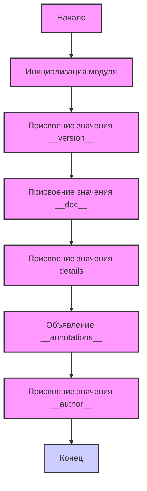

## ИНСТРУКЦИЯ:

Анализируй предоставленный код подробно и объясни его функциональность. Ответ должен включать три раздела:  

1.  **<алгоритм>**: Опиши рабочий процесс в виде пошаговой блок-схемы, включая примеры для каждого логического блока, и проиллюстрируй поток данных между функциями, классами или методами.  
2.  **<mermaid>**: Напиши код для диаграммы в формате `mermaid`, проанализируй и объясни все зависимости, 
    которые импортируются при создании диаграммы. 
    **ВАЖНО!** Убедитесь, что все имена переменных, используемые в диаграмме `mermaid`, 
    имеют осмысленные и описательные имена. Имена переменных вроде `A`, `B`, `C`, и т.д., не допускаются!  
    
    **Дополнительно**: Если в коде есть импорт `import header`, добавьте блок `mermaid` flowchart, объясняющий `header.py`:\
    ```mermaid
    flowchart TD
        Start --> Header[<code>header.py</code><br> Determine Project Root]
    
        Header --> import[Import Global Settings: <br><code>from src import gs</code>] 
    ```

3.  **<объяснение>**: Предоставьте подробные объяснения:  
    - **Импорты**: Их назначение и взаимосвязь с другими пакетами `src.`.  
    - **Классы**: Их роль, атрибуты, методы и взаимодействие с другими компонентами проекта.  
    - **Функции**: Их аргументы, возвращаемые значения, назначение и примеры.  
    - **Переменные**: Их типы и использование.  
    - Выделите потенциальные ошибки или области для улучшения.  

Дополнительно, постройте цепочку взаимосвязей с другими частями проекта (если применимо).  

Это обеспечивает всесторонний и структурированный анализ кода.
## Формат ответа: `.md` (markdown)
**КОНЕЦ ИНСТРУКЦИИ**

## <алгоритм>



1. **Начало**: Программа запускается.
2. **Инициализация модуля**:  Запускается скрипт `version.py`
3. **Присвоение значения `__version__`**: Переменной `__version__` присваивается строковое значение `"3.12.0.0.0.4"`.
    *   **Пример**: `__version__ = "3.12.0.0.0.4"`
4. **Присвоение значения `__doc__`**: Переменной `__doc__` присваивается строка документации модуля, которая в данном случае пуста.
    *   **Пример**:  `__doc__ = None` (не явно присвоено, но в коде это подразумевается)
5. **Присвоение значения `__details__`**: Переменной `__details__` присваивается строка `"Details about version for module or class"`.
    *   **Пример**: `__details__ = "Details about version for module or class"`
6. **Объявление `__annotations__`**: Объявляется переменная `__annotations__` без присвоения значения.
    *   **Пример**: `__annotations__` = {} (будет создан пустой словарь при использовании аннотаций типов)
7. **Присвоение значения `__author__`**: Переменной `__author__` присваивается строка `'hypotez '`.
    *   **Пример**: `__author__ = 'hypotez '`
8. **Конец**: Завершение работы скрипта.

## <mermaid>

```mermaid
flowchart TD
    Start[Начало] --> ModuleName[<code>__name__</code>: str]
    ModuleName --> ModuleVersion[<code>__version__</code>: str = "3.12.0.0.0.4"]
    ModuleVersion --> ModuleDoc[<code>__doc__</code>: str]
    ModuleDoc --> ModuleDetails[<code>__details__</code>: str = "Details about version for module or class"]
    ModuleDetails --> ModuleAnnotations[<code>__annotations__</code>]
     ModuleAnnotations --> ModuleAuthor[<code>__author__</code>: str = 'hypotez ']
    ModuleAuthor --> End[Конец]

    style Start fill:#f9f,stroke:#333,stroke-width:2px
    style End fill:#ccf,stroke:#333,stroke-width:2px

     classDef box fill:#f9f,stroke:#333,stroke-width:2px
    class ModuleName,ModuleVersion,ModuleDoc,ModuleDetails,ModuleAnnotations,ModuleAuthor box;
    
```

**Описание зависимостей:**

*   `__name__`:  Эта переменная типа `str` представляет имя модуля. Обычно в файле, выполняемом как основной скрипт, она равна `"__main__"`.
*   `__version__`: Эта переменная типа `str` хранит версию модуля (в данном случае `"3.12.0.0.0.4"`).
*   `__doc__`: Эта переменная типа `str` содержит строку документации модуля. Она может быть пустой или содержать описание.
*   `__details__`: Эта переменная типа `str` содержит дополнительные сведения о версии модуля, в данном случае `"Details about version for module or class"`.
*  `__annotations__`: Эта переменная предназначена для хранения аннотаций типов. В данном случае, она не инициализирована, что означает, что она будет пустым словарем, если будут добавлены аннотации.
*   `__author__`: Эта переменная типа `str`  содержит имя автора модуля, в данном случае `"hypotez "`.

## <объяснение>

**Импорты:**

В данном коде импорты отсутствуют, так как это файл, содержащий метаданные о модуле и версии. Взаимодействия с другими пакетами `src` не происходит напрямую в этом файле.

**Классы:**

В данном коде нет классов. Это простой файл, определяющий метаданные.

**Функции:**

В данном коде нет функций.

**Переменные:**

*   `__name__`:
    *   **Тип**: `str`
    *   **Назначение**:  Имя модуля. Обычно, когда скрипт запускается напрямую, эта переменная устанавливается в `"__main__"`.
    *   **Использование**: В данном файле, она объявлена, но не присвоена значение, это значение установиться когда файл будет выполнятся
*   `__version__`:
    *   **Тип**: `str`
    *   **Назначение**: Строка, представляющая версию модуля.
    *   **Использование**: Используется для отслеживания версии модуля.
*   `__doc__`:
    *   **Тип**: `str`
    *   **Назначение**: Строка документации модуля. В данном случае не инициализирована.
    *   **Использование**: Используется для предоставления документации к модулю.
*   `__details__`:
    *   **Тип**: `str`
    *   **Назначение**: Дополнительные сведения о версии модуля.
    *   **Использование**: Предоставляет более подробную информацию о версии.
*    `__annotations__`:
    *   **Тип**: dict (хоть и неявно)
    *   **Назначение**:  Для хранения аннотаций типов.
    *   **Использование**:  Аннотации типов для переменных и функций.
*   `__author__`:
    *   **Тип**: `str`
    *   **Назначение**: Имя автора модуля.
    *   **Использование**: Указывает автора модуля.

**Потенциальные ошибки и области для улучшения:**

1.  **Отсутствие значения для `__doc__`:**  Строка документации (`__doc__`) не присваивается явно, что делает документацию модуля неполной.
2.  **Жестко заданная версия**: Версия хардкодится, что не очень удобно, если нужно изменять версии автоматически.
3. **Нет зависимостей**: Файл просто хранит метаданные, без зависимости от других частей проекта.
4. **Наличие пустых строк**:  В файле много пустых комментариев, что выглядит как мусор

**Взаимосвязь с другими частями проекта:**

Файл `version.py` обычно используется как часть метаданных модуля.  Он может быть импортирован в другие части проекта, где нужна информация о версии, авторе и других деталях.

**Цепочка взаимодействий:**

1.  Другие модули могут импортировать `__version__`, `__author__` и `__details__` из этого файла для отображения версии и другой информации о текущей сборке.
2. Скрипты сборки могут использовать эту информацию для управления версиями.
3. Информация о версии может быть использована в логах или для отладки.

В целом, это базовый файл для хранения метаданных о модуле. Он нуждается в улучшении для более удобного использования и автоматизации.