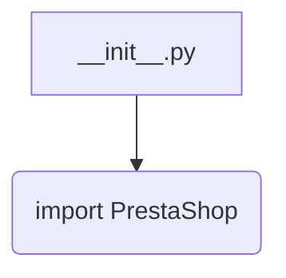

```MD
# Анализ файла `hypotez/src/endpoints/prestashop/api/__init__.py`

1. **<input code>**:

```python
## \file hypotez/src/endpoints/prestashop/api/__init__.py
# -*- coding: utf-8 -*-\
#! venv/Scripts/python.exe
#! venv/bin/python/python3.12

"""
.. module: src.endpoints.prestashop.api 
	:platform: Windows, Unix
	:synopsis:

"""
MODE = 'dev'

from .api import PrestaShop
```

2. **<algorithm>**:

Этот файл является инициализационным модулем для API Престашоп. Алгоритм работы сводится к импорту класса `PrestaShop` из подмодуля `api`.  Логики, выполняемой в этом файле, нет.  Все действия происходят на уровне импорта.



3. **<mermaid>**:

```mermaid
graph LR
    subgraph Init Module
        A[__init__.py] --> B{import PrestaShop};
    end
    B --> C[PrestaShop Class (in api.py)];
```

4. **<explanation>**:

* **Импорты**:
    Файл `__init__.py` служит для инициализации пакета `endpoints/prestashop/api`. `from .api import PrestaShop` импортирует класс `PrestaShop` из модуля `api.py` внутри текущего пакета. Значок `.` перед `api` означает, что импортируемый модуль находится в том же каталоге, что и текущий файл. Это стандартный способ организации импортов в Python для модулей, которые находятся в структурах папок.

* **Классы**:
    Класс `PrestaShop` (который находится в файле `api.py`, но не определен в данном файле) — вероятно, содержит атрибуты и методы, необходимые для взаимодействия с API Престашоп.  Он содержит данные и функциональность, связанные с этим API.  Без просмотра `api.py` нельзя сказать точно, что он делает.

* **Функции**:
    Файл `__init__.py` не содержит функций.  Все функциональность сосредоточена в классе `PrestaShop` (в файле `api.py`).


* **Переменные**:
    `MODE = 'dev'` — глобальная переменная, вероятно, определяющая режим работы приложения (разработка, производство).  Это переменная уровня модуля и доступна всем классам и функциям, определенным в этом же модуле.

* **Возможные ошибки или области для улучшений**:

    * Отсутствие документации к классу `PrestaShop`.  Рекомендуется добавить `docstrings` (документационные строки) к методам класса.
    * Непонятно, какие зависимости имеются у этого API. Проверка, что все необходимые модули и пакеты, которые использует `PrestaShop`, доступны и правильно настроены.
    * Отсутствие проверки `MODE` на корректность значений (хотя в данной части кода это не критически важно).


* **Взаимосвязи с другими частями проекта**:

    Файл `__init__.py` служит начальной точкой для использования API Престашоп в других частях приложения.  Программный код, использующий API, должен импортировать `PrestaShop` из `src.endpoints.prestashop.api`.  Непосредственной связи с другими частями проекта без анализа `api.py` и его функций/методов, не наблюдается.  Для полного анализа необходимо просмотреть файлы, в которых используется этот API.