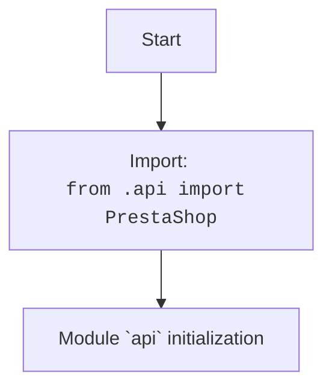

## АНАЛИЗ КОДА: `hypotez/src/endpoints/prestashop/api/__init__.py`

### 1. <алгоритм>

1. **Импорт модуля `PrestaShop`:** Из файла `api.py`, расположенного в том же каталоге, импортируется класс (или модуль) `PrestaShop`.
   *  Пример: `from .api import PrestaShop`
   
2. **Экспорт:** Класс `PrestaShop` становится доступным для импорта в других частях проекта через `src.endpoints.prestashop.api`.

### 2. <mermaid>

### 3. <объяснение>

#### Импорты:

*   `from .api import PrestaShop`:
    *   **Назначение:** Импортирует `PrestaShop` из файла `api.py`, находящегося в той же директории (`.`). Это означает, что в текущий пакет `src.endpoints.prestashop.api` добавляется класс `PrestaShop` из модуля `api.py`.
    *   **Взаимосвязь с `src`:** `api.py` является частью пакета `src.endpoints.prestashop.api`, который в свою очередь является частью более широкой структуры `src`. Этот импорт обеспечивает возможность использовать логику `PrestaShop` в других модулях, импортируя `src.endpoints.prestashop.api.PrestaShop`.

#### Классы:

*   `PrestaShop`:
    *   **Роль:** Класс, скорее всего, предназначен для работы с API PrestaShop.
    *   **Предполагаемые атрибуты и методы:** Ожидается, что в файле `api.py` данный класс будет иметь методы, которые позволяют взаимодействовать с API PrestaShop (например, отправлять запросы, получать данные и т.д.).
    *   **Взаимодействие с другими компонентами:** Через этот класс другие модули проекта смогут работать с PrestaShop API. Например, модуль, отвечающий за синхронизацию товаров, сможет взаимодействовать с PrestaShop через `PrestaShop`.

#### Функции:

*   В данном файле нет явных функций.

#### Переменные:

*   В данном файле нет явных переменных.

#### Потенциальные ошибки и области для улучшения:

1.  **Соглашение об именовании:** Имя `PrestaShop` может быть расширено до `PrestaShopAPI` или подобного, чтобы сделать назначение класса более ясным.
2.  **Отсутствие документации:** Файл `__init__.py` мог бы включать краткое описание пакета.
3.  **Обработка исключений:** В `api.py` должна быть предусмотрена корректная обработка исключений, которые могут возникать при работе с API PrestaShop.
4.  **Конфигурация:** API-ключи и другие настройки для доступа к PrestaShop должны храниться в безопасном месте и передаваться в класс `PrestaShop` при создании его экземпляра.

#### Цепочка взаимосвязей:

1.  `src.endpoints.prestashop.api` -> `api.py`: `__init__.py` импортирует `PrestaShop` из `api.py`.
2.  `src.endpoints.prestashop.api` -> `src`: Модуль `api` и класс `PrestaShop` могут быть импортированы и использованы другими модулями пакета `src`. Например, модуль, отвечающий за синхронизацию данных, может использовать `PrestaShop` для работы с PrestaShop API.
3.  `src` -> другие пакеты (например, `src.core`, `src.config`): Другие модули `src` могут зависеть от `src.endpoints.prestashop.api`, если им нужно взаимодействовать с PrestaShop.

В итоге, `__init__.py` служит для того, чтобы сделать класс `PrestaShop` из `api.py` доступным как часть пакета `src.endpoints.prestashop.api`, обеспечивая модульный и структурированный доступ к функциональности API PrestaShop.